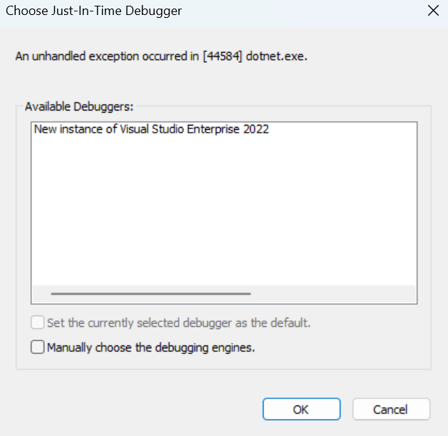
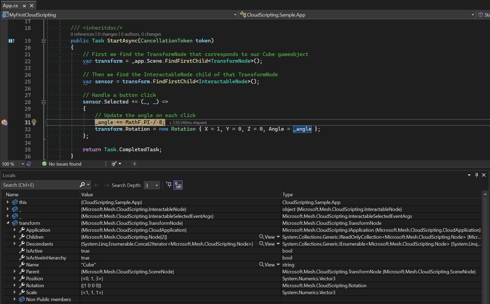
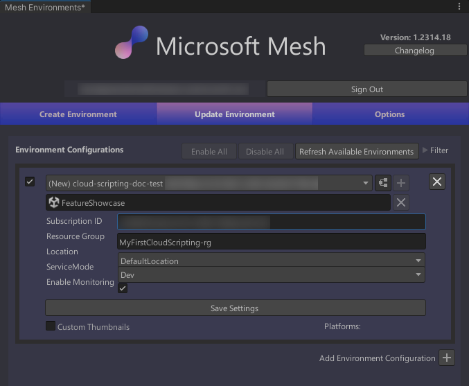

# Mesh Cloud Scripting Getting Started Guide

This article will help you configure your development environment and start iterating on your project. We’ll also cover how to upload your environment, publish your app to Azure, and prepare for testing. Finally, we’ll go over testing and troubleshooting. We recommend that you familiarize yourself with the current list of [known issues](cloud-scripting-known-issues.md) before starting development with Mesh Cloud Scripting.

## Prerequisites

- Advanced Unity skills.
- A username and password for the Azure Portal so you can upload your work.
- Your account must be added as a Contributor to the Mesh world you’re trying to publish to. If you’re unsure about this, check with your IT admin.
- There must be an existing Mesh World that contains a Space in the Azure Portal that you can upload your work to. To learn more about setting this up, see our document titled *Mesh IT Admin Guide*. TBD
- There must be an existing Unity project that was created based on the process detailed in our document titled *Get Started with Mesh Environments* TBD, or you must create one. That document instructs you to load the *Mesh Toolkit* which contains the Unity package you need for Mesh Cloud Scripting. This package is named *mesh.meshapps.unityruntime*.   
- You should be at least somewhat familiar with event management. To learn more about this, see the event management section in the document titled *Mesh IT Admin Guide”*. TBD

## Software dependencies

1. [.NET 6.0 SDK Windows](https://dotnet.microsoft.com/en-us/download)
1. [Unity 2022.3.7f1+](https://unity.com/releases/editor/whats-new/2022.3.7)
1. [Azure CLI 2.40.0](https://learn.microsoft.com/en-us/cli/azure/install-azure-cli)

## Create a Scene with a C# MeshApp application

The following instructions show how to create a simple app with a cube that rotates when a user clicks on it. We'll use the app to show local development workflow, deployment and testing.

1. Create a new scene and choose the **Standard (URP)** template.
1. Save the scene and name it. For this example, we'll use the name **MyFirstMeshApp**.

    > [!NOTE]
    > Renaming of Unity scenes isn't supported, and space characters aren't allowed in project and folder names.

1. On the menu bar, select **GameObject** > **Mesh Toolkit** > **Create Mesh App**.

   

   Note that a game object named **MeshApp** appears in the **Hierarchy** and is selected. This also creates a new C# application project under `Assets\.MeshApps\MyFirstMeshApp`.

   

1. You can use the **Open application folder** button to navigate to the project folder.

   

### Modify the scene

1. On the menu bar, select **GameObject** > **Mesh Toolkit** > **PlaymodeSetup** to add simulation support.
1. On the menu bar, select **GameObject** > **3D Object** > **Plane** to create a floor.
1. In the **Hierarchy**, select the **Plane** object and, in the **Inspector**, change the **Layer** to **NavMesh**.
1. On the menu bar, select **GameObject** > **3D object** > **Cube**.
1. In the **Hierarchy**, drag the cube to the **MeshApp** object to make the cube a child of that object.

   

1. With the cube selected, in the **Inspector**, click **Add Component** and then select **Touch Sensor**.

   

1. In the **Transform** component, set the Cube's **Position** values to 0, 1, 3.
1. Save the scene.

### Modify the C# project

1. In the **Hierarchy**, select the **MeshApp** object.
1. In the **Inspector**, navigate to the **MeshApp** component and then click the **Open application folder** button. This opens File Explorer and shows you a view of your project contents.

   

1. Open the `App.cs` script in your code editor.
1. Note that in the App class, there are two variables:

   ```c#
   private readonly ILogger<App> _logger;
   private readonly CloudApplication _app;
   ```

   Add the following as a third variable:

   ```c#
   private float _angle = 0;
   ```

1. The **StartAsync** method contains a single comment: "Add your app startup code here." Replace that with the code below so that the **StartAsync** method looks like the following:

   ```c#
   public Task StartAsync(CancellationToken token)
   {
       // First we find the TransformNode that corresponds to our Cube gameobject
       var transform = _app.Scene.FindFirstChild<TransformNode>();

       // Then we find the TouchSensorNode child of that TransformNode
       var touchSensor = transform.FindFirstChild<TouchSensorNode>();

       // Listen to changes on the ClickTime property
       touchSensor.Clicked += (_, _) =>
       {
           // Update the angle on each click
           _angle += MathF.PI / 8;
           transform.Rotation = new Rotation { X = 1, Y = 0, Z = 0, Angle = _angle };
       };

       return Task.CompletedTask;
   }
   ```

### Run your application locally

1. Click the Play button.
1. Navigate around the scene and click on the cube.
1. Exit play mode.

### Debug your application with Visual Studio (optional)

1. In the **Hierarchy**, ensure that you have the **MeshApp** object selected.

1. In the **Inspector**, navigate to the **MeshApp** component and then select **Enable Application Debugging**.

   

1. Enter Play mode and select debugger.

   

1. Open the **App.cs** file, then add a break point, and then continue execution.

   

1. In Unity, click the cube.

   


## Upload the Environment

The MeshApp infrastructure deployment and publishing is integrated as part of the Mesh Toolkit Uploader. 
You can use the specific settings UI in MeshUploader to define your Azure subscription ID that the meshapp will be deployed to.

1. Add your deployment configurations such as Azure subscription ID to the environment from the MeshUploader UI. You could do this when you create an environment: setup the configs in the **Mesh Environments** window, **Create Environment** tab, **Setup Mesh Script Configuration** block shown in the following images. Alternatively, you could set up and update the setting for an existing environment in the **Update Environment** steps.

   

1. In the **Mesh Environments** window, **Update Environment** tab, select your environment and scene to upload. If the scene has a Mesh Script component, the deployment configurations will be shown along with the select scene. Select the **Modify Deployment Configs** tickbox to add or change the configs associated with the current environment and scene. Unselect the tickbox to save and update the settings and you should see the updated configs, as illustrated in the following images.

   

1. In the **Mesh Environments** window, on the **Update Environment** tab, select **Build & Publish**. (To learn more about the Mesh Environments window, see our document titled *Get Started with Mesh Environments*.) TBD

   

1. As the Uploader builds and publishes your Environment, the application's infrastructure will be deployed to Azure and the application will be published.

   > [!TIP]
   > If this process doesn't complete successfully, see below on how to use **[Mesh APP CLI Tool](#appendix%3A-mesh-app-cli-tool)** to deploy manually.
   
   

   

1. When the Uploader has finished, you should see the MeshApp deployment and publishing operation results in the results window

> [!NOTE]
> If you're publishing an Environment for both PC and Android, it's normal to see  multiple entries for *MeshApp Metadata* in the results window.

   

### Connect to the deployed application from Unity

1. In the **Hierarchy**, ensure that the **MeshApp** object is selected.
1. In the **Inspector**, navigate to the **MeshApp** component, and then open the **Developer Settings** drop-down.
1. Unselect **Run Local MeshApp**.
1. Click the Play button.

> [!NOTE]
> Since auth is now enabled on the MeshApp server by default, it expects you to send an auth token from whichever client you're connecting from. You can set the auth mode in the Mesh Uploader Settings located in your Unity project's settings. The **Dev** option is recommended for MeshApps in active development.

### Create an event and join it from the Mesh app

1. Create an event using the Environment **MyFirstMeshApp**. If you need guidance, follow the _Event management_ section in the document named *Mesh IT Admins Guide*.TBD
1. Join the event in the Mesh app.

### Show MeshApps errors in the Mesh app (optional)

1. The error messages from MeshApps are by default not shown in the Mesh app in order to minimize user disruption. If you need to show these messages for debug purposes, use the following steps:

2. Go to the main menu of the Mesh app.

   

2. Select "Settings" in the main menu.

   

2. Go to the "Troubleshooting" tab in "Settings" and toggle the "Show Mesh scripting error" button.

   

## Mesh App CLI tool

Mesh App CLI tool is installed, invoked and kept up-to-date by the *Mesh Toolkit* Unity package. If it was previously installed on your machine, run the following command to uninstall it:

```cmd
dotnet tool uninstall MeshApp.CLI.Tool --global
```

If you need to use the CLI tool directly, it can be found in your Unity project under `{ProjectRoot}\Assets\.MeshApps\.Packages\{MeshToolkitVersion}\meshappcli\meshapp.exe`.

### Deploying with the MeshApp CLI Tool

1. Disable MeshApp Cloud Host Tool Extension.

   

1. Locate the `meshapp.exe` CLI tool under `{ProjectRoot}\Assets\.MeshApps\.Packages\{MeshToolkitVersion}\meshappcli`.
   If it's missing:
   1. Add the MeshApp component to your scene if it doesn't already have one.
   1. Enter and exit Play mode; this will trigger automatic installation of the tool in that folder.

1. Deploy the application's infrastructure to Azure.

    > [!NOTE]
    > Ensure that you have the required access rights to create resources in Azure. You should have one of these:

   1. Rights to deploy resources in a specific Azure resource group&#8212;in other words, you own the resource group.
   <br>-or-<br>
   1. Rights to deploy resources in a specific Azure subscription&#8212;in other words, you're at least a Contributor for the target Azure subscription.

1. In the app's C# project folder, open a command line window.
1. [Log in to Azure](https://learn.microsoft.com/en-us/cli/azure/reference-index?view=azure-cli-latest#az-login).

   ```cmd
   az login
   ```

1. [Deploy the application's infrastructure](#mesh-app-cli-tool-command-reference):

   This provisions all the resources needed to run the Meshapp in Azure&#8212;storage account, app service plan, app service, virtual network, application insights and log analytics workspace.

    > [!NOTE]
    > This command only needs to be run once, unless you'd like to make some changes to the infrastructure such as changing MeshApp's authentication mode or deploying MeshApp to another resource group.

   ```cmd
   meshapp deploy -s <subscription-id> -m dev
   ```

   Running this command will take ~2-3 minutes. The following console output is expected:

   ```txt
   ...
   Deploying myfirstmeshapp resources started.
   Deploying myfirstmeshapp's resources into the "myfirstmeshapp-rg" resource group of the "Test Subscription" subscription started.
   Deployment started @: 1/17/2023 3:00:33 PM
   Resource group 'myfirstmeshapp-rg' was created or updated in the 'westeurope' location of the 'Test Subscription' subscription.
   Deploying app took: 1 minute, 44 seconds
   ```

1. [Publish the application and restart the webapp](#mesh-app-cli-tool-command-reference):

   Publishes MeshApp to the cloud by uploading the MeshApp package and restarting the app's website.

   **Note**: This command needs to be run whenever changes are made to MeshApp.

   ```cmd
   meshapp publish
   ```

   Running this command will take ~2-10 minutes, depending on your network upload speed. The following console output is expected:


   ```txt
   ...
   100.00% Uploaded: 148.32 MB of 148.32 MB 00:04:28
   Publishing app took: 4 minutes, 31 seconds
   App Endpoint is: https://app-ma-0000000000000000-we.azurewebsites.net
   'app-ma-0000000000000000-we' meshapp was successfully restarted.
   Polling service endpoint https://app-ma-0000000000000000-we.azurewebsites.net in 30 seconds...
   App connection string is: https://app-ma-0000000000000000-we.azurewebsites.net/channel
   ```

2. _Optional_: **[Connect to the deployed application from Unity](#connect-to-the-deployed-application-from-unity)**.
3. Follow the _Build and publish the Environment_ section in the document named *Get Started with Mesh Environments* to upload the **MyFirstMeshApp** scene as a new environment.

### Mesh App CLI tool command reference

| S/N  | Command | Options | Description |
|-----------|-----------|-----------|-----------|
| 1.  | `meshapp deploy`  | - **Required:**<br><br> `-s, --subscription-id` The Azure subscription id to use. <br><br>**Optional:**<br><br> `-g, --resource-group` The resource group to provision resources in. [**default**: `<app-name-from-manifest-file>-rg` i.e if the app's name is `"test-app"`, default value is `"test-app-rg"`] <br><br> `-l, --location` Azure region where the resources should be deployed. [**default**: `westeurope`]. **Note**: See the [known issues](Known_Issues.md#deploying-meshapps-application-insights-azure-resource-is-unsupported-in-certain-locations) section if you can't find your preferred location in the Uploader's **location** dropdown.  <br><br> `-c, --cloudhost-version` The cloudhost version to use for deployments. [**default**: `<cloudhost-version-cli-tool-nupkg-was-deployed-with>` ] <br><br> `-m, --mode` The mode in which the app is being used. **Allowed**: dev, prod [**default**: `dev`]. **Note**: `"dev"` disables authentication and is recommended for the local development workflow, while `"prod"` has authentication enabled. <br><br> `-t, --instance-idle-timeout` Number of minutes of inactivity before the instance gets shutdown. Minimum is 2 minutes. [**default**: `30 minutes`] <br><br> `-d, --deactivate-app-instance-when-vacant` Deactivates the MeshApp instance immediately the last participants disconnects, irrespective of the instance-idle-timeout value [**default**: `false`] <br><br> `-eam, --enable-app-monitoring` Enables application logging and includes the creation of resources needed for this. [**default**: `true`] <br> | Deploys a Mesh app's required infrastructure to Azure. |
| 2.  | `meshapp publish` | **Optional:**<br><br> `-v, --dotnet-verbosity`  Sets the verbosity level of the command. **Allowed**: quiet, Minimal, Normal, Detailed, Diagnostic [**default**: `Normal`]| Publishes the meshapp to the cloud by uploading the meshapp package & restarting the app's website. |
| 3.  | `meshapp restart` | **Optional:**<br><br> `-s, --subscription-id` The Azure subscription id to use. <br><br> `-g, --resource-group` The MeshApp's resource group name. <br><br> --app-endpoint` The deployed mesh app's web url. <br>  | Restart the app service on Azure. |
|   |   |   |

To get help with any of the commands, enter the command followed by `-h`. For example: `meshapp publish -h`.


## Next steps

   > [!div class="nextstepaction"]
   > [Cloud scripting basic concepts](cloud-scripting-basic-concepts.md)

   > [!div class="nextstepaction"]
   > [Cloud Scripting Troubleshooting](cloud-scripting-troubleshooting.md)