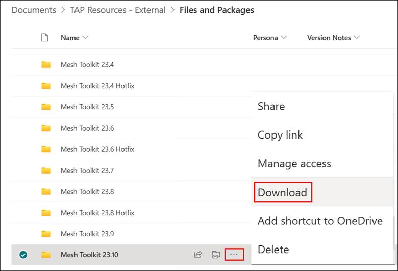
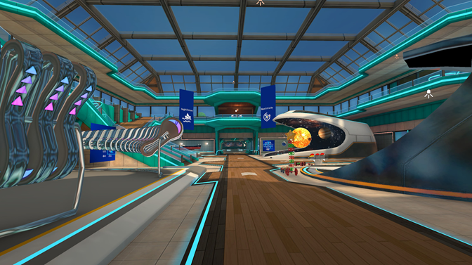

# Choose your journey

The Mesh experience that you create in Unity starts out as a new project
or existing sample; you can add content and then upload it to a world in
the Azure Portal as an *Environment*. When a user creates a Mesh event
for that world, they can choose to hold their event in the custom
Environment you created.

This document introduces you to the packages available for Mesh, walks
you through the Unity setup, and describes the samples provided by
Microsoft that you can use as a starting point for your Environment. The
document includes instructions on how to upload the Environment to a
world in the Azure Portal. We'll also touch on using custom Environments
for Event Production.

There are several ways to create Mesh Environments:

- Open and build upon an existing sample.

- Upgrade packages in a pre-existing Mesh project in Unity.

- Start a new project from scratch.

## Start with a Mesh sample

It's easiest to start with a sample file to ensure all packages are
configured in your Unity project. We recommend this option if you
haven't already created a Mesh project in Unity.

[]{#_Start_with_a .anchor}There are several samples to choose from:

- **Hello World.** A simple yet elegant small room with various
    paintings (powered by WebView) and objects that will set your Unity
    project up for basic Mesh development.

- **Scripted Worlds.** A simple Environment where you can see the
    power of scripted worlds and begin scripting in Mesh.

- **Dartroom.** A saloon-style room with a dart game to showcase
    interactive Mesh Physics features.

- **Science Building.** An expansive museum exhibiting the power of
    Mesh Physics to create dynamic, engaging experiences.

### Try our Mesh 101 tutorial

If you're new to Mesh and like the idea of learning through a
step-by-step tutorial, we recommend that you try our Mesh 101 tutorial.
It starts you off with a pre-built Unity project and then walks you
through the process of creating an educational windfarm experience.
You'll learn how to use Mesh scripting and physics to add interactivity,
and then you'll deploy the project as a metaverse Environment to your
Mesh World. To get started with the tutorial, see our document named
*Mesh 101 Tutorial.pdf*.

## Open and build upon an existing sample

The easiest way to set up your Unity project for Mesh development is to
start with a Sample. There are various samples that display an array of
Mesh features.

For more information, see the [Start with a Mesh sample](start-with-sample.md) article.

## Upgrade packages in a pre-existing Mesh project

If you already have a pre-existing Mesh project, you can upgrade the
packages and continue developing.

For more information, see the [Mesh Toolkit](install-tools-upgrade.md) article.

## Start from scratch

If you'd like to start from scratch and build from the ground up, create
a simple 3D URP (Core) project and then import the necessary packages.

For more information, see the [Create a new Unity project](create-new-mesh-project.md) article.

## Add more features to your Environment

Once you've created an Environment through the paths mentioned above,
you can add features including:

- [WebViews to display Web pages](../Developing%20for%20Mesh/Building%20your%20environment/webcontent.md)

- [Cloud scripting](../Developing%20for%20Mesh/Scripting%20your%20scene%20logic/cloud-scripting-overview.md), [visual scripting](../Developing%20for%20Mesh/Scripting%20your%20scene%20logic/visual-scripting-overview.md), and [Mesh Physics](../Developing%20for%20Mesh/Building%20your%20environment/physics-interactions.md) to add interactivity

- And more!

## Unity version 2021.3.21f1+

Unity version 2021.3.21f1+ is suggested for this tutorial. Later
versions will work, but you may see errors which can be bypassed.

{width="3.49in" height="1.0in"}

[Get help installing Unity Template](https://docs.unity3d.com/hub/manual/InstallEditors.html)

Your installation should include modules for Android and Windows. When
you create a new project, we recommend using the URP 3D Core template.

## Intermediate to advanced Unity skills

This document assumes you have intermediate to advanced Unity skills and
are familiar with the fundamentals of Unity.

*We can't guarantee that all steps will work as expected due to your
unique Unity and computer configuration. There may be extra work needed
on your end to triage errors or issues.*

[Learn Unity & Review fundamentals](https://learn.unity.com/)

## Azure portal access or Content Contributor permissions

To upload an Environment to a Mesh world, there are two things that must
be enabled for your work account.

1. **Mesh world already created.** There must be a Mesh world to upload
    to from Unity. If there isn't one, your Azure Admin or Mesh world
    resource owner should make one for you. **\
    \
    ***For more information, see the document named "Mesh IT Admin
    Guide" and its section named "Creating a Mesh world."*

2. **Content Contributor role.** Your Azure Admin or Mesh world owner
    must add your work account as a content contributor for each Mesh
    world you want to upload an Environment to.\
    \
    *For more info, see [Becoming a Content
    Contributor](#become-a-content-contributor).*

# Download the Mesh Toolkit

The Mesh Toolkit holds all packages and samples, as detailed in the
[Package Overview](#package-overview). Once downloaded and unzipped,
import the packages to your new project.

**Note**: Setting up a new project or updating an existing one both have
the same steps for adding packages.

1. In your browser, navigate to the **Microsoft Mesh EAP Onboarding
    Resources** website:

[Microsoft Mesh EAP Onboarding Resources - Home
(sharepoint.com)](https://microsoft.sharepoint.com/teams/MicrosoftMeshEAPOnboardingResources/?OR=Teams-HL&CT=1660599435162&clickparams=eyJBcHBOYW1lIjoiVGVhbXMtRGVza3RvcCIsIkFwcFZlcnNpb24iOiIyNy8yMjA4MDcwMTAwMCIsIkhhc0ZlZGVyYXRlZFVzZXIiOmZhbHNlfQ%3D%3D)

2. On the main page, scroll down to the **Mesh Resources and Developer
    Tools** section, and then, under **Get the Files and Packages**,
    select the **Go** button.

    

3. On the **Files and Packages** page, download the latest version of
    the Mesh Toolkit---as of August 10, 2023, it's 23.10. Select the
    three-dot button and then select **Download**.

    

4. Place the downloaded zip file in a location where the file path
    won't be too long, such as the Windows desktop.

**Note**: The downloaded zip file's name may vary depending on your
computer setup.

5. Unzip the file, and then navigate through the unzipped folder
    hierarchy until you see folders named *Packages* and *Samples*.

    

# Start with a Mesh sample

It's easiest to start with a sample file to ensure all packages are
configured in your Unity project. We recommend this option if you
haven't already created a Mesh project in Unity.

[]{#_Start_with_a .anchor}There are several samples to choose from:

- **Hello World.** A simple yet elegant small room with various
    paintings (powered by WebView) and objects that will set your Unity
    project up for basic Mesh development.

- **Scripted Worlds.** A simple Environment where you can see the
    power of scripted worlds and begin scripting in Mesh.

- **Dartroom.** A saloon-style room with a dart game to showcase
    interactive Mesh Physics features.

- **Science Building.** An expansive museum exhibiting the power of
    Mesh Physics to create dynamic, engaging experiences.
    

## Next steps
Now's the time to choose your journey:

- [Open and build upon an existing sample](start-with-sample.md).

- [Upgrade packages in a pre-existing Mesh project in Unity.](install-tools-upgrade.md)

- [Start a new project from scratch.](create-new-mesh-project.md)
