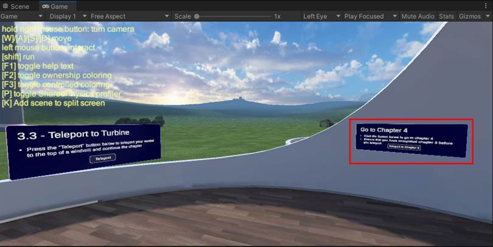
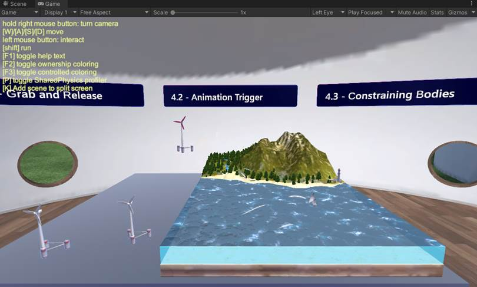
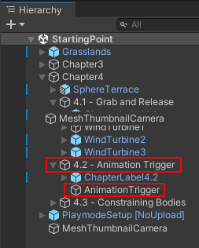
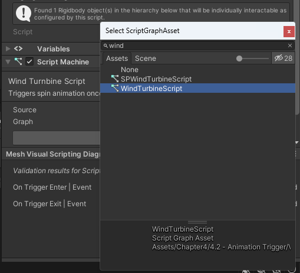
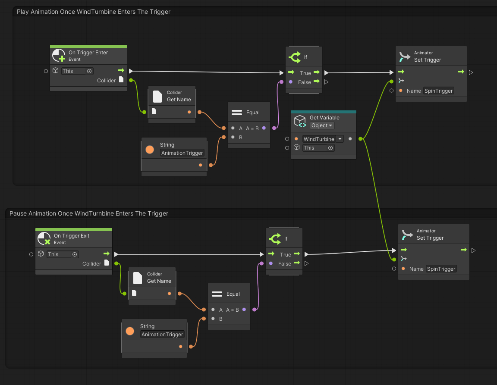
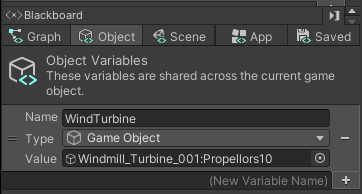
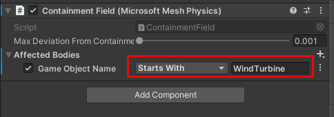

# Mesh 101 Tutorial Chapter 4: Move objects and trigger animations with Mesh Physics

In this chapter, you'll work with a model of the wind farm. You'll learn
how to use Mesh Physics to grab and release Rigid Bodies (in this case,
wind turbines) and set up an animation trigger using Visual Scripting. You'll wrap things up by
constraining the wind turbines so they can only be moved within a
specified area.

This chapter is a little more straightforward than what you did in
Chapter 3---there's no scripting, and all the networking is done for
you, which means that the physics will look the same to all avatars in
the session.

There are a couple of things we need to do before getting started with the first station.

### Reconfigure the Hierarchy

- In the **Hierarchy**, collapse the **Chapter3** GameObject and then
    expand the **Chapter4** GameObject.

### Change the view to display the Chapter 4 Sphere Terrace

In the experience in Mesh, the participant will move smoothly from the
end of Chapter 3 to the beginning of Chapter 4 and will be properly
located to begin the Chapter 4 learning activities. However, when you
exited Play mode at the end of Chapter 3, you were *not* automatically
placed with a view to the Chapter 4 model in the **Scene** window. Let's
set up that view.

1. In the **Hierarchy**, select the GameObject named **4.1 -- Grab and
    Release**.

    

1. Move the cursor over the **Scene** window and then press the F key
    on your keyboard.

This centers the view on the **4.1 -- Grab and Release** object, but you'll most likely not be in quite the position we need.

1. Drag, rotate and/or zoom the view until you see the model in front
    of you, as shown below.

    

### Station 4.1: Grab and Release

The goal for the participant in this chapter of the training is to move
wind turbines from the tabletop to the ocean. Once located there, the
turbines will catch the ocean wind, making their blades turn and
generating power.

1. In the **Hierarchy**, expand the **4.1 -- Grab and Release**
    GameObject. Note that it contains three Wind Turbine GameObjects
    that are located on the tabletop in the scene.

    

Let's add "grab and release" capabilities to **WindTurbine1** so that participants will be able to move it around in Mesh.

1. In the **Hierarchy**, select **WindTurbine1** -- in the
    **Scene** window, it's the one farthest in the back and has red
    blades.

    We want the avatar to be able to grab and manipulate this object.

1. In the **Inspector**, click the **Add Component** button and then search for and add **Mesh Interactable Properties**.

    

1. In the same component, select **Manipulable**.
1. Ensure that the component is active.
1. In the **Rigidbody** component, expand the **Constraints** option if
    needed, and then for the **Freeze Rotation** settings, select **X,**
    **Y**, and **Z**.

    

This will prevent the turbine moving tipping over if you place it on an
uneven surface.

#### Test your work

1. Save the project and then select the Unity Editor Play button.

    Note that whenever you enter Play mode, your starting point in the **Game** window is the Chapter 3 Sphere Terrace. We want to be in the other Sphere Terrace---the one for the Chapter 4 features. Fortunately, there's an easy way to get there.

2. Rotate the view to the right until you see the **Go to Chapter 4**
    information box.

    

3. Walk up to the information box and then select the **Teleport to
    Chapter 4** button.

    

4. After you arrive at the Chapter 4 Sphere Terrace, drag **WindTurbine1** until the cursor's shape changes, and then
    drag the turbine around the scene and drop it in the ocean.

    The turbine will stay upright as a result of turning on its *Freeze Rotation* constraints. Notice that the wind is blowing, but the turbine's blades don't turn. This is because we haven't triggered the blade-turning animation yet. We'll do that at the next station.

    

5. Click the Unity Editor Play button to exit Play mode.

You don't need to update the other two wind turbines---we've already
done that for you.

### Station: 4.2 Animation Trigger

The idea here is that when you drag a wind turbine over the ocean, the "wind" causes the turbine's blades to spin. What actually happens is that the **Animation Trigger** GameObject is located over the ocean and acts as a trigger volume. If you drag a wind turbine into the trigger volume, it sets off an "On Trigger Enter" event  that starts a spinning-blade animation.

1. In the **Hierarchy**, expand the **4.2 -- Animation Trigger** GameObject, and then select its child object named **Animation Trigger**.

    

1. In the **Inspector**, navigate to the **Box Collider** component and then select **Edit Collider**. This shows you the boundaries of the trigger volume in the **Scene** window. When you're finished, click **Edit Collider** again to hide the boundaries.

    

1. In the **Box Collider** component, select **Is Trigger**.

    

1. In the **Hierarchy**, navigate to **Chapter 4** > **4.1 - Grab and Release** and then select **WindTurbine1**.
1. Click the **Add Component** button, and then search for and add **Script Machine.**
1. In the **Script Machine** component, click the round button next to **Graph**, and then in the **Select ScriptGraphAsset** window, search for and select "WindTurbineScript".

    

1. Click the **Edit Graph** button to open the script graph. Note that there are no custom Mesh nodes here; it's all standard Unity.

    

Note that the **Get Object Variable** node, it lists a variable called "WindTurbine"--but we don't actually have that variable in the graph yet. Let's create it now.

1. In the **Blackboard** section of the **Script Graph**, select the **Object** tab.
1. Enter the variable name "WindTurbine" in the text box and then press the Enter key or click the + button.
1. For the **Type**, select "Game Object."
1. In the **Hierarchy**, navigate to the GameObject **Chapter 4** > **4.1 - Grab and Release** > **WindTurbine1** > **WindTurbineBody** > **Windmill_Turbine_001:Propellors10**.
1. Drag **Windmill_Turbine_001:Propellors10** from the **Hierarchy** and then drop it in the **Value** field for the *WindTurbine* Object variable.

    

#### Test your work

1. Save the project, and then press the Unity Editor Play button.

2. As noted earlier, entering Play mode places your avatar in the
    **Chapter3** Sphere Terrace. Rotate the scene to the right, and then
    walk over to the **Teleport to Chapter 4** button and press it.

    

3. Now in the **Chapter4** Sphere Terrace, drag **WindTurbine1**
    (reminder: it's the furthest one in the back, with the red blades) over the ocean. Note
    that the turbine's blades are now spinning.

    

4. When you've finished observing the animation, press the Unity Editor
    Play button to exit Play mode.

You don't have to update the other wind turbines---we've already done it for you.

### Station 4.3: Constraining Bodies

Right now, there's no constraint on where a participant can drop a wind
turbine. The goal is to place the turbines in the ocean so they catch
the wind, but a participant could, for example, accidentally drop a
turbine on the floor. We want to avoid this, so to ensure that the
turbines can only land on the tabletop or in the ocean, we can set up a
containment field. This is basically a transparent box---the turbines
will be restricted to the inside of the box.

1. In the **Hierarchy**, expand the **4.3 -- Constraining Bodies**
    GameObject and select its child object named **Containment Field**.

1. In the **Inspector**, select the **Add Component** button and then
    add the **Containment Field** component.

    

1. In the **Containment Field** component, select the "+" button to the
    right of the **Affected bodies** option, and then, in the popup
    menu, select the **Game Object Name** condition.

    

4. In the **Starts With** box, type "WindTurbine." Since all three wind
    turbines in our scene start with "WindTurbine," they'll all be
    restricted to the **Containment Field**.

    

### Test your work

1. Save the project, and then press the Unity Editor Play button.

1. As noted earlier, entering Play mode places your avatar in the
    **Chapter3** Sphere Terrace. Rotate the scene to the right, and then
    walk over to the **Teleport to Chapter 4** button and press it.

    

1. Now in the **Chapter4** Sphere Terrace, grab one of the wind
    turbines and drag it around in the scene. Try to drag it away from
    the tabletop and ocean and drop it on the floor. The containment
    field prevents you from doing so.

### Chapter 4: Summary

In this chapter, you added Mesh features that empower participants in
your experience to do the following:

- Grab and move an object

- Trigger an animation when the participant drags an object into a
    trigger volume

- Drop an object only in a particular area that you specified
