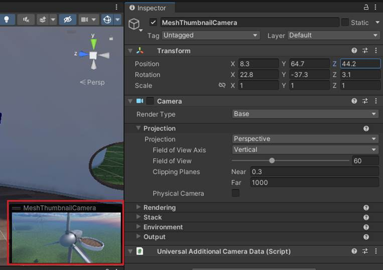

# Adding a Thumbnail Camera

Adding the Mesh Thumbnail Camera provides a thumbnail image that will be
added to your Environment listings in the Azure Portal and the Mesh app.
This comes in handy when you're selecting Environments in either place
because it gives you a visual reminder of what the Environment looks
like.

**To add the thumbnail camera to the scene and sets its view:**

1. In the **Scene** window, adjust the view so that it shows what you
    want to display in the thumbnail (the Thumbnail Camera's view will
    be based on the **Scene** view).

2. Select the "+" drop-down located below the **Hierarchy** tab, and
    then select **Mesh Toolkit Thumbnail Camera**.

3. To confirm that the view in the Thumbnail Camera is what you want,
    in the **Hierarchy**, select **MeshThumbnailCamera**. The Camera's
    view appears in a small window in the lower right of the **Scene**
    view.

    **Note**: If you decide you want a different view for the Thumbnail
    Camera, you can adjust it directly in the **Scene** view or change its
    **Position** and **Rotation** values in the **Inspector** prior to
    uploading your Environment to Mesh.

    There are no set rules for how your thumbnail should look---it's totally
    up to you. For the following example, we chose a close-up front view of
    a wind turbine.

    

## Next steps

   > [!div class="nextstepaction"]
   > [Build for single and multiple platforms](build-for-single-and-multiple-platforms.md)