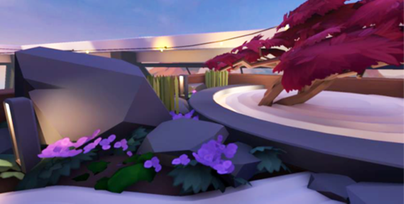

# Model textures

Using flat colors and a clean light bake instead of custom textures is a
very efficient and performant route to take for prop textures.

These props don't have custom textures, but instead rely on the
URP/Baked Lit shader's Base Map color value and a clean light bake.

Not using textures also eliminates texture artifacts like pixelization
and aliasing, which is a big boost to VR immersion.

When
a custom texture is used, like on these purple plants, green leaves, and
the red leaves of the tree, keeping the detail simple and clean goes a
long way towards hiding the textures' low resolution.

Tiling textures should be authored at 3x3 meter scale.

All tiling textures should be authored left to right.

## Unity model importer

Utilizing the Unity Importer for material management not only speeds up
iteration time, it also has a positive impact on performance. As of
Spring 2022, when the Importer lists the On Demand Remap slot as 'None
(Material)', Unity embeds the default URP/Lit material into the asset.

**Even one material set to 'None (Material)' has a performance cost.**

**Ensure that all slots have corresponding Unity materials loaded in, as
shown below.**

## Unity shaders

### Quick Links

- Universal Render Pipeline overview \| Universal RP \| 12.1.4
    (unity3d.com)

- Baked Lit Shader \| Universal RP \| 12.1.4 (unity3d.com)

- Complex Lit Shader \| Universal RP \| 12.1.4 (unity3d.com)

### Shaders

Microsoft Mesh utilizes the URP renderer. Unity has multiple built-in
URP shaders available to use.

+-----------------------------------+-----------------------------------+
| **For Android-focused projects**, | **For PC / High-end focused       |
| we only use the following:        | projects**, we recommend that you |
|                                   | use the following:                |
+===================================+===================================+
| -   **URP/BakedLit**              | -   **URP/ComplexLit (if advanced |
|                                   |     materials are need)**         |
| -   **URP/Unlit**                 |                                   |
+-----------------------------------+-----------------------------------+

### Resources for Unity shaders

**Complex Lit Shader:** [Complex Lit Shader \| Universal RP \| 10.2.2
(unity3d.com)](https://docs.unity3d.com/Packages/com.unity.render-pipelines.universal@10.2/manual/shader-complex-lit.html)

### Shader graph

Unity Shader Graph is okay to use; however, performance could be
negatively impacted if the custom shader isn't properly optimized. **For
Android projects:** we highly recommend that you stick to \~30 math
operations in vertex, \~120 math operations in fragment, and \~2 texture
look ups..

### Shader Features

Most shader and renderer features are available to every platform, but
some platforms disable features for performance considerations.

  -----------------------------------------------------------------------
                                **Android**       **PC**
  ----------------------------- ----------------- -----------------------
  **\_CameraDepthTexture**      ❌                ❌

  **\_CameraColorTexture**      ❌                ❌

  **HDR**                       ❌                ❌

  **MSAA**                      2x                2x

  **Reflection Probe Blending** ❌                ✔

  **Post Processing**           ❌                ❌
  -----------------------------------------------------------------------

When unsure if a setting is enabled or disabled for a platform you are
developing for, reference the URP assets contained within the Mesh
Toolkit Uploader's URP folder:

Note, that altering render pipeline settings or adding renderers is not
supported.
