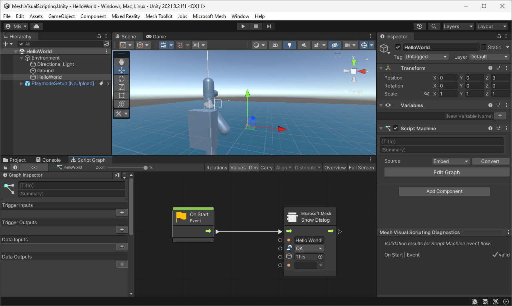
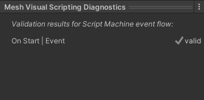
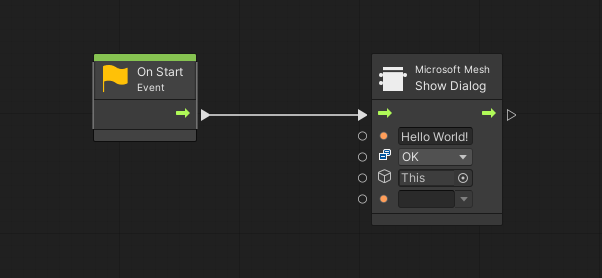
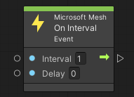
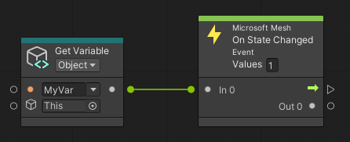

# Mesh Visual Scripting

## Overview

Read an [overview of Mesh Cloud Scripting and Mesh Visual Scripting](mesh-scripting-overview.md)

If you're brand new to Mesh Visual Scripting, we recommend one or both of the following:

- Go through [Unity's Visual Scripting tutorial](https://learn.unity.com/project/introduction-to-visual-scripting). This teaches you most if not all of the concepts you need to get started with Mesh Visual Scripting.

- Go through our [Mesh 101 tutorial](../../getting-started/mesh-101-tutorial/mesh-101-01-overview-and-setup.md). Chapter 3 of the tutorial give you hands-on experience setting up three Mesh features using Visual scripting. The tutorial lists a prerequisite that you already have some Unity Visual Scripting knowledge; however, we've gotten feedback that some beginners have found the instructions easy to follow. If you go through the Unity tutorial linked above, this should prepare you sufficiently for the tutorial.

Otherwise, there's no special setup needed&#8212;you can just start scripting!

**Tips**

- Component properties and visual script variables that have simple types are automatically shared across clients in a session.
- To exclude parts of your scene from this automatic sharing, add a **Local Scene Scope** component. Everything underneath that transform won't be shared automatically.
- To do something in regular time intervals in sync across clients, use the **On Interval** trigger node.
- To do something in response to certain component properties or visual script variables changing (for example, because this or some other client was setting them in a visual script), use the **On State Changed** trigger
- There are additional Visual Scripting functions provided by Mesh&#8212;see the _Microsoft_ > _Mesh_ and _Microsoft_ > _Events_ > _Mesh_ sections in the Fuzzy Finder.

**Limitations**

- Only a subset of Unity functionality is exposed to visual scripts.
- Variables and properties with non-simple types (including object references) aren't automatically shared. See [Sharing and networking](#sharing-and-networking) below to learn more about this.

## Development workflow

### Testing your scripts

Before you upload your scene to Mesh, you can develop and test visual scripts, even with multiple clients in split screen mode, in Mesh Playmode.

### Visual script diagnostics in the Editor

When a GameObject with a Script Machine is selected in the transform hierarchy, Mesh displays the _Mesh Visual Scripting Diagnostics_ panel at the bottom of the Inspector panel:

The diagnostics panel gives immediate feedback on any warnings or errors that might prevent your scripts from working well in Mesh.

**_Current limitation:_** Future versions of the diagnostics panel may also give insight into the visual script's use of shared variables and properties and display additional diagnostics and warnings.

### Uploading to Mesh

Use the _Mesh Uploader_ to upload scenes that contain visual scripts. To open the Uploader, on the **Mesh Toolkit** menu, select **Environments**.

**Note**: Mesh Uploader validates visual scripts before upload and refuses to upload when there are any validation errors in any visual scripts. Detailed diagnostics are output to the **Console**.

## Sharing and networking

### Shared and local script state

Mesh uses Unity Visual Scripting, which is designed to work without networking. Visual scripts run on each client independently. However, the users' Mesh experience is shared; all users experience a single shared scene that looks the same on all clients.

The effect of a visual script's execution is how it changes the scene's state.

By default, Mesh automatically replicates scene changes done by visual scripts on one client to all other clients. Aside from everything that's shared in a scene, some state remains independent on each client (in other words, local).

Local changes temporarily take precedence over changes coming in from clients. Example: If you keep animating an object locally, your local animation isn't compromised by changes coming in from other clients.

There's some automatic update rate limiting. A client doesn't send additional updates while one is still in flight; there's one update sent per roundtrip through the server. This amounts to approximately five to six updates per second in practical situations. This means that a smooth animation driven by one client won't look smooth on other clients. The best practice is to do smooth animations locally, ideally not through visual scripts but through the normal Unity animation system.

Eventual consistency of shared state is guaranteed (even if clients' states can temporarily be different).

Local state:

- Natural local state – sounds, UI, rendering.
- User-controlled local state – sub-scenes marked with the **Local Script Scope** component.
- Technical local state – objects that aren't part of the scene hierarchy (for example, renderer materials, assets).

Shared state:

- Limited to visual script variables and the properties of GameObjects and scene components that are part of the scene hierarchy.
- Only variables and properties of simple types can be replicated: integers, floating-point numbers, booleans, strings, `Color`, `Vector2`/`3`/`4`, `Quaternion`, `Matrix4x4`, and `Rect`.

Any change to shared state is sent over the network. This increases network traffic and, if used carelessly, can consume significant bandwidth.

### Shared and local script triggers

All visual script flows start in response to an event.

- If the event originates on a single client (for example, the user clicks a button), the visual script executes only on that client.
- If the event occurs on all clients, the visual script executes on all clients (for example, timer event, shared property change, shared variable update, avatar enters trigger, physics body touches collider).

If a local script sets a shared variable and a second script listens to changes to this variable (using the **On State Changed** trigger; see below), the second script will be executed on all clients.

Mesh offers some special script nodes:

- **On Interval** triggers at regular intervals synchronously on all clients.
- **On State Changed** triggers when its inputs change (for example, shared properties, shared variables, local).
- **Show Dialog** displays a message dialog with custom text that may optionally provide buttons as response options.

Mesh makes certain trade-offs in favor of simplicity:

- If more than one client tries to change the same data, the last client wins (instead of using a transaction-based data update model).
- To ensure data consistency, visual scripts that run on all clients must not read and then write shared properties or variables. If this occurs, it triggers a runtime error and aborts the script flow's execution.

## Hello World

The simplest visual script you can create is one that just opens a message box:

This is how it looks in Mesh:

## Mesh script nodes

### On Interval

The **On Interval** event node triggers a script flow in regular time intervals synchronized across all clients in the same room.

- **Interval**: Interval (in seconds) between events.
- **Delay**: Delay (in seconds) before the first event. You can use this to interleave events with the same **Interval** triggered by different **On Interval** nodes.

### On State Changed

The **On State Changed** event node triggers when any of its inputs changes its value. This is a powerful mechanism that lets your scripts respond to state changes caused by user interaction or other visual scripts, both locally and on other clients in the same room.

- **Values**: Specifies how many input ports you would like to observe. Up to 10 input ports can be observed simultaneously. **On State Change** triggers when any of them changes its value.
- **In 0**, **In 1**, and more in this sequence: Inputs observed for state changes. You can attach any data node to these inputs: **Get Variable** or any component property (instance or static).
- **Out 0**, **Out 1**, and more in this sequence: Outputs corresponding to the **In 0** (and so on) inputs that return the observed values.

When observing script variables or component properties, **On State Changed** usually operates by registering appropriate callbacks internally, avoiding the need to constantly re-evaluate its inputs. When an appropriate callback isn't available, like in the following example, the **On State Changed** node turns red and the _Graph Inspector_ panel warns that the input can't be observed efficiently and is therefore disabled:

In this case, you can select **Allow Polling** in the _Graph Inspector_ panel to force **On State Changed** to detect changes by constantly re-evaluating its inputs. The node retains a yellow bar along its top to remind you that it's observing an input at an increased runtime cost.

### Show Dialog

The **Show Dialog** node displays a dialog box with custom message and one or several buttons that allow the user to dismiss the dialog.

- **Text**: Message shown in the dialog box. The message text will be word-wrapped if necessary.
- **Buttons**: Selection of buttons to present to the user. The following buttons can be shown: _OK_, _Cancel_, _Yes_, _No_, _Confirm_, _Next_, _Retry_, _Continue_, _Leave_.
- **Result**: Variable name to store the user's response in when they dismiss the dialog by selecting a button. (If left empty, the response is discarded.)
- **Target**: GameObject with a **Variables** component to store the user's response.

If a **Result** variable is defined, it will be reset to an empty string as soon as the **Show Dialog** node is entered, and set to user's response asynchronously when the user selects a button to dismiss the dialog. The stored value is the button's unlocalized label from the list above. Use an **On State Changed** event node to react to the user's response like in the following example:

The **Result** variable can be local or shared. If it's shared, the user's response is sent to all clients in the same room, and the **On State Changed** event node triggers on all clients to react to the user's response.

## Security

Mesh protects users from threat scenarios such as these:

- Compromised scene content&#8212;for example, malicious attempts to access sensitive local data.
- Compromised client or transport channel&#8212;for example, malicious attempts to read or write inaccessible remote data on other clients.

To achieve this, Mesh runs visual scripts in a sandbox (like JavaScript in a web browser).

At scene startup, Mesh uses a curated allowlist to validate visual scripts to limit access to certain types of Unity components and a safe subset of their properties.

At scene runtime, Mesh limits access to certain parts of the scene:

- Locally: by preventing access to Mesh internals and other sensitive data.
- Remotely: by checking that the scene's author intends this part of the scene to be modified. This is done by statically analyzing visual scripts on the receiver's side for their potential scene writes.

Examples:

- A malicious local visual script wants to give all avatars bobble heads. To that end, it attempts to scan the entire scene for GameObjects that represent avatar heads. Mesh automatically filters the scanning results to exclude the avatar system.
- A malicious remote client wants to deface the scene by flipping all GameObjects upside down. To achieve that, it sends a property update that sets the vertical scale of each GameObject in the scene. However, since no visual script on the receiving client is designed to do anything like that, the local client ignores the remote input.

## Mesh integration

**_Current limitation:_** This section describes a preview of features that are still works in progress.

Generally, integration with other components is often done by changing and listening to component property changes. For example:

- Interactables: observe "Is Hovered" and "Is Active" properties.
- Avatars: read avatar position, view rotation, and name plate.
- Physics interactions: observe bodies in trigger volume or in contact with collider.
- Session state: list participants and read participant info.
- Cloud Scripting: operate in tandem with cloud scripts that can read and write variables and component properties.

Some components provide local actions:

- Audio Manager
- Timeline
- Animators
- Rendering: read and write material and shader properties

Physics is handled specially because simulation for any given physics object is always authoritatively done by one client only: its owner. To make this work, setting physics properties triggers an automatic ownership transfer to the client that applies the change.

## Best practices

Visual scripts are significantly slower than native C# code. In addition, Mesh augments visual scripts with network and other integration features, and seemingly low-overhead visual script actions may result in network traffic.

Performance issues in visual scripts are almost always caused by the scripts doing high-frequency updates of variables or component properties that are shared by default.

- Do use **Local Script Scope** components liberally to make sure only variables and component properties that _need_ to be synchronized across clients incur networking overhead. Anything animated locally with a visual script should not be shared.

- Do use the **On State Changed** script trigger to start script flows in response to changing variables or component properties. This works both for local and shared state. It's also the recommended way to synchronize local animations.

- Do use the **On Interval** script trigger instead of a high-frequency trigger like **On Update** to start script flows in controllable, regular intervals.

Things to be aware of:

- Avoid triggering visual scripts every frame (for example, **On Update**). Instead, use **On State Changed** or **On Interval** if possible.

- Avoid triggering visual scripts every frame on many objects.

- Don't update shared properties at high frequency. Instead, consider making high-frequency updated properties local by using the **Local Script Scope** component. Remember that visual script variables are also shared by default!

- Don't use object variables if flow variables would work.

- Avoid updating shared properties or variables in visual scripts that are triggered simultaneously on all clients.

- Avoid setting physics properties (transform and velocity) on the same physics body on multiple clients at the same time. This can easily happen by accident in visual scripts that respond to shared scene change triggers.

- Don't try to fix performance problems by consolidating several script flows that work on individual objects into a single script flow that works on many objects. The overhead of starting a script flow is negligible, and the added complexity you have to add to consolidate your script may very well negate any slight performance benefit you might get from reducing the number of ScriptMachines.

## Next steps

> [!div class="nextstepaction"]
> [Debug & optimize performance](../debug-and-optimize-performance/performance-guidelines.md)
