# Web Content Overview

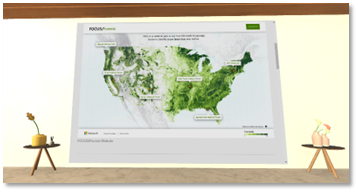

Use WebSlate to display web content into your 3D Mesh Environment. Get a full browsing experience on PC or Quest 2 with intuitive input, customizability, security, and performance management. With WebSlates you can:

- Display rich web content

- Configure display brightness

- Experience built-in input across devices without extra work to enable it

- Drag-and-drop prefabs to show simple WebSlates or add scripted interactivity

- Manually authenticate to access secure content from within the experience

- Secure experiences with disabled local file access and cleared cookies, cache, and session state during initialization

In the Mesh Toolkit, the WebSlate prefab contains a URL parameter that developers can specify to control the content displayed in their Mesh Environment. Web slate can display Web pages and supports interaction but does not function as a browser and does not support bookmark, history or travel back-forth. Envision using WebSlates in your custom environments for:

- Viewing dashboards, web pages, photos, and videos

- Showcasing content that highlights products and services, demonstrating expertise, customer stories, and brand identity

- Interacting with maps, diagrams, and data

To experience a WebSlate showcase within a Unity scene, see the *HelloWorld-Unity.zip* sample on the EAP SharePoint site.

## Requirements/Dependencies

WebSlate depends on the *Unity.InputSystem* and *Unity.XR.Interaction.Toolkit* Unity packages, located in the Mesh Authoring package.

## Features

WebSlate loads an interactive page via a provided URL. The URL given to it in the Environment will be the same one loaded in Mesh. WebSlate offers the following features:

- When loaded on the Mesh App for PC and Quest, Web pages loaded by the WebSlate are interactable through mouse, keyboard, and Quest XR controller input.

- The size and shape of the WebSlate will match that of the quad GameObject on which it is placed, typically this is the quad baked inside of the prefab from the Mesh Authoring package.

- Multiple WebSlates can be added to a scene. The number of users in your Mesh Environment does not affect WebSlate performance, as WebSlate resources are initialized locally on the user's machine.

- Configure WebSlates with visual or cloud scripting to add interactive behaviors and synchronization across users.

- You can preview your WebSlate before uploading your scene to Mesh by hitting play in the Unity editor on your Environment project.

## Default Settings

By default, the WebSlate loads the preset URL. The URL should be replaced with a desired one on each WebSlate in use. The brightness parameter is set to 1.0 (100% of the browser's brightness).

## General Tips

- While WebSlate can be placed on Game Objects other than a Quad by adding *WebSlate.cs* as a script component directly to your 3D object of choice, visual texture stretching, inversion, and/or rotation may be seen.

### Performance

- As a WebSlate is a loaded Web page, it is important to consider performance implications:

  - Scenes are typically performant at 60fps with up to 10 WebSlates. Framerate and general performance degradation may be observed in proportion to the number of WebSlates placed in a scene, regardless of content.

  - While content is loaded and executed in the WebSlate on a thread separate to the scene's update and rendering thread(s) (and is therefore unlikely to directly affect framerate), it's still important to consider the cost of JavaScript running on a Web page both in terms of runtime complexity and memory usage.

- Since WebSlates don't have any external navigation UI by default, the best practice is to only load custom URLs, where the site navigation is cyclic and can be done inside the page. This can be done with a navigation sidebar, or links to a hub page, for example.

- The Content Performance Analyzer (CPA) tool includes a WebSlate analyzer which measures the average time it takes Unity's render pipeline to render WebSlates in a frame.
  - Measurements are based on Unity's profiler recorder and requires playmode. The analyzer moves the camera over each WebSlate to collect sufficient profiler samples and calculates the average render time.

  - This provides a first-stage, high-level analysis of WebSlate render times in the context of Unity's render pipeline (it does not provide the frame rate of the WebSlate content itself).
  
  - If Unity's render pipeline exceeds the threshold to render WebSlates (currently 10ms), the CPA tool provides a warning.
  
  - The same measurements are also available to the Visual Profiler. The group on the Visual Profiler typically changes colors from green to red when the budget allowance for a category is surpassed. For now, the WebSlate group only shows as green until a reasonable render time budget is rationalized for WebSlates.

  

## Limitations/Issues

### Known issues

- When working with WebSlate in the Unity editor, the editor needs to be restarted when updating the WebSlate or Mesh Toolkit packages through the Unity package manager.
- The "Current URL" field of a WebSlate currently cannot be updated during Play mode.
- If your WebSlate game object displays an "internal shader error", navigate to the Inspector view of your WebSlate and ensure that the selected shader is set to "UnlitWebSlate".
- Visual scripting has WebSlate support. If your visual scripting graph shows references to the legacy “WebView” type, manually update this reference to “WebSlate”.

### General limitations

- WebSlates are currently supported in the Mesh App on PC Standalone, Quest 2, and for previewing in the Unity editor on Windows only.

- We are still working on automatic scaling and scale adjustments for content with different resolution requirements.

### Security restrictions

- WebSlates are locked to the URLs they navigate to, preventing malicious redirects. All unintended hyperlink navigations to outside domains are blocked.

- WebSlates are restricted to navigation within the initial domain or the specified URL's and server\'s redirections.

- Navigation within WebSlate is exclusively limited to HTTPS.

- Device access to webcam, microphone, and geolocation are blocked.

### Windows / PC Standalone

- When interacting with a WebSlate, Mesh may capture keyboard input causing unintended interactions with the Mesh app.

## Start with a sample

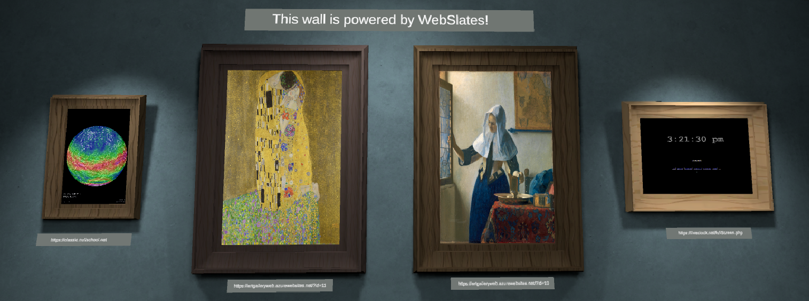

Did you know we have pre-made Mesh Environments that you can download and use in Unity?

Check out the **Room Blue** scene in the **HelloWorld** sample! There you can see WebSlates like this one and much more.

## Add a WebSlate to your Mesh Environment

Adding a WebSlate to your Environment should be a relatively straightforward process so long as you have a Unity project set up to create Mesh Environments or artifacts.

### Prerequisites

- Understand project setup in Unity covered in the E2E Environment Creation Guide.

- A username and password for the Azure Portal so you can upload your work.

- Your account must be added as a Content Contributor in the Mesh World you're trying to publish to. If you're unsure about this, check with your IT admin. There's more information about this in the next section.

- There must be an existing World that contains a Space in the Azure Portal that you can upload your work to. To learn more about setting this up, see our document titled "Custom Worlds -- IT Admin User Guide.

### Import the Mesh Toolkit Packages

If you haven't already imported the Mesh Toolkit, import it:

**com.microsoft.mesh.toolkit-X.X.X.tgz**

### Add a WebSlate prefab to your Unity project

There are two flavors of WebSlate prefabs available in the Mesh Toolkit that you can add to your scene. If you would like a WebSlate contained in a stylized frame with extra functionalities, you can use the WebSlateFramed prefab. Otherwise, if you would prefer a clean WebSlate with no extra components, you can use the WebSlate prefab.

#### Using Mesh Toolkit Context Menu (Recommended)

To include either of the prefabs to your scene, right-click the scene hierarchy, navigate to "Mesh Toolkit," and then click "WebSlate"/"WebSlateFrame". You can also click the "+" button at the top left of the hierarchy window to see the same menu. Once you've added a WebSlate, add a URL to display content in Mesh.

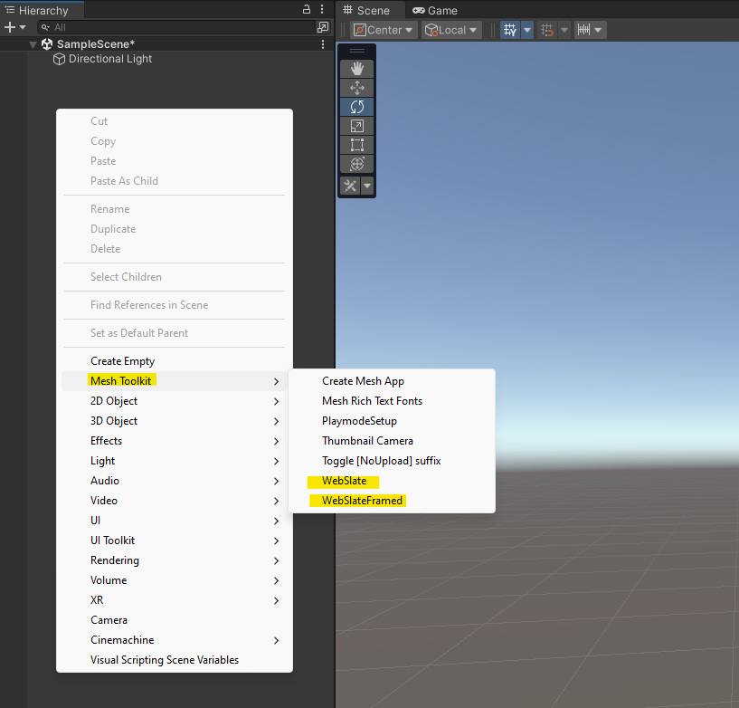

#### Using Mesh Toolkit Package

You can also find the WebSlate manually by navigating or searching for it inside the Mesh Toolkit package. Search for "WebSlate" in your project, and make sure you're searching inside "Microsoft Mesh Toolkit":

Drag and drop the prefab into your scene, then add a URL to display on the WebSlate:

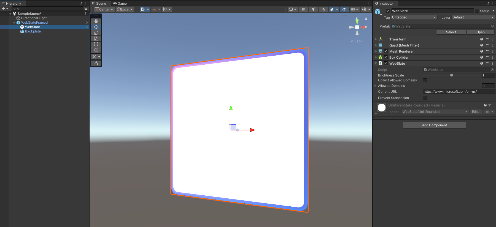

# Preview WebSlate in Unity Play Mode

To view a URL displayed in your WebSlate more quickly, you can use Unity Play Mode. Aside from using the Play Mode, the only other way to see your WebSlate is to upload it using the Mesh Toolkit Uploader and view it in a Mesh experience.

In the Inspector window, add a URL to the WebSlate (Script) via the Current URL property:

Press the Unity editor Play button to view your Web page:

## Enable WebSlate interaction for Unity Play Mode

To enable interaction in the WebSlate, you have to set up a few things.

1. Right-click in the scene hierarchy, navigate to "Mesh Toolkit," and then click "PlayModeSetup".

    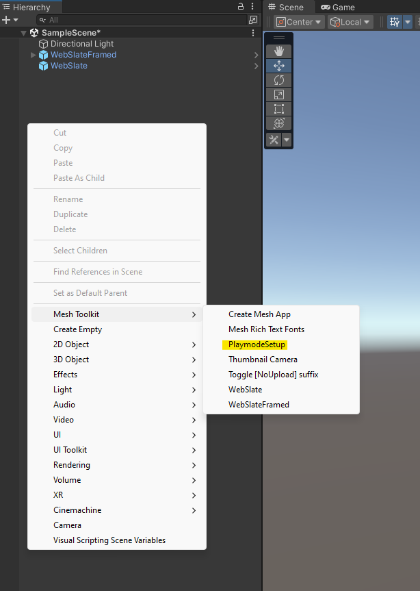

    Ensure you see it in your scene, as shown here:

    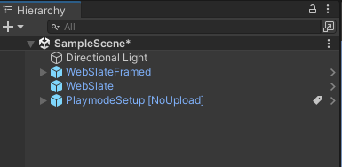

2. Create a new **Plane** GameObject. This will be your floor. Ensure the Game Object is positioned at the origin (0,0,0):
    
    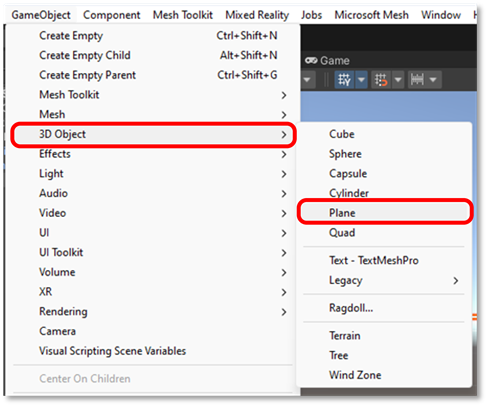

3. Position the WebSlate so it sits in front of the PlaymodeSetup character:

    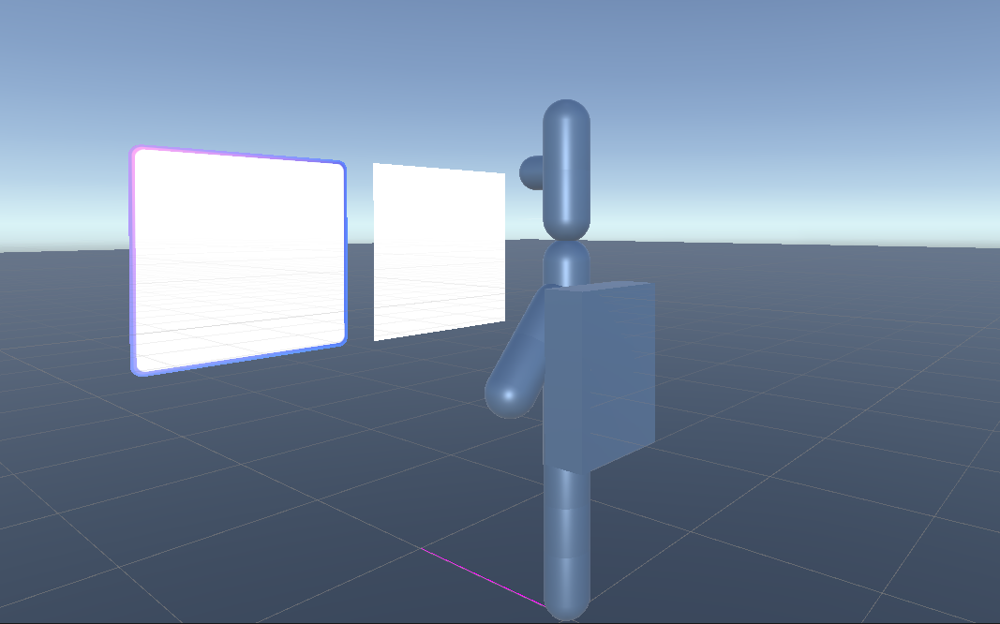

4. Click the play button, and double click to interact with the Web page displayed in the WebSlate:

    

**Great job! You added a custom WebSlate to your Unity scene and tested the interaction in Unity Play Mode.**

**Now you're ready to upload the Environment to Mesh and share your creation with the world!**

# WebSlate domain allow-list

To ensure security against unintended URL-based attack vectors such as phishing, WebSlates by default restrict navigation to the URL's that are included under the domain of the first page loaded into the WebSlate. For example, a WebSlate launched on https://www.microsoft.com/ will only navigate to pages whose URL's start with \"www.microsoft.com\".

While this ensures that users will not accidentally diverge from the intended navigation flow, it can be an overly restrictive default for some use-cases, such as user authentication, during which there may be redirections to subdomains or third-party authentication providers.

The way to accomodate for these use-cases is by adding domains to the WebSlate's allow-list.

## Automatically add domains (recommended)

When working with WebSlates in the Unity editor, you have the option of enabling \"Collect Allowed Domains,\" which will remove the domain navigation restriction so that you can navigate freely when running in playmode to test your scenario.

While you navigate in playmode, the WebSlate will log the domains you visit in the background. 

In this case, we're expanding navigation from *microsoft.com* to also include *learn.microsoft.com*.

Once you exit playmode, you will find an asset called *\"WebViewAllowedDomains.asset\"* in your top-level *Assets* folder.

Clicking on this asset will give you the list of extra domains you visited, beyond the domain of your initial URL. You can right click, copy, and then paste the values into the \"Allowed Domains\" field of the WebSlate component.

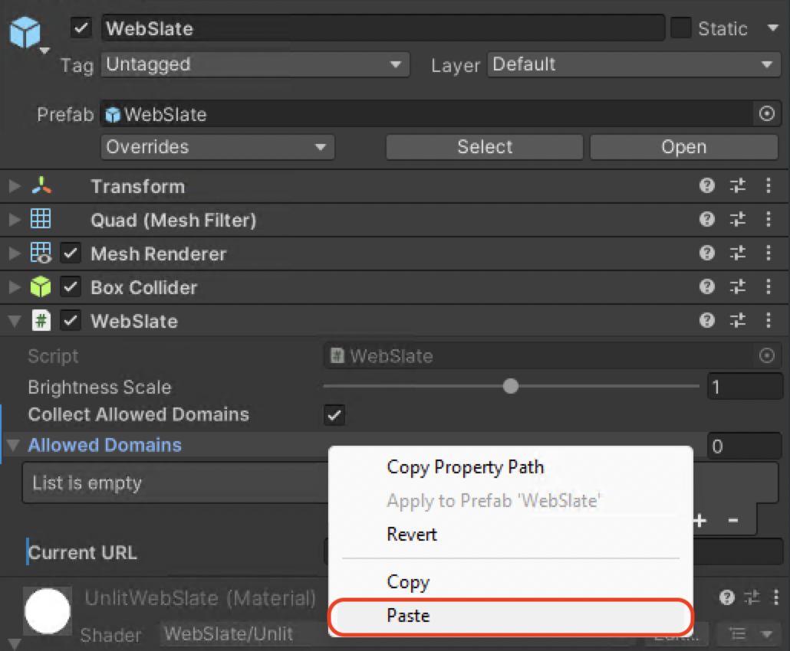

**Note that this option is impossible to enable in uploaded scenes. Leaving the \"Collect Allowed Domains\" enabled will NOT remove the restriction in your final scene. However, your allowed domains list will persist and will allow navigation, as long as the domains are added to the WebSlate.**

## Manually add domains

If you already know which domains you will need, you can manually add them to the WebSlate by expanding the \"Allowed Domains\" drop-down and adding your supplemental domains to the list in the Unity GUI.

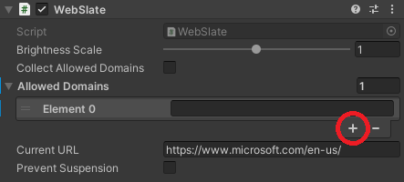

# WebSlate in Visual Scripting

Visual Scripting offers a \"no-code\" approach to adding behavior to a scene. This means that developers can now implement WebSlate functionality and behavior without the need for traditional programming. Instead, a visual interface is provided, enabling users to define and connect various actions and events in a scene. This simplifies the process of adding interactivity and behavior, making it accessible to individuals without extensive programming knowledge or experience.

To enable visual scripting using WebSlate, you must set up a few things.

1. Go to **Edit** \> **Project Settings**.

2. Select **Visual Scripting**.\
    

3. Expand **Node Library**.

4. At the end of the assemblies list, select **Add** (+).

5. In the new assembly entry, select **(No Assembly)** to open the **Assembly** menu.

6. Select **Microsoft.Mesh.WebSlate** from the **Assembly** menu\
    

    Visual Scripting adds the **Microsoft.Mesh.WebSlate** and its nodes to the Node Library. To use the nodes in your project, add **WebSlate** type to your Type Options and regenerate the Node Library.

    

    After incorporating the WebSlate visual scripting node into your project, you can utilize it just like any other node in your visual script graph. Here\'s an example of a script graph that loads a new URL in WebSlate when the state of a graph variable changes.

    

# WebSlate in Mesh Scripting

Developers now can add a WebSlate to their scripted worlds. This means that a WebSlate can be navigated through a MeshApp script and therefore synchronized across users. For example, create an app containing a WebSlate node and one or more TouchSensor nodes. Then, you can set up your TouchSensor's click event handler to navigate the WebSlate to a different URL. By adding a Mesh App script to WebSlate, your users now can update the WebSlate contents interactively.

Refer to the [Visual scripting overview](../Scripting%20your%20scene%20logic/visual-scripting-overview.md) for further guidance on the WebSlate node in Mesh Apps.

# Feedback for web content in Mesh

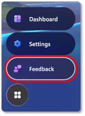

We love feedback and bug reports! If you'd like to provide feedback, use the Feedback button inside any Mesh experience. This ensures that your feedback and bug reporting will be triaged and incorporated quickly.

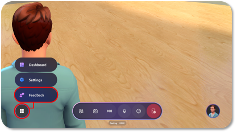

For WebSlate feedback, include "**\[web content\]**" or **a mention of WebSlate** in your feedback.

If you're not able to give feedback or report bugs using the Feedback button in Mesh, use the Teams chats with your Microsoft partners, or contact your Microsoft partners directly.
