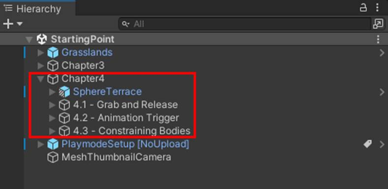
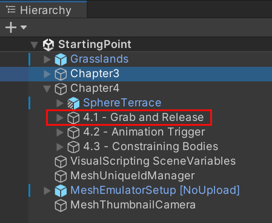
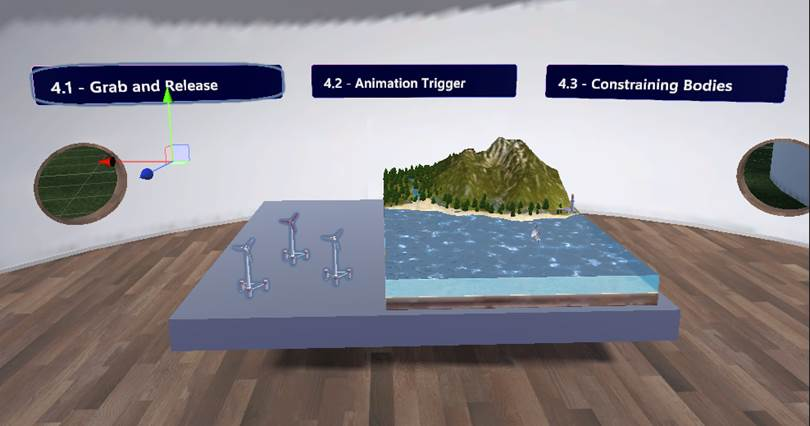
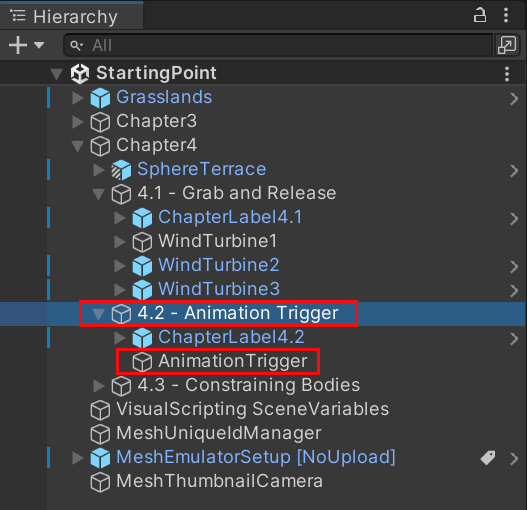
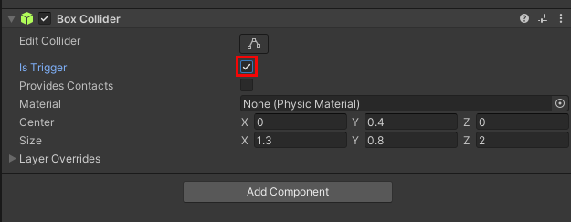
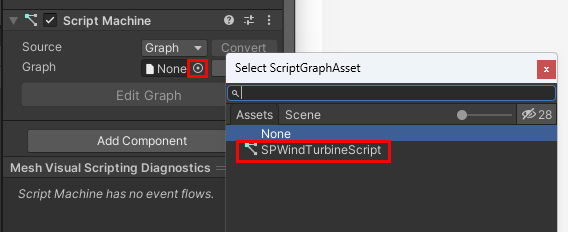
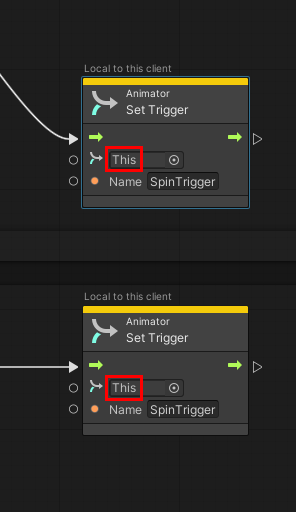
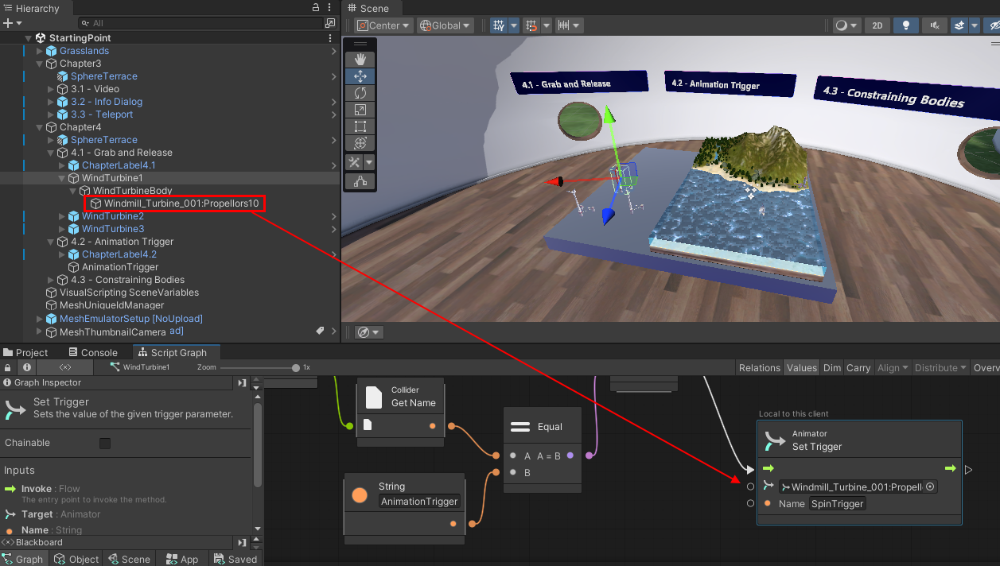
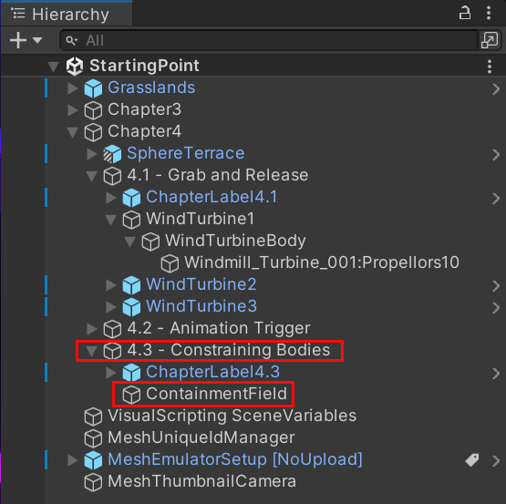
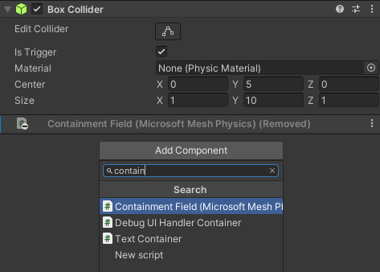

# Mesh 101 Tutorial Chapter 4: Move objects and trigger animations with Mesh Physics

In this chapter, you'll work with a model of the wind farm. You'll learn
how to use Mesh Physics to grab and release Rigid Bodies (in this case,
wind turbines) and set up an animation trigger using Visual Scripting. You'll wrap things up by
constraining the wind turbines so they can only be moved within a
specified area.

This chapter is a little more straightforward than what you did in
Chapter 3---there's no scripting, and the networking is set up so that the physics will look the same to all avatars in
the session.

There are a couple of things we need to do before getting started with the first station.

## Reconfigure the Hierarchy

- In the **Hierarchy**, collapse the **Chapter3** GameObject and then
    expand the **Chapter4** GameObject.

## Change the view to display the Chapter 4 Sphere Terrace

In the experience in Mesh, the participant will move smoothly from the
end of Chapter 3 to the beginning of Chapter 4 and will be properly
located to begin the Chapter 4 learning activities. However, when you
exited Play mode at the end of Chapter 3, you were *not* automatically
placed with a view to the Chapter 4 model in the **Scene** window. Let's
set up that view.

1. In the **Hierarchy**, select the GameObject named **4.1 -- Grab and Release**.

    

1. Move the cursor over the **Scene** window and then press the F key
    on your keyboard.

    This centers the view on the **4.1 -- Grab and Release** object, but you'll most likely not be in quite the position we need.

1. Drag, rotate and/or zoom the view until you see the Chapter 4 stations in front
    of you, as shown below.

    

## Station 4.1: Grab and Release

The goal for the participant in this chapter of the training is to move
wind turbines from the tabletop to the ocean. Once located there, the
turbines will catch the ocean wind, making their blades turn and
generate power.

1. In the **Hierarchy**, expand the **4.1 -- Grab and Release**
    GameObject. Note that it contains three Wind Turbine GameObjects
    that are located on the tabletop in the scene.

    

Let's add "grab and release" capabilities to **WindTurbine1** so that participants will be able to move it around in Mesh.

1. In the **Hierarchy**, select **WindTurbine1**.
1. In the **Inspector**, click the **Add Component** button and then search for and add **Mesh Interactable Setup**.

    

> [!TIP]
> An explanation of this component was given in [Chapter 3](mesh-101-03-visual-scripting.md) of this tutorial.

1. In the same component, select **Manipulable**.
1. Ensure that the component is active.
1. In the **Rigidbody** component, expand the **Constraints** option if
    needed, and then for the **Freeze Rotation** settings, select **X,**
    **Y**, and **Z**.

    

This will prevent the turbine from tipping over if you place it on an
uneven surface.

### Test your work

1. Save the project and then select the Unity Editor Play button.

    Note that whenever you enter Play mode, your starting point in the **Game** window is the Chapter 3 Sphere Terrace. For this chapter, we want to be in the other Sphere Terrace---the one with the Chapter 4 features. Fortunately, there's an easy way to get there.

1. Rotate the view to the right until you see the **Go to Chapter 4**
    information box.

    

1. Walk up to the information box and then select the **Teleport to
    Chapter 4** button.

    

1. After you arrive at the Chapter 4 Sphere Terrace, move the cursor over **WindTurbine1**--its shape will change--and then
    drag the turbine around the scene.

    The turbine will stay upright as a result of turning on its *Freeze Rotation* constraints. 

    

1. Click the Unity Editor Play button to exit Play mode.

You don't need to update the other two wind turbines---we've already
done that for you.

## Station: 4.2 Animation Trigger

The idea here is that when you drag a wind turbine over the ocean, the "wind" causes the turbine's blades to spin. What actually happens is that a transparent cube named **Animation Trigger** is located over the ocean and acts as a trigger volume. If you drag a wind turbine into the trigger volume, it sets off an "On Trigger Enter" event that starts a spinning-blade animation.

For this chapter, we'll add a script to a GameObject and then enable animation in the script.

1. In the **Hierarchy**, expand the **4.2 -- Animation Trigger** GameObject, and then select its child object named **Animation Trigger**.

    

    Note that you can see the green outlines of the **Animation Trigger** GameObject's Box Collider.

    

1. In the **Inspector**, navigate to the **Box Collider** component and then select **Is Trigger**.

    

1. In the **Hierarchy**, navigate to **Chapter 4** > **4.1 - Grab and Release** and then select **WindTurbine1**.
1. Click the **Add Component** button, and then search for and add **Script Machine.**

We want our script to be embedded, but that usually means you must start creating a new script graph from scratch. We'll take a shortcut; leave the **Source** option set to "Graph" for now. We'll attach an existing script graph and then convert it into an embedded graph.

1. Click the button in the **Graph** field and then, in the **SelectSceneGraph** window, select *SPWindTurbineScript*.

    
    
1. Click the **Convert** button. Note that this removes the **Graph** setting and changes the **Source** option to *Embed*.

### Add the spinning-blade animation to the graph

Take a moment to examine the script graph. It has two groups: the upper group triggers the blade-spinning animation when the user drags a wind turbine into the trigger volume, and the lower group stops the animation when the user drags the turbine out of the volume.

The graph is *almost* set up how we want it, but there's one remaining issue. The two **Animator: Set Trigger** nodes are set to *This* ...

... but *This* (in other words, *WindTurbine1*) doesn't have the animation we want to trigger. Let's find it.

1. In the **Hierarchy**, expand **WindTurbine1** and then expand its child object named **WindTurbineBody**. This reveals the child object named **Windmill_Turbine_001:Propellors10**.

1. Select **Windmill_Turbine_001:Propellors10**, and then, in the **Inspector**, note that it contains an **Animator** component with the Animator **Controller** named **WindmillPropellors**.

This **Animator** is what will provide our animation.

1. Drag the **Windmill_Turbine_001:Propellors10** GameObject from the **Hierarchy** and then, in the script graph, drop it in the first field in the *Animator: Set Trigger* node located in the *first* group.

1. Drag the **Windmill_Turbine_001:Propellors10** GameObject from the **Hierarchy** again and then, in the script graph, drop it in the first field in the  *Animator: Set Trigger* node located in the *second* group. 

The script is now complete.

### Test your work

1. Save the project, and then press the Unity Editor Play button.

1. As noted earlier, entering Play mode places your avatar in the
    **Chapter3** Sphere Terrace. Rotate the scene to the right, and then
    walk over to the **Teleport to Chapter 4** button and press it.

    

1. You should now be in the **Chapter4** Sphere Terrace. Drag **WindTurbine1**
    (reminder: it's the furthest one in the back, with the red blades) over the ocean. Note
    that the turbine's blades are now spinning.

    

1. Drag the same turbine away from the ocean and place it back on the tabletop. Note that the turbine's blades stop spinning.

1. When you finish observing the animation, press the Unity Editor Play button to exit Play mode.

You don't have to update the other wind turbines---we've already done it for you.

## Station 4.3: Constraining Bodies

Right now, there's no constraint on where a participant can drop a wind
turbine. We *hope* they place the turbines in the ocean where they can catch
the wind, but a participant could, for example, accidentally drop a
turbine on the floor. We want to avoid this, so to ensure that the
turbines can only land on the tabletop or in the ocean, we can set up a
containment field. This is basically a transparent box---the turbines
will be restricted to the inside of the box.

1. In the **Hierarchy**, expand the **4.3 -- Constraining Bodies**
    GameObject and select its child object named **Containment Field**.

    

1. In the **Inspector**, select the **Add Component** button and then
    add the **Containment Field** component.

    

1. In the **Containment Field** component, select the "+" button to the
    right of the **Affected bodies** option, and then, in the popup
    menu, select the **Game Object Name** condition.

    

1. In the **Starts With** box, type "WindTurbine." Since all three wind
    turbines in our scene start with "WindTurbine" they'll all be
    restricted to the Containment Field.

    

### Test your work

1. Save the project, and then press the Unity Editor Play button.

1. As noted earlier, entering Play mode places your avatar in the
    **Chapter3** Sphere Terrace. Rotate the scene to the right, and then
    walk over to the **Teleport to Chapter 4** button and press it.

    

1. You should now be in the **Chapter4** Sphere Terrace. Drag one of the wind turbines away from
    the tabletop and ocean and try to drop it on the floor. The containment
    field prevents you from doing so.

### Chapter 4: Summary

In this chapter, you added Mesh features that empower participants in
your experience to do the following:

- Grab and move an object

- Trigger an animation when the participant drags an object into a
    trigger volume

- Drop an object only in a particular area that you specified

## Next steps

> [!div class="nextstepaction"]

> [Chapter 5: Make your environment available for Events](mesh-101-05-make-environment-available.md)

