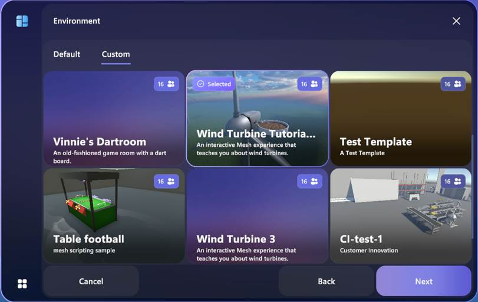
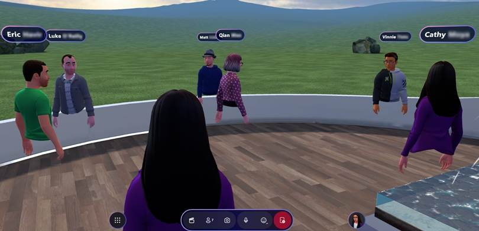

# Mesh 101 Tutorial Chapter 6: Create an event and invite others

Now that you've uploaded your Mesh 101 Environment to the Azure portal, you can
create and produce an Event based on that Environment that participants
can experience through the Mesh app for PC or Quest.

See our document titled *Mesh Event Producer Guide* to create an Event
via the in-app event producer experience.

### Create an event

1. Open the Mesh app and then log in.

2. In the left-side vertical button bar, click the icon for your World,
    or click the ["All Worlds" button](#_Mesh_dashboard_overview) at the
    bottom left, and then select the world you want.

    

    **Notes**:
    - You may have to scroll to view all the worlds.
    - You can pin worlds to the left nav bar for easy access.

    
3. In your Mesh World, select the **Manage** button.
    

    > [!NOTE]
    > If you don't see the **Manage** button, then you aren't a Content contributor for this World.
4. Select the **Create** button, and then, in the drop-down menu,
    select **Create event**.
5. Add your event details (**Name**, **Date**, **Time**,
    **Description**, etc.).
    
6. When you're finished, click **Next**.
7. On the **Template** page, press **Skip**.
8. On the **Environment** page, select the **Custom** tab.
9. Find the **Wind Turbine Tutorial** Environment, then select it, and
    then click **Next**.

    
10. On the **Review** page, review your event details. Click **Back** if
    you need to go back and change anything.
    

11. When you're ready to move forward, select **Create Event**. This
    saves your event and takes you to the **My Events** page.

    

### Summary

In this chapter, you learned how to create an Event that's based on your
Environment. Participants can join the Event and then use the Mesh
features that you enabled in Chapters 3 and 4 to learn about wind
turbines.

## Conclusion

Congratulations! Now that you've learned some of the basics of Mesh, you
can create a Unity project using your own 3D assets and build a
collaborative Mesh experience that best fits your business goals.
