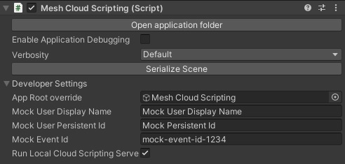
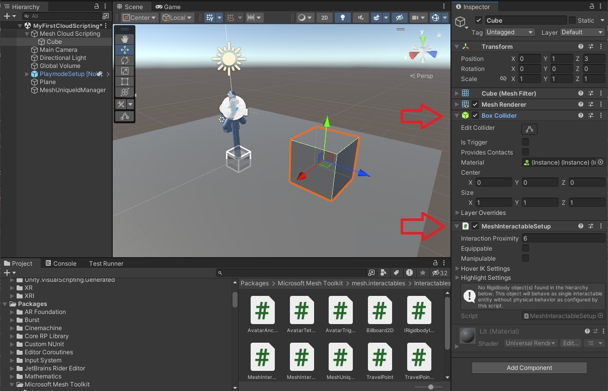
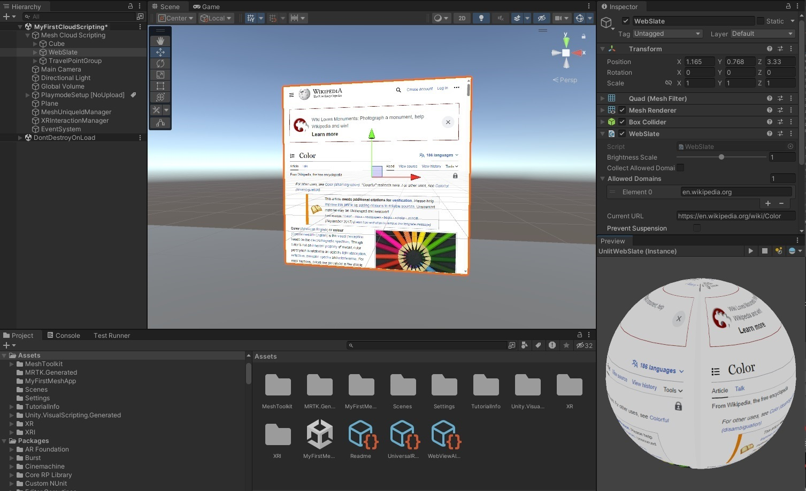

# Cloud Scripting programmer's guide

This guide describes how to use the Mesh Cloud Scripting API and developer tools to build Environments (these start out as projects in Unity, and are then uploaded to a Mesh World). We recommend that you first read the [Set cloud Scripting infrastructure in Azure](cloud-scripting-setup-infrastructure.md) to familiarize yourself with the concepts and basic architecture of Mesh Cloud Scripting.

This document describes the features and interface of the Mesh Cloud Scripting API, which is used to write the scripts that drive behaviors in Environments.

## Basic DOM structure

The DOM structure mirrors the structure of your Unity scene. The application's "Scene" member corresponds to the game object to which your Mesh Cloud Scripting component is attached. The following Mesh Cloud Scripting API classes map one-to-one with Unity objects created in the editor:

- GameObject (& Transform Component) -> TransformNode
- Light Component -> PointLightNode, SpotLightNode, DirectionalLightNode
- Animator Component -> AnimationNode (and derived classes, see below)
- Box Collider Component -> BoxGeometryNode
- Sphere Collider Component -> SphereGeometryNode
- Capsule Collider Component -> CapsuleGeometryNode
- Mesh Collider Component -> MeshGeometryNode
- Text Mesh Pro Component -> TextNode
- Rigidbody Component -> RigidBodyNode

For example, if you create a scene with a game object that has a Light component (set to a point light) and a sphere collider attached, your scene will contain a TransformNode with two children: a PointLightNode and a SphereGeometryNode.

Additionally, some Mesh Cloud Scripting API objects don't have corresponding built-in Unity components. These are additional components you can create in Unity that are part of the Mesh Toolkit package.

- Mesh Cloud Scripting component (Described above)
- WebView component

## Mapping the Unity DOM to the Mesh DOM

You can create a scene with components that the Mesh Cloud Scripting API doesn't know about. These will simply not exist in the Mesh Cloud Scripting DOM for the scene. However, the full scene structure of GameObjects will be mirrored in the DOM API as TransformNodes.

Unity has a GameObject/component API shape; however, the Mesh Cloud Scripting DOM has a single tree structure. A TransformNode in the Mesh Cloud Scripting API has children which may be other TransformNodes or may be other Nodes that map to components. We can consider this a merged list of the components of the associated game object and the children of its transform component.

### Rect Transform

If you add a component that uses a RectTransform&#8212;for example, the Text Mesh Pro component&#8212;the game object won't appear as a Node in the Mesh Cloud Scripting scene graph. It's still possible to move, enable and disable such a component, but to do so, you're required to wrap the game object using RectTransform in another game object using the regular Transform component.

## Property change events

You can subscribe to property change events by calling `AddPropertyChangedEventHandler` on any node in the hierarchy.  You must pass in the name of the property as a string.  

It's also possible to subscribe to all events by subscribing to the `DomObjectPropertyChanged` event.  This is called when any property in the DOM changes.

## Object lifecycle

Nodes, when created, are unparented. This means they won't be visible in the scene until they're explicitly added as a child to the scene or one of its descendants.  Likewise, setting a node's parent to null will remove it and its descendants from the scene.  

Sometimes you want to disable a node temporarily but not keep a record of where it was in the scene. For this reason, each Node has an "active" flag. When set to false, it'll disable the node and its descendants.

You can create game objects and components in Unity that are part of the scene but are disabled. These will appear as Nodes in the Mesh Cloud Scripting scene hierarchy but will have their active flag set to false. Setting the active flag to true will enable them in the Unity scene.

## Cloning and reparenting

Nodes can be cloned and reparented in the Mesh Cloud Scripting API; the corresponding Unity scene will update accordingly. If you clone a node, it'll clone that node and all its children (including children that may be in the corresponding Unity objects but are not visible to Mesh Cloud Scripting).

It's possible to clone or reparent Nodes that correspond to Unity Components. This is implemented by recreating these Unity components based on the Mesh Cloud Scripting Node representations. Only Nodes that can be created through the Mesh Cloud Scripting API can be cloned or reparented. If you've created a component in Unity and set fields that aren't reflected in the corresponding Mesh Cloud Scripting Node, these fields will be reset to their defaults if the Node itself is cloned. For this reason, we recommend that you clone or reparent Transform Nodes where you're manipulating objects that were created in Unity. These will always correctly keep all the original Unity settings.

## Users

There are various places in the API that provide User properties. The `User.Identifier` property is a persistent identifier string that is persistent for the user, even if the user leaves and rejoins. The user's display name is also accessible through `User.DisplayName`. The event ID that the user has connected from is accessible through `User.ConnectedEventId`.

During development the user display name, identifier, and event ID can be mocked in the Mesh Cloud Scripting component editor in the "Developer Settings" as shown below.



## Avatars

Avatars are the representation of users in the scene. They can be used to teleport users to a given location, travel between scenes, and to detect collisions with trigger volumes.

## Info Dialogs

It's possible in Mesh Cloud Scripting to pop up a screen space dialog in the Microsoft Mesh application with a custom message. SceneNode contains a function for this, `ShowMessageToParticipants(string message, IReadOnlyCollection<Participant> participants)`. [Rich text tags](http://digitalnativestudios.com/textmeshpro/docs/rich-text/) can be used in the message to control text properties (color, bold etc).

# Classes

## CloudApplication

The `ICloudApplication` interface is the starting point for developing Mesh apps. It's available in "App.cs" as the _app variable. In addition to the scene, `ICloudApplication` has create functions for all available types. It also has a number of other methods, but they're for internal use.

## InteractableNode

The MeshInteractableSetup is a custom Unity component that's part of the Mesh Toolkit package. When you attach it to a game object in Unity, it'll raise click events when any user clicks on any of the active collidables in that game object or its children.

A simple example is shown below, where the MeshInteractableSetup component is added to the same game object as the box collider:



## WebSlateNode

The WebSlate is a custom Unity component that is part of the Mesh Toolkit Authoring package. To add a WebSlate prefab to your scene, select **GameObject** > **Mesh Toolkit** > **WebSlate** from the menu bar. The website that is assigned to the WebSlate instance's URL property is rendered on the quad of this prefab.

An example is shown below, where a WebSlate prefab has been added to the scene and assigned a Url:

```c#
        var webSlateNode = Root.FindFirstChild<WebSlateNode>(true);
        webSlateNode.Url = new System.Uri("https://en.wikipedia.org/wiki/Color");
```



### Listening for clicks

Here's a simple Mesh Cloud Scripting script that rotates the cube each time it's clicked.  Replace the stub `StartAsync` method inside `App.cs` with this code.

```c#
        private float _angle = 0;

        public Task StartAsync(CancellationToken token)
        {
            // First we find the TransformNode that corresponds to our Cube gameobject
            var transform = _app.Scene.FindFirstChild<TransformNode>();

            // Then we find the InteractableNode child of that TransformNode
            var sensor = transform.FindFirstChild<InteractableNode>();

            // Handle a button click
            sensor.Selected += (_, _) =>
            {
                // Update the angle on each click
                _angle += MathF.PI / 8;
                transform.Rotation = new Rotation { X = 1, Y = 0, Z = 0, Angle = _angle };
            };

            return Task.CompletedTask;
        }
```

### Hit Info

It's possible to find out which user clicked the collider by looking at the property change event arguments. You can also read the contact normal and position of the click from the event arguments. These coordinates will be relative to the local coordinate space of the InteractableNode.

## Animators

You can create and add a Unity Animator to your scene and control it through Mesh Cloud Scripting. The Mesh Toolkit plugin will look through the assets in your Unity project, and for each Animator that's found, it'll generate a class in an "AnimationScripts" folder in your Mesh Cloud Scripting project. This class derives from AnimationNode and can be used to control the Animator from the Mesh Cloud Scripting. When you add the Animator as a component to a game object in Unity, you'll find a corresponding instance of the generated class as a child of the corresponding TransformNode. Using the API of this class, you can control the Animator.

The Mesh Cloud Scripting programming model is server authoritative, and we support only a small subset of the Animator functionality. This is because we model the Animator on the server and expect that all clients will synchronize accurately to the server model. For this reason, only the following API is currently supported:

- State setting (for each layer there's a corresponding property in the class that can be set to an enum based on the available states in the Animator). States are set immediately, not through transitions.
- Float variable setting: only float variables are exposed, and only for the purpose of binding to "Motion Time" in an Animator.
- Layer speed setting

Within a state, you can create an Animation Clip with no restrictions on what values you can set in the Unity scene. Looping Animation Clips are also supported. The following features of Animators are not supported through AnimationNodes:

- Transitions: if you add transitions to your Animator, you won't be able to trigger these through the Mesh Cloud Scripting API (the server doesn't model transitions).
- Variables (other than floats to drive Motion time). Variables used to drive transition logic or speed multipliers aren't supported.
- Mirrored states, Cycle offset, and foot IK.

### Late Join and Animators

When clients join a Mesh Event, they synchronize to the current state and local time of all running Animation Nodes. If you have a long-running animation playing in a state, the playback time will be set to the correct current time of the animation on late join. However, if your state fires events, these will NOT be fired in the late joined client. Some other scenarios might not work as expected; for example, if you trigger a sound by enabling an AudioSource at the start of a state, that AudioSource will still be enabled in the late join client, but will start playing at the beginning of the audio clip.

#### Animator initial state

We recommend that you create Animators that have default states that do nothing. When a scene starts playing in Unity, it will activate all the Animators and start playing their default animations. This can happen before the Mesh Cloud Scripting Service connection occurs; therefore, there's no way to synchronize these states and behavior may not be as desired.

### Animator reparenting and cloning

AnimationNodes can't be created through the Mesh Cloud Scripting API. The only way to create an AnimationNode is by exporting a Unity scene that contains an Animator component. If you try to clone or reparent the AnimationNode, you'll get an error because there's no way to support this action. It's still possible to clone or reparent the *parent* of the AnimationNode, as this corresponds to the containing Unity Game Object which can be cloned and parented.

### Notes on Generated Code

The generated code will remove spaces from names of Animators, Layers, States and Variables; for example, the variable name "my var" becomes "myVar" in code. Because of this, it's possible to create Animators that won't generate valid code. For example, if you have two variables named "my var" and "myVar", you'll get an error during generation and a message asking you to rename the variable(s).

## LightNode

PointLightNode, DirectionalLightNode and SpotLightNode all map to the Unity Light component (which will have its type set to the corresponding value). It's possible to set the basic parameters of these lights through the LightNode APIs. It's also possible to create Lights by hand through the API. Creating light nodes through the API will leave parameters that are not settable through the Mesh Cloud Scripting API to their defaults.

## GeometryNode

BoxGeometryNode, SphereGeometryNode, CapsuleGeometryNode and MeshGeometryNode map to Unity's Box Collider Component, Sphere Collider Component, Capsule Collider Component, and Mesh Collider Component, respectively. They can also be created through the Mesh Cloud Scripting API. Enabling and disabling Geometry Nodes will add and remove them from hit candidates if a MeshInteractableSetup is attached to their game object or one of its parents.

Creating geometry nodes through the API will leave parameters that are not settable through the Mesh API to their defaults (for example, Physics Material will be set to none and isTrigger will be set to false).

### RigidBodyNode

Adding a Rigidbody component to an object will put its motion under the control of [Mesh Physics](../enhance-your-environment/physics-interactions.md). Without adding any code, a Rigidbody object will be pulled downward by gravity and will react to collisions with other objects.

**Note**: `GeometryNode.Friction` will return `staticFriction`. However, if set on the Mesh Cloud Scripting side, it will update both `staticFriction` and `dynamicFriction` on clients.

### Trigger volumes

Geometry nodes can act as trigger volumes when their `IsTrigger` property is set to true. This flag corresponds to the `IsTrigger` property on the collider in Unity, and cannot be changed at runtime. When the geometry is a trigger it will generate `Entered` and `Exited` for any Avatars that start/stop overlapping with it.

**Note**: The Unity object needs to be added to the `TriggerVolume` layer to allow the teleport beam to ignore it, since colliders in the `Default` layer block the teleport beam.

## TextNode

TextNode maps to Unity's TextMeshPro component. If you add a TextMeshPro component to your scene there will be a corresponding TextNode in your Mesh Cloud Scripting scene hierarchy. This allows you to set the text of the component at runtime. You can also change the basic text properties through the TextNode API&#8212;bold, italic, underline, strikethrough and color. It's not currently possible to create a TextNode through the API; you must create them by adding them to your scene in Unity. Also, you can't clone a TextNode directly&#8212;you must instead clone the TextNode's parent TranformNode.

 ## Meshes

Meshes are currently "hidden" components to the Mesh Cloud Scripting API. They can be created in the Unity editor, and can be manipulated by manipulating their parent game objects/Transform components, but they can't be created programmatically, nor can their properties be edited at runtime through the Mesh API.

# Other Mesh app topics

## Adding resources to the Mesh Cloud Scripting Service

If you need to add a resource for your Mesh Cloud Scripting Service to use, you need to add it as an embedded resource into your C# project file. This can be done through the project UI in Visual Studio or by adding the following line into the .csproj file directly:

```cmd
<EmbeddedResource Include="<my_resource_file>" CopyToOutputDirectory="PreserveNewest" />
```

Note that this is how the scene.map is packaged, which you can see in the .csproj file for reference.

## Working with Mesh Physics

The packages you need for working with Mesh Physics are added to your project when you import the Mesh Toolkit. To learn more, see the document named [Importing the Mesh Toolkit](../build-your-basic-environment/import-the-mesh-toolkit.md#importing-the-mesh-toolkit).

`Mesh Physics` will take care to synchronize motion of rigid bodies between clients. Mesh Cloud Scripting  `TransformNode.Position`, `TransformNode.Rotation`, `RigidBody.Velocity` and `RigidBody.AngularVelocity` won't be updated with latest simulation state. However, clients will apply changes if these are set in the Mesh Cloud Scripting Service. Note that changing single property will leave others unchanged. For example, if only position is set, velocity won't be changed and rigid body will continue motion with old velocity from new position. Given that Mesh Cloud Scripting Service is not updated with latest motion state for rigid bodies, recommendation is to set these only for new rigid bodies.

If `TransformNode` with `RigidBodyNode` is cloned, cloned body will be registered and handed over to `Mesh Physics` for synchronization between clients. **Note**: Cloned rigid body will have position, rotation and velocities from the beginning of the scene of original rigid body. If these should be different, they must be set explicitly in the Mesh Cloud Scripting.

## Next steps

> [!div class="nextstepaction"]
> [Cloud scripting troubleshooting](cloud-scripting-troubleshooting.md)