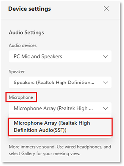
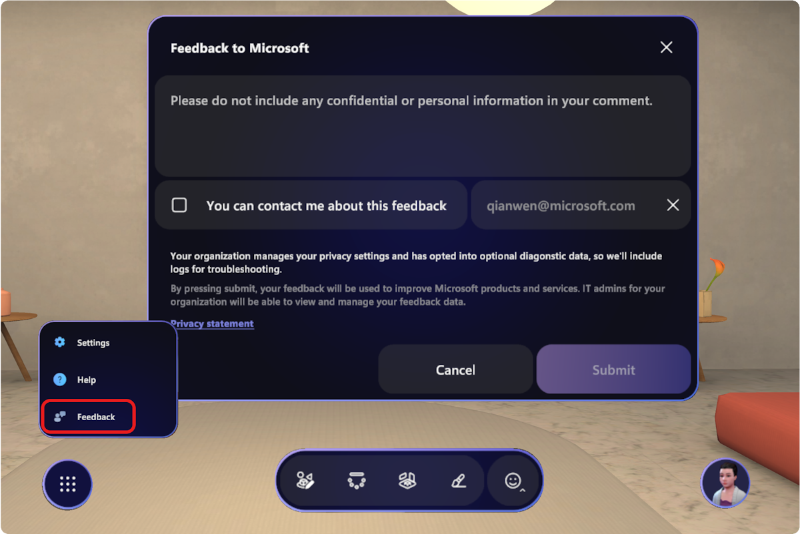
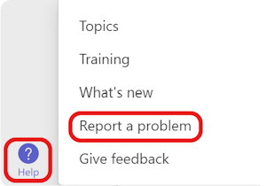
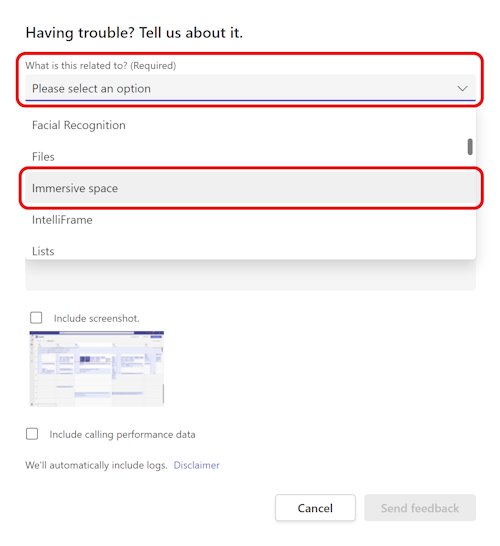

# Active known issues and limitations - Immersive Spaces in Teams

## Version 5.2313.0

### Audio

1. Users who are experiencing poor network connection may hear audio quality issues as a result.  There is currently no warning message for poor network quality. We'll be implementing this soon, as well as working continuously to improve overall audio quality.

1. If a user declines to give Mesh access to their microphone upon first launch in Immersive space, they will be completely muted without additional notification. If this occurs, go into your Teams **Settings -> App permissions**. Select the **Mesh immersive spaces** app, and switch the **Media permissions** on.

1. When a meeting participant is sharing screen with audio, the audio won’t play in the immersive space on the virtual stage. If you want to share your screen with audio, you must come out of the immersive space.

1. **Default Mic/Speaker Settings:** When going to the immersive space, Mesh handles the audio for users instead of Teams in order to enable spatial audio. However, Mesh uses the default OS settings, which might be a different mic and speaker that Teams uses. This may sometimes result in loss of audio for speaker/mic. You will need to double-check that the correct audio devices are selected on the pre-join screen when you go into the immersive space. If you're experiencing audio issues, check which mic/speaker Mesh uses by going into the Immersive space and select **Settings > Display & sound > Devices**, and update mic and speaker settings.

1. **Bluetooth Headset Limitations**: Most Bluetooth audio headsets switch to mono output when the microphone is in use. With mono output you will not be able to experience spatial audio. Here’s what you can do to resolve the issue: 

    * Switch to a wired headphone, or

    * If you’re on a Bluetooth headset, in Teams **Audio Settings**, update the Microphone setting to use laptop Mic instead.
 
   >[!Note]
    >The most used Bluetooth audio profiles are **Stereo (recv-only)** and **Mono (send+recv)**. Using laptop mic allows the headphones to use the former mode.

    

1. **Dropped audio when switching environments**: When you join the immersive space or switch environments, your audio may temporarily drop. 

1. **Background noise cancelation**: Spatial Audio background noise cancellation is currently limited. You may experience audio quality inconsistency and/or artifacts when inside the immersive space. 

### Join the immersive space in Teams

1. The only way to get to the immersive space is to use the Teams **View** menu from inside a Teams meeting. 

    1. You cannot access immersive spaces with the Mesh app pinned to the Teams menu. 

    1. It’s not useful to install the app. 

1. If you are losing internet connection during a session in the immersive space, you will be disconnected, removed from the space, and sent back to the gallery. You can rejoin the immersive space manually once internet connection is restored.

### React with the Teams vs. Immersive spaces menu bar

1. Using the **React** options on the Teams meeting menu will not trigger any gestures of the avatar in the immersive space. Other Teams users will still see your reaction on their screen. Immersive space users should use the Mesh menu bar to emote, which will both trigger your avatar gestures as well as show the emote on the Teams meeting screen.

### Current limitations

1. There is a room size limit of 16 persons for immersive users, while there’s no limit on the number of participants in a 2D Teams meeting. 

1. Content limitations: PowerPoint Live and Whiteboard are not supported. If a meeting participant is using Powerpoint Live, it will not display on the immersive space stage. Same for whiteboard.
1. If a meeting is being recorded, only the audio of immersive participants in the meeting zone will be recorded. Those holding side conversations outside the meeting zone will not be in the meeting recording.
1. Mesh immersive space in Teams today can take up to a minute to load. Thank you for your patience while we improve app performance. 
1. When you share content while already in an immersive space, you will not see your own content on the virtual stage. Other meeting participants will be able to see it on the main stage.
1. Chat in Quest can’t render images, only text. In addition, texts don’t wrap in both the chat and the feedback form on Quest.
1. Mesh immersive spaces doesn't support cross-tenant calls.
1. A single user joining Mesh from multiple devices will result in audio issues. Do not join from multiple devices at this time. This is not a supported use case.
1. People already in the immersive space on Quest won't be able to admit people from the meeting lobby in Teams.

### Other known issues

1. If a user starts a meeting from a Teams channel as opposed to joining a scheduled meeting, they will not be able to change environments.

1. On Quest, if you try to rotate the avatar preview in the Avatar Customizer, your field of view will also move.

1. Mesh immersive spaces do not properly support low bandwidth situation: users who are experiencing poor network quality may see problems such as missing avatars and audio glitches. We are actively working on integrating notifications to alert users when they are in this state.

## Submit Feedback
 
Have a question, problem, or suggestion? We deeply appreciate your input. Here are two ways to submit feedback: 
 
#### Provide feedback from inside the immersive space

This is the preferred method for providing feedback to us.
 
1. Click on the system menu button at the bottom left of the screen.  
 
2. Select Feedback.

    

#### Provide feedback from Teams
 
1. If you're in Microsoft Teams, click on the **Help** icon in the Teams window. 
 
2. Select **Report a problem**. 
 
3. Under What is this related to? Select Immersive space from the drop-down.

    

    
