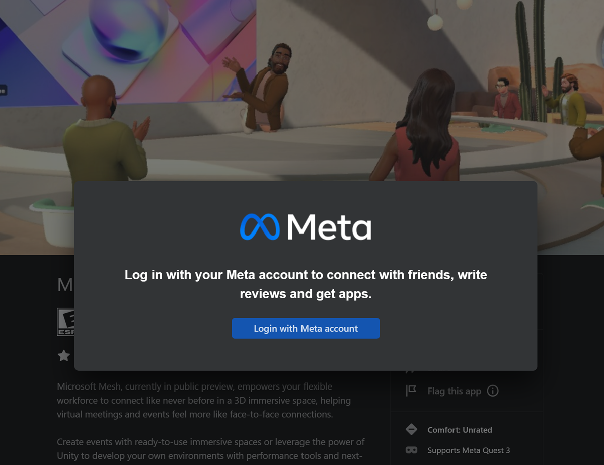
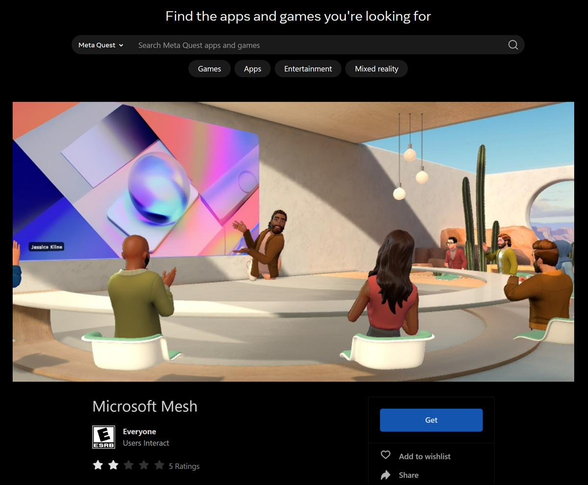
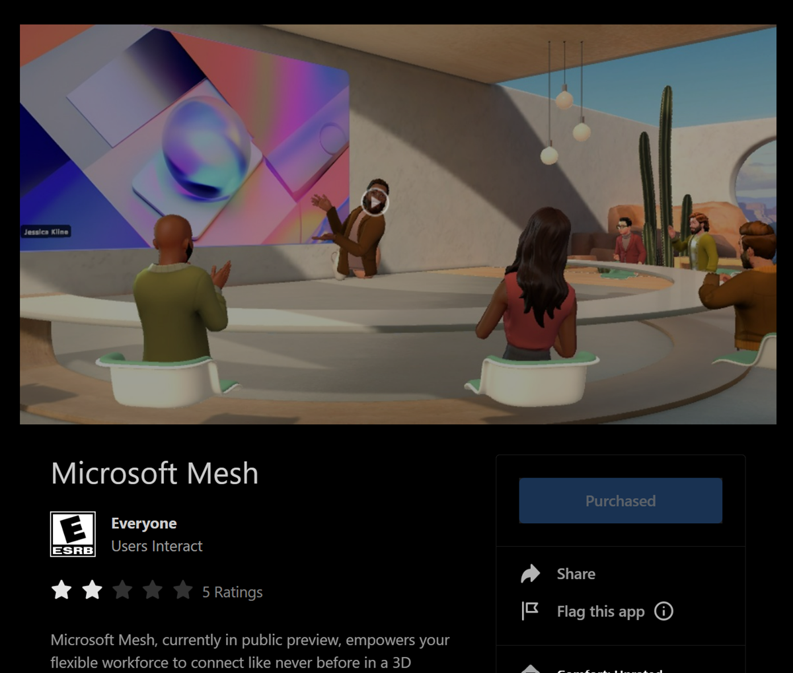
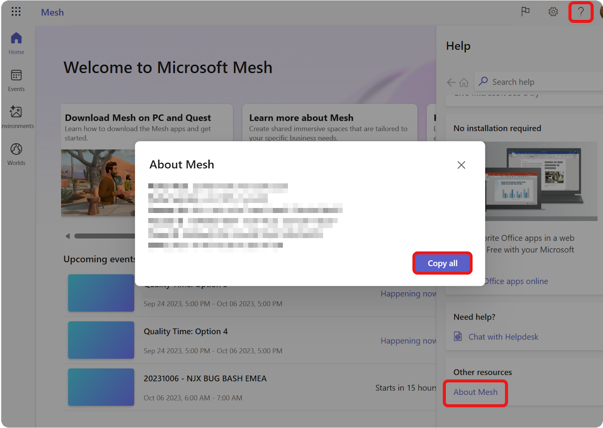

# Troubleshooting & FAQ

## Frequently asked questions

## What are the license requirements for immersive spaces in Mesh?

[!INCLUDE [The include file for the license requirements in Mesh](../Includes/license-requirements-for-Mesh.md)]

### What if I limit user permissions with corporate policies?

If you do not *allow* users with Teams and Office licenses to create Groups, Sharepoint/OneDrive sites, or use Mailbox/Calendar, the user may notice the following:

1. You cannot create a Collection (formerly called a "Mesh World") since you do not have the ability to do M365 Group creation in your organization.

1. You cannot create an event since you do not have access to M365 Calendar in your organization.

1. One or more people cannot be invited to the event because they do not have access to Outlook.

1. User cannot be added to collection membership since they do not have the ability to access M365 Groups in your organization.

1. You cannot create a template since you do not have access to SharePoint in your organization.

### Will there be support added in future to use an existing M365 Group?

We currently have no plans to support this feature. Right now, when Mesh creates an M365 Group, some additional data is added to the group to identify it as being a Mesh Collection.

### When an M365 Group is created through Mesh, can it still be enabled for Teams after? Just like any other M365 Group?

All M365 Groups created are normal M365 groups. A unique identifier is added to the group for the Mesh Portal to identify which Groups are associated with specific Mesh Collection groups.

### Can we script or automate the creation of an M365 Group for use with Mesh?

We currently do not support this feature.  

## What are the license requirements for Immersive spaces in Teams?

[!INCLUDE [The include file for license reqs for immersive spaces in Teams](../Includes/license-requirements-for-immersive-spaces-in-teams.md)]

## What are the data handling standards for Mesh?

Mesh is a part of M365, and it operates within the [M365 compliance framework](/compliance/assurance/assurance-data-retention-deletion-and-destruction-overview), including with respect to security and privacy commitments.

## How to download Mesh on Quest 2 via App Lab

Microsoft Mesh for Meta Quest devices is available through AppLab.

If you had previously downloaded the **Napili** app on your Quest 2 device, you should move to the new app available at the link below.

**Napili** will be deprecated in lieu of the new Microsoft **Mesh (Preview) app**.

1. On your PC, visit the link below to download Mesh on Quest 2.

    > [!div class="nextstepaction"]
    > [Microsoft Mesh on Oculus Quest 2 \| Oculus](https://www.meta.com/experiences/6750166401689690/)

    If the URL doesn't work, use a new private window in your browser.

2. Sign in with your **Meta device account** (*not* your corporate AAD account). This could be your Meta ID, Facebook account, or another
    email.

    [Can't find your Meta account associated with your Quest 2 device?](#how-do-i-find-my-meta-id)

    

3. Once authenticated, select the **Get** button.

    

4. You'll see the button grey out and change from **Get** to **Purchased** which indicates that the app has been acquired.

    

    >[!Note]
    >You may need to restart your headset to ensure the app loads.

### How do I find my Meta ID?

Log in to Oculus in a web browser, go to **Profile**, and get your email.

1. Go to the Oculus login page on your web browser: [Log in with Facebook \| Meta](https://auth.oculus.com/login/)

2. Continue with your Facebook account or log in with your Oculus account.

3. It should bring you to your **Profile** page. If not, click your **Profile** icon in the top right corner.

   

4. Select **Profile**. From there you should see your Email.

#### How to open Mesh on Quest 2

1. Start up your Quest. Use the Oculus button to open the dashboard menu.

1. Select the **App library** button.

    

1. Find the **Microsoft Mesh (Preview)** app in the App library.

1. Select to **Install** then **Open** the app by selecting it again.

1. Complete the device login flow using the link below on your computer (*this requires a mobile phone for verification*): https://login.microsoftonline.com/common/oauth2/deviceauth

    >[!Note]
    >If the code doesn't work, quit the Microsoft Mesh app and restart it.

    You'll see a window like this when the authentication is complete:

    

1. Select to **Allow** any **Terms of service & Allow Diagnostic data**.

1. Accept the **Terms of service & Allow Diagnostic data**.

### What should I do if the Mesh app on Windows crashes during startup, crashes during runtime, or behaves strangely during runtime?

1. Confirm you have a license required to use Mesh as shown [here](../setup/content/preparing-your-organization.md#verify-your-licenses-and-policies).

1. Double check that the machine has the latest Operating System and security updates.

1. Double check that your network admins have allowlisted the required endpoints as described [here](../setup/content/preparing-your-organization.md#work-with-your-organizations-security-team).

1. Gather the logs from your device: `%USERPROFILE%\AppData\LocalLow\Microsoft\Microsoft Mesh\`.

1. If the logs are too large to share, the two most important are `Player.log` and `Player-prev.log`.

1. Open a support request by following the link [here](https://admin.microsoft.com) (this support link may only be available to M365 admins).

### What should I do with issues relating to M365?

You'll need to first reproduce the problem, and then follow the steps below to collect all information related to Mesh:

1. Click the **?** help icon in the M365 header.

    

1. Click the **About Mesh** link in the **Other resources** section. You may need to scroll down to the bottom of the screen to see this option.
1. Click the **Copy all** button.
1. Share that data with [Microsoft support](https://admin.microsoft.com) (this support link may only be available to M365 admins).

The data should be your version of the following: 

- **Portal host:**
- **Portal version:**
- **Session ID:**
- **Tenant ID:**
- **Trace ID:**
- **Date:**

## I created a Collection, but now I can't generate an environment or template based on that Collection. *Or* I was able to create an environment, but now I can't create an event based on that environment. What's causing this?

You're probably running into the "partially created Collection" problem. A Collection consists of two parts: an M365 group and a database entry related to room creation in an event. There may be times when the Collection is created before the database provisioning part of the process has completed. If this occurs, the Collection may be partially usable but will be in a bad state. You should delete this Collection and create a new one.

### Audio setup in Mesh FAQ

#### Which audio devices work best in Mesh?

Spatial audio works best with **wired headphones**.

Using bluetooth headphones will not provide the most optimal spatial audio experience.

#### Where do I access audio input/output settings?

Audio input/output settings are available in:

**Settings** > **Display and sound**

There you can select your audio devices, choose system default speakers, adjust app volume and test speakers, choose mic device and test your microphone.

#### What are the advanced audio settings?

For advanced audio settings, you can adjust:

- Environment volume
- Effects volume
- Incoming Voices

#### Does spatial audio work with bluetooth headphones? what about wired headphones? 

Wired headphones work best for a full spatial audio experience where you will be able to detect audio distance (attenuation) and directionality.  When using a wireless or Bluetooth headphones, audio attenuation will be present but directionality will not be present.

#### Where do I go to access my audio input/output settings during an event? What are the advanced audio settings options?

1. On the bottom left corner in Mesh (Preview), find the Menu button.

1. Go to **Settings > Display & sound**. There you can select your audio devices.

    

For advanced audio settings, you can adjust:

- *Environment volume:* You can adjust the loudness of the ambient sounds up or down.

- *Effects volume:* You can adjust the loudness of the sound effects to help detect movement and activities in the immersive space.

- *Incoming Voices:* You can adjust the loudness of participant activity around you. 

Incoming Voices:* You can adjust the loudness of participant activity around you.

## Mesh error messages

#### You don't have permission to enter this space.

You don't have permission to enter this room as the event host. 

#### You have already joined this space from another location. Please disconnect and retry.

You have already joined this event from another device. Please disconnect from the other device and try again. 

#### This space is full. Please try back later!

Mesh spaces can support up to 16 people. This space is currently at full capacity. 

#### Cannot join the space since one (or more) people are using a different version of the client.

Please make sure all participants are joining the Mesh event with the same version of the Mesh app.

#### Falied to connect to Mesh session. Please try again later.

We cannot connect to Mesh services. This happens sometimes... Please try again.

#### Unable to load the environment. Please try again later.

There was an error loading the space. This happens sometimes... Please try again.

#### Unable to join the Teams meeting. Please try again later.

This error occurs when we cannot connect to Microsoft Teams services.

#### `Response Code` Failed looking up space details.

This error occurs when something goes wrong while trying to get event and space information

#### Failed to lookup Teams meeting details!

This error occurs when we fail to get information about the Teams meeting.

#### The space you were trying to reach isn't available on this device.

This error occurs when the assets in a space isn't compatiable with the current device.

#### This space requires a newer version of the Mesh app. Go to Microsoft Store to update the app.

You need to run the latest verions of the Mesh app to enter this space.

#### An unexpected error occurred when loading the environment for the space.

This is a general error message when we fail to load the asset bundle or we fail to extract the environment from the asset bundle

#### Something went wrong loading the space. Please try again later.

This error occurs When we fail to construct a scene based on the asset bundle.

#### Your app version `client version` must match the version used by others already in the space `hostClientVersion`.

This error occurs When you're trying to join the meeting or event with a different version of Mesh already being used by other participants.

#### Failed to connect. Client version could not be set or compared to other client version already in space.

The Mesh version is unavailable.

#### Failed to navigate to the destination space.  You may need to restart the application.

This is a general message when travel fails.

#### We lost connection with the space. Please retry or close to return to the main dashboard.

This is a general error message when we lose connection to one of our services while traveling to or from a space.

#### You do not have access to this space. You must be invited into a space to join it.

This error message occurs when you receive a 403 error from the Mesh service.

#### Failed to get meeting info from service. 

This error message occurs when you receive a 404 error from the Mesh service.

#### Failed to lookup event code details!

This error happens when finding a meeting failed.

#### Failed looking up space details.

This error happens when we failed to find space information from service.

#### The destination you are trying to reach is not available.

This is the generic error message you see if we don't know what specific error you're hitting. Help us diagnose this problem by using the **Report a Problem** feature in Teams.
