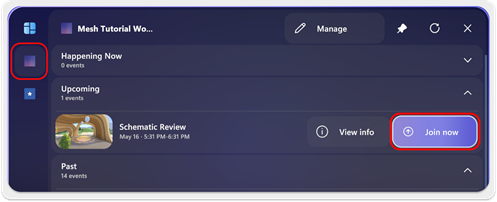
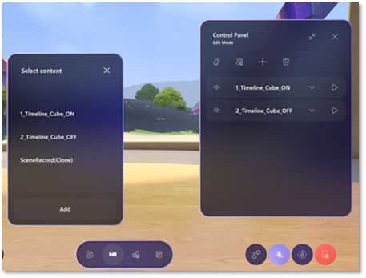
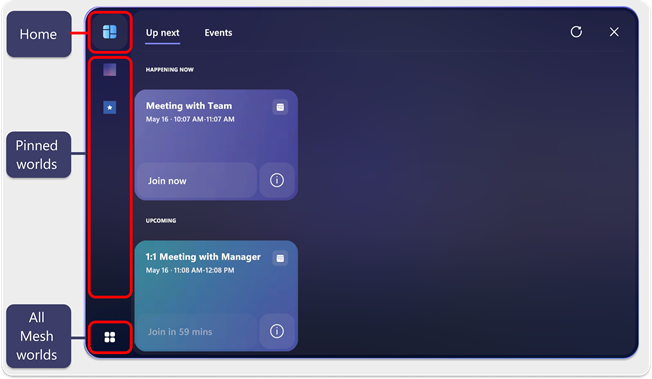

### Considerations before starting your event

#### Customize before the event

To ensure the event runs smoothly, ensure that you customize the event
at least one hour before the event should start.

Jump to [Customize your event](#customize-your-event) to begin using the
powerful Event Producer tools!

#### Provision Multiple Rooms before the Event

If you've chosen a Multiple rooms event, ensure that you've provisioned
your Multiple Rooms event at least 30 minutes before the event start
time.

*Provisioning is necessary to enable broadcasting between rooms as the
event host.*

See the [Provision Multiple Rooms event](#provision-multiple-rooms-before-the-event) section for more
info.

### Just start

All event participants should be able to find the event by going to your
Mesh world **Events** tab.

1. Go to your Mesh world, then select **Join now.**

 **Great job! Continue reading below to produce your event!**

## Producing your event

Once you've joined your event, you'll have
access to a few tools to help produce the event:

- **Host Panel.** A toolbar and panel with common tools to facilitate
    meetings.

- **Control Panel.** A panel to play animations or prompted
    transitions between in the event.

Use the **Control Panel** to access production tools like **Broadcast**,
**Megaphone**, **Mute All** buttons.

## Host panel

The host panel is the main panel for managing interactions, hand-raises,
and broadcasting.

### Host controls in the Control Panel

Use the control panel to access the production tools:

#### Broadcast

In a multiple room event, broadcasting will show your Avatar to all
other rooms in the event. To start, select the broadcast button, then
select **Start broadcast**. To stop broadcasting, select the broadcast
button again, then select **End** **broadcast**.

> [!NOTE]
> If your event is not Provisioned for broadcasting, you'll receive a pop-up that says "Unable to Start Broadcast. Your event must be provisioned to enable broadcasting. Please provision your event to proceed."
>
> *The admin who provisions the event **must exit the event to provision again**.*

When broadcasting, other participants will see a broadcasting icon next
to your nametag above your Avatar.

#### Troubleshooting broadcasting

If new joiners are still not seeing/hearing you, there are a few
troubleshooting steps you can take to help.

1. **One host.** Please stop your broadcast and then restart the
    broadcast. The problem should be corrected in 2-3 attempts.

2. **Multiple hosts.** The first host should STAY broadcasted. A second
    host should start broadcasting. The second host can stop
    broadcasting once everyone sees and hears the first host.

#### Megaphone

Use **Megaphone** to make your voice audible to all participants in the
event.

 

### Mute All

Use **Mute Al**l to bring attention to your voice and mute all other
participants.

:::image type="content" source="../../media/mesh-event-producer-guide/image028.png" alt-text="Megaphone button location":::

Use these tools to help produce your event and explore the [Customize
your event](#customize-your-event) section to see how the Control Panel
can be expanded to control scripted experiences in Events.

## Customize your event

If you have a custom environment created Unity, there may be components
you can add to the environment that you can control as an event
producer.

Make your event your own! Create a scripted sequence that you control
for your event -- think props for pizazz or a curtain opening to start
the show.

> [!NOTE]
> We recommend customizing an event at least one hour before the
> event is scheduled to ensure a smooth experience.

> [!TIP]
> **Who should customize an event?**
>
> Anyone with **Content contributor** privileges and invited to
> collaborate for an event can also customize an event. Do this with
> caution, knowing that any edits you make will affect the environment
> that event participants will join in.

#### Event Producers tools

- [Control panel](#_Add_Content_with) -- control the elements you add
    to the environment with scripted sequences of events. Imagine a
    curtain raise to signal the start of the event!

- [Event templates](#_Event_templates) -- create a template of your event with all customizations that you add to reuse in future events

#### Open the Manage events page

**Important!** If you don't see **Manage**, then you aren't a [Content
contributor](#content-contributor-permissions) for this world. Please
speak to your IT Admin to get Content contributor privileges.

1. Go to your pinned world, or search for it using the **All Mesh
    worlds** button.

2. You will see the **Manage** button.

#### Customize event experience

Click the **Customize event experience** button and enter the event.
Once you've joined, you can begin [adding content with the Control
Panel](#_Add_Content_with).

**Now that you've joined the event customization experience it's time
to start customizing!**

## Add Content with the Control Panel

Use the **Control Panel** to access the core set of tools that enable
you to set up, customize, and trigger specific show-elements in your
events. Like having a technical booth for theatrical technicians, it's
designed to give the Event Producer the ability to orchestrate a
performance in real time.

1. On the **Manage Events** page, select the **Customize event
    experience** button for the event you wish to customize and
    collaborate on.

    
2. Click the **Join now** button.

3. After you've joined the session, click
    the "Control panel" button.
    

    > [!NOTE]
    >
>     Adding content takes place in **Edit mode**. 
>
> 
>
> You should be in this mode by default (look at the top/middle of the window).

4. Click the **+** button.

    

5. In the **Add items** window, click the **Content** entry.\
    This opens the **Select content** window. You can add playable
    content such as *Unity Timelines and Video Players*.

    

**Control Panel Notes**:

- For the playable content to be available, it must have been added to
    the original Unity project used to create the environment. If the
    environment contains no playable content, the **Select content**
    window will be empty. Reference the [Choose your journey](../Create/Getting%20started/choose-your-journey.md)
    to get started with adding custom content.

- For a VideoPlayer, the URL needs to be a publicly accessible
    webpage, or static hosted MP4.

- In the **Select content** window, select the content you want to
    add, and then click the **Add** button.

    The added content appears in the **Control Panel** window:

### Configure the content controls for a Timeline

1. Select the **Play** button for the Timeline.

2. Select or deselect **Scale animation**.

    

### Configure the content controls for a Video Player

1. In the Select content window, choose CentralVideoScreen and click
    Add.\
    \
    

2. Once the **CentralVideoScreen** is in your Control panel, click the
    text button to input a URL for a static hosted MP4 file.\
    
3. Press the **Play** button to view your content.

    Note: To control the volume, use the volume slider found in the
    expanded dropdown for the item on the Control Panel.**\
    **

### Preview the live run of your event

Within a Customize event experience, open the Control Panel, then Toggle
to Preview Mode\

When you're done configuring content for the event, you can exit the
customization session and it will automatically save your changes.

### Producing Live with Configured Content

1. At the start time of your event, join the event.

2. Open the **Control Panel** (it defaults to Live Mode).

3. View your content in the order in which you set it.

4. Play through each item to confirm that the configurations appear as
    you've defined them in your customize event experience.

### Show or Hide Elements

The **Show/Hide** option can eliminate distractions and help the Event
Producer focus on only the elements being used in the show.

**To show or hide an element in the Control Panel:**

1. Ensure that you're in **Edit Mode**.

2. Click the **eyeball icon** to the left of the element name.

**Show:**

**Hide:**

**Note**: Hidden elements aren't deleted from your list, but are hidden
from view while in **Live Mode**.

## Event Production Best Practices

Here are things you need to look out for throughout this process:

1. Don't have multiple producers editing the Control Panel
    simultaneously; the edits may be overwritten.

5. For smooth event production, we recommend that you complete all
    edits at least one hour before showtime. Last minute edits can cause
    problems for your performance.

 **We hope you enjoy the Mesh Producer Experience!**

# Event templates

Now that you've created an event and customized it to your liking,
create an Event template! Event templates to easily reproduce curated
experiences in other events, saving time and effort. Create a template
once and use it again and again!

Simply use a custom or pre-created environment then add Event
integration features (via the Control Panel, Unity Timelines, and Unity
Video Player) to that event. That event can be saved and become a
Template, used across future events with no additional work needed.

## Manage events page

To manage your events, you must be in the Manage events page.

1. Go to your pinned world, or search for it using the **All Mesh
    worlds** button.

2. Once in your world, select **Event** in the top bar.

3. You will see the **Manage events** button.

## Create a template

1. In the left-side vertical button bar, click the icon of your World,
    or click the **All Mesh worlds** button to find your world.\
    

2. In the horizontal menu bar at the top, click **Events**.

3. Click the **Manage Events** button.

4. Select the event you want to create a template of, and then click
    the **Options** button.

    

5. In the popup menu, select Save as template to save an event template
    with the same name as the event you selected.

    

## Deleting templates

1. Go to the **Manage Events** page.

2. Click the **Templates** tab.\
    

3. In the Template list, select the template you want to delete, and
    then click its Trash Can icon. This deletes the template for you and
    everyone in your world.

   > [!div class="nextstepaction"]
   > [Customize your event](produce-event.md)

   > [!div class="nextstepaction"]
   > [Event help](events-help.md)