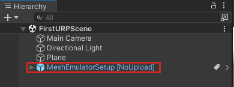
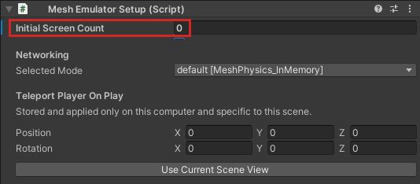

# Mesh Emulator testing in Unity

If you add the *Mesh Emulator* (or, simply, the "Emulator") to your project, you get an
approximate preview of what the content will look and feel like when it
runs in the Mesh app every time you enter Play mode. This greatly speeds up the iteration cycle during
content development and allows developers of advanced interactive
content to deeply debug the logic with all the powerful tools that Unity
offers.

The look and feel in the Emulator are similar but not identical to those in
the Mesh app. We're continuously working to reduce the differences where
possible without sacrificing the lightweight environment necessary for
quick iteration. A key feature of the Emulator is the ability to run
multiple clients within the same process; this allows a single developer
to easily get a first impression of a multi-user scenario.

**To use the Emulator in your project (or not)**:

1.  Ensure that you have the Mesh Toolkit imported.
1.  Ensure that the scene contains a piece of solid floor below the origin that's set to the *NavMesh* layer.
1.  Press the Play button. The Toolkit checks to see if a GameObject with "EmulatorSetup" in its name exists at the top level of the **Hierarchy**. If it doesn't, this dialog appears:

    

    Do one of the following:

    **To ensure that the Emulator runs every time you click Play**:
    Select the first button, **Add working MeshEmulatorSetup prefab.** The **MeshEmulatorSetup [NoUpload]** prefab appears in the **Hierarchy**.

    

    **To avoid running the Emulator and prevent the Emulator Setup missing dialog from appearing again when you click Play**:
    Select the second button, **Add dummy NoMeshEmulatorSetup game object**. As the name suggests, this doesn't actually do anything, but the Toolkit will find "EmulatorSetup" in its name and will refrain from showing you the **Emulator Setup missing** dialog again.

If you initially decide you don't want to use the Emulator, but change your mind later on, delete the **NoMeshEmulatorSetup [NoUpload]** dialog from the **Hierarchy**. The next time you click Play, the Toolkit will display the **Emulator Setup missing** dialog again, and you can click the button to add the Emulator.

## Teleport Player on Play

When working in a large scene, you may find it valuable to teleport the player to a specific location at startup. To achieve this:

1. In the **Hierarchy**, select **MeshEmulatorSetup [NoUpload]**.
1. In the **Inspector**, navigate to the **Mesh Emulator Setup** script.
1. In the **Teleport Player on Play** section, enter the **Position** and **Rotation** XYZ values you want the player to teleport to.

## Emulator Split Screen

This feature lets you run multiple clients within the same process and
show them side-by-side within the same window. Mesh Toolkit itself implements a very minimal
emulated ____________________ component that's sufficient to communicate
the player position between the clients, allowing the different players
to see each other as heavily stylized avatars:

This is sufficient for previewing static content. When developing
interactive content, [visual scripting](../script-your-scene-logic/visual-scripting/visual-scripting-overview.md), [cloud scripting](../script-your-scene-logic/cloud-scripting/cloud-scripting-basic-concepts.md) and/or [WebSlate](../enhance-your-environment/webcontent.md), keep in mind that those features each contain their own networking mechanisms
which provide an Emulator preview of a synchronized experience with multiple users.

Do one of the following:

-   Increase the initial screen count before entering Play mode by setting the value in the **Mesh Emulator Setup** component:

-or-

1.  Start Play Mode.

2.  In the **DontDestroyOnLoad** scene, navigate to the
    **EmulatorSplitScreen** component and then select **Add screen**.

Now you can quickly test your Unity Scene without going through the
build and upload process each time you make an iteration.

 > [!IMPORTANT]
 > If you're using the [Visual Profiler](../debug-and-optimize-performance/performance-guidelines.md#visual-profiler) in your scene, make sure the **Initial Screen Count** setting in the **Mesh Emulator Setup** component is zero. If it's "1" or higher, you won't see the Visual Profiler.

 