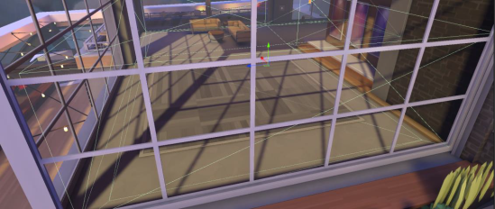

# Lighting

For Microsoft Mesh environments, utilize Unity Baked Lighting.

To include a mesh object in the light bake, make sure you check the
**Static** checkbox in the **Inspector**.

 

All Unity light types are available when
using baked lighting.

**Make sure you set the mode to "Baked". Realtime lights** **aren't
supported for use in the environment.**

To include a mesh object in the light bake, make sure you check the
**Static** checkbox in the **Inspector**.

 

If this isn't checked, lighting won't be
applied to the mesh, nor will it cast any shadows in the scene.

The Scale in Lightmap value increases/decreases the size of the selected
mesh's UVs in the Unity light map bake. If you need to change a specific
mesh's resolution, this is where to do it.

Leave **Scale in Lightmap** at its default (1) while setting up your
scene.

If you need to increase overall scene light map resolution, don't do it
on a mesh-by-mesh basis; do it in the scene Lightmapping Settings.

### Quick tips for lighting

- The further a mesh object is from the scene's playable space, the
    smaller its Scale in Lightmap value can be.

> Deemphasizing far away objects in the light bake is a great way to
> save light bake texture space and use resolution on objects that
> players can get up close to.

## Dynamic lighting

Most environments use baked lighting, but there are a handful of objects
in your environment that need to be dynamically lit. For example,
avatars, user content, and physics objects. To ensure these objects are
properly lit add a single directional light that is:

- Type: Directional

- Mode: Real time

- Culling Mask: includes "Avatars" and "UserContent"

Color and intensity can be any values that suit the environment. The
[Content Performance
Analyzer](https://microsoft.sharepoint.com/teams/MicrosoftMeshEAPOnboardingResources/Shared%20Documents/Forms/Mesh%20%20Custom%20Worlds%20%20Organized%20View.aspx?id=%2Fteams%2FMicrosoftMeshEAPOnboardingResources%2FShared%20Documents%2FEAP%20Resources%20%2D%20External%2FFiles%20and%20Packages%2Fcom%2Emicrosoft%2Emesh%5Ftoolkit%5Fcpa%2D0%2E1%2E4%2Ezip&parent=%2Fteams%2FMicrosoftMeshEAPOnboardingResources%2FShared%20Documents%2FEAP%20Resources%20%2D%20External%2FFiles%20and%20Packages)
will also display an error if a light like this is not found.

