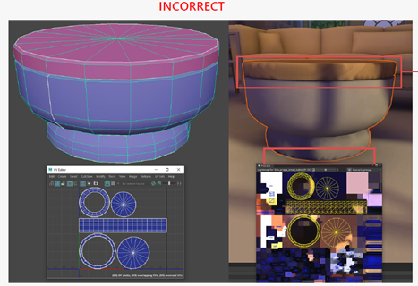
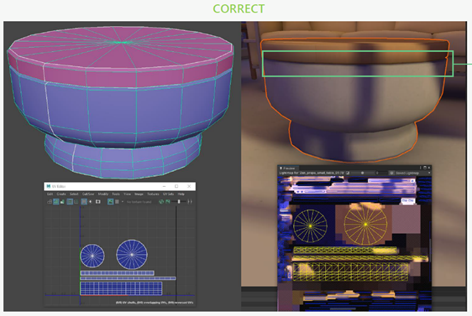
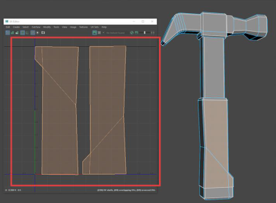
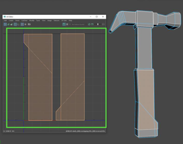
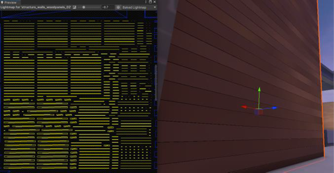
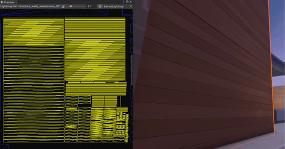

# Working with UVs

## UVs and lightmaps

Setting up optimized and clean lightmap UVs is one of the most important
aspects of achieving a clean and immersive VR environment.

**Note: The** Unity Auto-Generate Lightmaps option doesn't easily give
the control needed to accomplish this, and we recommend that you avoid
using it.

Each mesh object that makes up an .fbx needs its **own** optimized UV
channel 2 layout.

## Lightmap UV Tips

Unity light bake grabs each individual mesh and packs it on its own. If
you pack together in your 3D program, you'll end up with wasted space.

Setting up optimized and clean light map UV's is one of the most
important aspects of achieving a clean and immersive VR environment.

Splitting lightmap UV seams where there's a hard edge on the mesh will
give you crisp edges with the Unity light bake.

If there isn't a UV seam at the hard edge, and with the light bake
resolution constraints we have, the hard edges will turn soft and lose
their impact.

 
This version of the elephant has bigger UV
shells with no cuts at the hard edges.

Unity light bake smoothed it out.

Light bake aliasing is an issue with our resolution constraints.

Straighten UV shells to cut out unwanted aliasing

Aliasing in the UVs will cause aliasing in the light map textures.
Aliasing baked into textures hurts immersion and presence.

The aliasing seen here is due to the UV shell being a circle.

 
Aliasing will be gone regardless of the
lightmap texture resolution.

Even a small amount of aliasing can be problematic for VR users since
they can view the mesh from any distance.

Introducing a small amount of warping in the light bake is okay if it
means ridding shell of aliasing

## Resources for lightmapping

[Unity - Manual: Generating lightmap UVs
(unity3d.com)](https://docs.unity3d.com/Manual/LightingGiUvs-GeneratingLightmappingUVs.html)

## Packing UV shells

With our focus on lightweight and optimized projects, UV layouts need to
be as efficient as possible.

Once texel size is determined in Unity, make sure to go back and adjust
any shells that are too closely packed to cut out texture bleed or have
room for smaller padding.

 First
pass, before the scene texel scale is determined.

 
Second pass, after the scene texel scale is
determined.