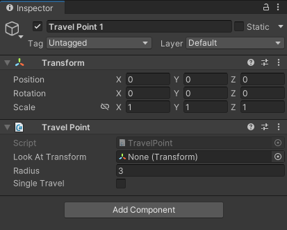
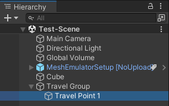

# Create avatar spawn and teleport points

## Travel Point and Travel Point Group

*Travel Point* is a component in the Mesh toolkit that can be used to define where to place an avatar when first joining an event and also to transport avatars during their experience using Visual Scripting.

If a travel point isn't present in an Environment, and there's a floor at the origin, the avatar will be grounded on the floor when spawned.  If no floor is present near the origin, the avatar will spawn above the origin and fall for a little while and then respawn in a loop.

**Setting up travel groups and travel points**

1. Create a travel point group: all travel points must belong to a group; a default group will be assigned to any travel points that don't have one. Every travel group must have a unique name. The default travel group will not be set as a DefaultSpawnGroup unless it's the only group that exists.

    - To do this, create a new GameObject with a *Travel Point Group* component attached.

    

2. Add travel points to the group. To do this, add new GameObjects as children of the travel point group with a *Travel Point* Component attached.

    

    
    
3. Set **Default Spawn Group** to true for travel groups you want avatars to spawn into when initially joining an event and false for travel groups that you do not.  

### Settings

**Travel Point**
- **Look At Transform:** the point you want the camera to look at after spawning into that transform. This will default to CenterTransform forward.  
- **Radius:** the size of the travel area. It’s a circle around the center transform.  
- **Single Travel:** If this is true, only one avatar at a time will spawn into this point unless there are no more points to choose from.

**Travel Point Group**
- **Default Spawn Group:** When true this group will be used for finding the default spawn point for an avatar entering a space

### Visual Scripting

- **Travel Point Methods:**
    - **TravelToPoint** – Transport the local avatar directly to a specific travel point
- **Travel Point Group Methods:**
    - **TravelToRandomTravelPoint()** – Transport the local avatar to a random point in the group

## Next steps

[Grab, attach and throw with Interactables](./interactables.md)
[Triggers, anchors and tethers](./triggers-anchors-and-tethers.md)
[Physics interactions](../physics/mesh-physics-overview.md)
[Enhanced features overview](../enhanced-features-overview.md)
