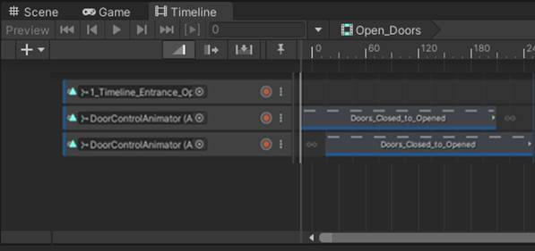

# Multi-room sync (animations, timelines and video)

## Overview

You can add various Event features to your Environment that can be controlled during an Event. Events in Mesh can create powerful interactive experiences for hosting all-hands meetings, social gatherings, showcases, or trainings. After you've uploaded your finished custom Environment to Mesh, an organizer can use your Environment to create an Event.  

## Playables

*Playables* are objects that are meant to be played, paused, looped, and
stopped; example Playables include animations, Unity-based Timeline elements and
Unity Video Players. When you include Playables in your Environment, they appear in the Mesh app's Event Control Panel where they can be turned on or off.

To learn more about the Unity Playables API, see [Unity - Manual:
Playables API
(unity3d.com)](https://docs.unity3d.com/Manual/Playables.html).

## Controllables

 The Mesh Toolkit includes key components that integrate into the Mesh event production system - these components are called *Controllables*.

**To locate the scripts:**
In the Project window, navigate to **Packages** > **Microsoft Mesh Toolkit** **mesh.toolkit.sharedcontent** > **Controllables**.

The components include:

- *EmbeddedAudioControllable*: For controlling Unity AudioSources with
    hard-coded/embedded audio clips

- *EmbededVideoControllable:* For controlling hard-coded video

- *ObjectControllable*: For marking GameObjects that can be
    enabled/disabled via the control panels

- *StreamedVideoControllable:* For playing online videos

- *UnityPlayableControllable:* For controlling a PlayableDirector

## Controlling an Animation in an Event

As an organizer in an Event, you can select *play* to start your
animation, *pause* it, and select *play* again to resume the animation.
You can also select *stop* to reset the animation to the beginning or
set your animation to *loop*.

For example, if you have a door-opening animation, selecting the *play*
button will open the door in your scene. Selecting *stop* will reset the
animation back to its original position. A Playable will not animate in
reverse; to do this, you'll need to create a different animation.

For more information, see [Prepare content with the Control Panel](../../events-guide/customize-event.md#prepare-content-with-the-control-panel).

## Animate Timelines in Unity for Mesh

If you're unfamiliar with how **Timelines** work in Unity, we recommend that you watch this
Unity Tutorial series on using [**Timelines**](https://learn.unity.com/project/up-to-speed-with-timeline)

#### To create a Timeline for Mesh

1. In the **Hierarchy**, add an empty GameObject and then rename it
    "Timelines."

1. Add another empty GameObject, make it a child to **Timelines**, and
    then rename it "Timeline1."

    

    **Notes**:

    - For an actual project you're working on, we suggest that you give this GameObject a more descriptive
        name---for example, *1_Entrance_Doors*. For this learning scenario, we'll
        stick with the name "Timeline1."

    - A Playable will *not* animate in reverse. Let's say, for example, that you have a door-opening animation. Selecting the Play button will open the door in your scene, and selecting the Stop button will reset the animation back to its original position. To animate in reverse, you'll need to create a different animation.

        **IMPORTANT**: Multiple timelines on a single GameObject will *not*
        work and will cause issues in events.

1. In the **Project** tab, navigate to the **Assets** folder and then
    create a new folder named *Animations*.

1. In the **Hierarchy**, select **Timeline1**, and then select **Window** > **Sequencing** > **Timeline**.

1. We recommend that you move the **Timeline** tab next to the
    **Project** and **Console** tabs. This allows you to view the
    **Timeline** and the **Scene** or **Game** windows simultaneously.

    

1. Select **Create**.

    

1. In the **Save** window, change the name of the Playable to
    *Open_Doors* and then save it to the **Assets** > **Animations** folder.

    

1. You can now animate or customize your Timeline---for example, add
    animation clips, activation clips, and more. To learn more about this, [see the Timeline tutorial](https://learn.unity.com/tutorial/introduction-to-timeline-2019-3#) on the Unity Learn website.
    
    A Timeline with several tracks might look something like this:

    

1. Once you're done animating, in the **Hierarchy**, select the
    **Timeline1** GameObject, and then in the **Inspector**, navigate to
    the **Playable Director** component.

1. In most cases you'll want to choose these settings:

    **Play On Awake** = not selected

    The timeline will be active when you upload it.

    **Wrap Mode = Hold**

    The last frame of your animation will be on hold indefinitely;
    otherwise, your timeline will reset to the start. There's also a
    **Wrap Mode** option named **Loop** which you may want to use in some
    instances.

    

Now you can upload your environment to Mesh using the **Mesh Toolkit
Uploader** and then see how it looks in your Mesh space. To learn more,
see [Prepare content with the Control Panel](../../events-guide/customize-event.md#prepare-content-with-the-control-panel).

### Unity Video Players

Video playback for the Control Panel can be done using the **Unity Video
Player**. You'll first need to embed a video player in your Unity scene.
Once added, it will appear as an option in your **Control Panel**
content list and can be added to your **Control Panel** using the **+**
button. You can then toggle it **on/off** or adjust playback controls.
Learn more about how to use the **Control Panel** in [Prepare content with the Control Panel](../../events-guide/customize-event.md#prepare-content-with-the-control-panel).

To learn more about the Unity Video Player component, see [Unity -
Manual: Video Player component
(unity3d.com)](https://docs.unity3d.com/Manual/class-VideoPlayer.html).

## Save your work as a template

If you create an Environment + Event features combination that you think
organizers may want to repeat in the future, you can save the
combination as a template. To learn more about templates, see [Create event template](../../events-guide/create-template.md).

