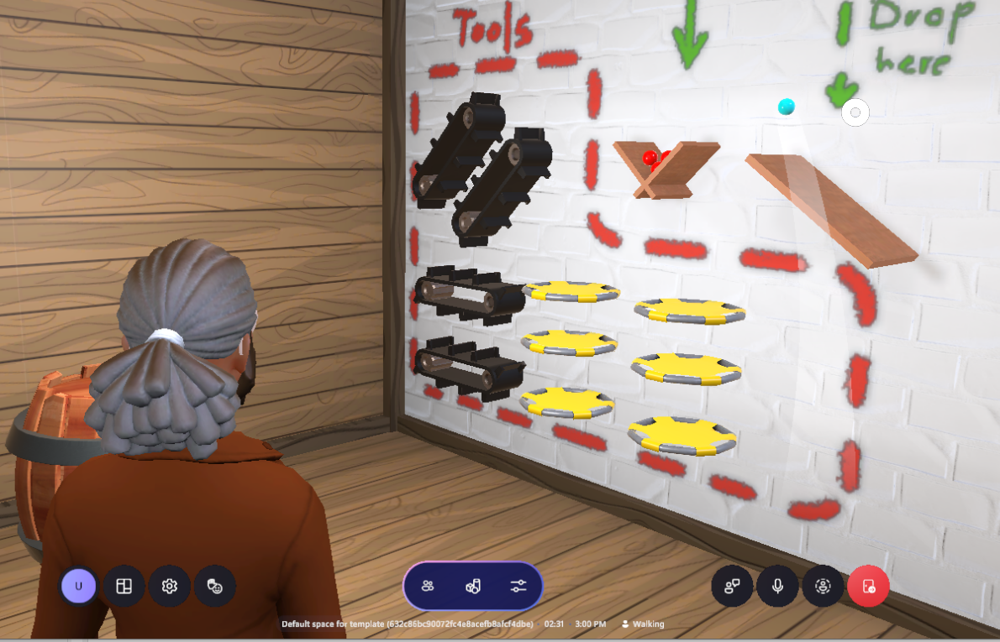
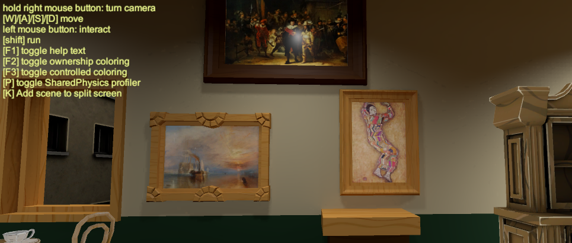
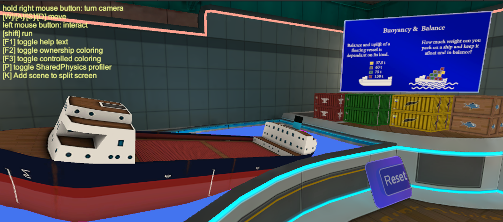
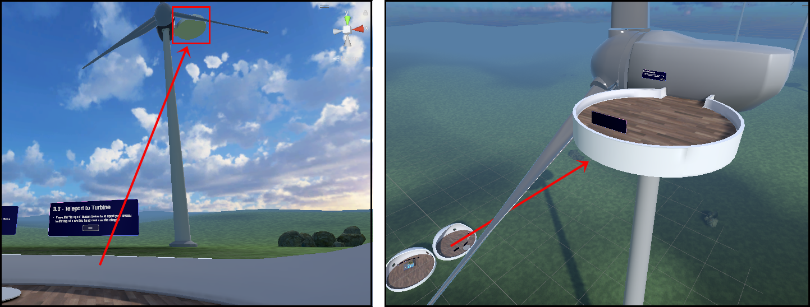

# Mesh Physics Overview

In a Mesh experience, physics simulation is key to enabling engaging dynamic content. In order to provide Mesh participants with high quality shared physics experiences and offer developers a productive workflow in creating custom content, we've created the *Mesh Physics* system. Mesh Physics is based on local authoritative simulation, which results in a very simple architecture. There's no need for server-side logic and special logic on the clients. Most importantly, this approach results in a very responsive and low-latency experience for each player interacting with their environment, even when connected to a high-latency network.

**Distributed physics simulation**

Mesh physics synchronizes the positions of rigid bodies and should work out-of-the-box, assuming all clients share the same scene. Most Unity physics features (for example, rigidbodies, colliders, materials, and constraints)  will be synchronized without extra developer effort:

**Notes:**

* Only rigidbody positions & orientations are synchronized with interpolation
* Discrete state changes (for example, breakable constraints) and trigger events must be avoided

Each client is responsible for simulating some of the bodies, called the distributed simulation *ownership*. When a player touches a rigid body, simulation ownership is immediately transferred to allow low-latency interaction. For neighboring bodies, the physics synchronization engine performs local prediction, interpolation, and automatic ownership redistribution to minimize visual artifacts.

Mesh Physics offers interaction and additional physics-related functionalities such as:

* various fields to physically influence bodies inside (buoyancy, gravity)
* various components to modify the behavior of individual bodies (magnetic, sticky, throwable)
* the ability to reset bodies to their startup positions (selective scene cleanup)
* [Mesh Emulator](../../debug-and-optimize-performance/mesh-emulator.md) support for multi-user testing of the features above

Here are more things you can do with Mesh Physics features:

* Allow participants to grab and carry objects.

* Control how gravity affects objects.

* Make an object “sticky”—it sticks to whatever it hits. Examples: throwing a dart at a dart board, attaching a picture to a wall.

* Add auto-play animations that interact with physics bodies.

* Allow participants to reset objects (for example, reset a chess board, or clean up a room after objects have been scattered about).

* Fire events when an object enters a trigger collider.

* Create a containment field. Objects will stay within the boundaries of the field.

* Control the velocity of an object.

* Control the buoyancy of objects&mdash;for example, make boats and other seagoing objects “float.”

* Control the angular velocity of an object.

* Create an explosion, causing nearby objects to move outward or in a specific direction.

* Create “bouncy” objects that bounce off each other with a predefined velocity.

* Teleport an object to a new position and (optional) new rotation.

## Terminology

Throughout the Mesh Physics articles, "body" is used as shorthand for "Rigidbody."

## Next steps

> [!div class="nextstepaction"]
> [Mesh Physics in Samples](mesh-physics-in-samples.md)