# UnityEvents and AnimationEvents

UnityEvents and AnimationEvents can be an effective way to employ user-driven callbacks. Normally, UnityEvents can set properties and invoke methods on components, and AnimationEvents can call script methods from certain points in an animation. However, Mesh has restrictions that you should keep in mind: UnityEvents and AnimationEvents are only allowed to initiate visual script flows (which can then set properties and invoke methods). UnityEvents can point to *ScriptMachine.TriggerUnityEvent* and AnimationEvents can point to *ScriptMachine.TriggerAnimationEvent*. From there, corresponding visual script flows can be triggered through "Unity Event" or "Animation Event" event nodes. This article walks you through brief tutorials for setting up and using both UnityEvents and AnimationEvents. 

## UnityEvent in a basic script

To demonstrate how a UnityEvent in a visual script works, we'll create a button that, when clicked, causes a message to appear in the **Console** window.

### Create the button

1. In your project, drag the **Console** window into the right side of the **Scene** window so you can view them side-by-side.
1. On the menu bar, select **GameObject** > **UI** > **Legacy** > **Button.**
1. Ensure that **Button** is selected, and then, in the **Inspector**, reset **Button** so that its **Rect Transform** component's XYZ values are all set to zero.
1. In the **Scene** window, adjust the view so that you can clearly see the button.

    

1. In the **Inspector**, navigate to the **Button** component and note that it contains an **On Click()** UnityEvent. 

## Create a Script Machine

Right now, there are no events to trigger--we'll add something here in a moment. First, let's create the event. We'll keep it simple and set things up so that when you click the button, a message appears in the **Console**.

1. On the menu bar, select **GameObject** > **Create Empty**.
1. Change the empty object's name to *MessageHolder*.
1. In the **Inspector**, select the **Add Component** button and then search for and add **Script Machine**.
1. In the **Script Machine** component, select the **Source** drop-down and then select **Embed**.
1. Select the **Edit Graph** button, and then dock the **Script Graph** window next to the **Project** window.
1. In the script graph, delete the two default nodes.
1. Right-click in the graph and then add the **UnityEvent Event** node.

    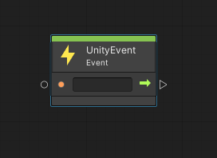

1. Name the **UnityEvent Event** node: in the text field in the node, add the name *ShowClickMessage*.

    

1. Drag the control output port of the **UnityEvent Event** node and then, in the Fuzzy Finder, search for and add the **Debug Log Message** node.

    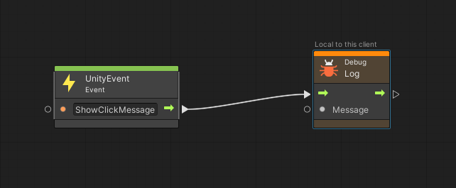

1. Drag the data input port of the **Debug Log Message** node and then, in the Fuzzy Finder, search for and add the **String Literal** node.
1. In the **String Literal** node, add the text: "You clicked the button!"

    

### Connect the button to the script

1. In the **Hierarchy**, select **Button (Legacy)** and then, in the **Inspector**, navigate to its **On Click()** UnityEvent.
1. Click the plus sign ("+") in the UnityEvent.
1. Drag the **MessageHolder** GameObject from the **Hierarchy** and then drop it in the field in the **On Click()** UnityEvent property that says **None (Object)**.

    

1. Select the **No Function** drop-down, then point to **Script Machine**, and then select **TriggerUnityEvent (string)**.

    

    The final step here is to add the UnityEvent node you want to trigger to the **On Click()** event. In a more complex script graph, you might have several to choose from, each with a different name; in our simple example, there's only one: *ShowClickMessage*.

    

1. In the remaining blank field in the **On Click()** event, type "ShowClickMessage."

### Test your work

1. Save the project, and then click the Unity editor Play button.
1. In the **Game** window, click the button. This causes the "You clicked the button!" message contained in the **String** node in the script graph to appear in the **Console**.

    

    Each time you click the button, the message appears.

**Note**

- With the *ScriptMachine.TriggerUnityEvent* function, you can't pass any parameters into the script flow.

## UnityEvents and Timeline Signals

You can trigger a UnityEvent from a [Timeline](multi-room-sync.md#animate-timelines-in-unity-for-mesh) by adding a Signal Emitter, then creating a Signal Asset and connecting it to the Signal emitter, and then creating a Signal Receiver component. Inside the Signal Receiver, you select a Signal Asset and then choose the function you wish you call (in other words, the UnityEvent). This is similar to how the UnityEvents work in the Button example explained above--the same event callback, *ScriptMachine.TriggerUnityEvent*, is used.

In this example, we created a Signal Asset named *Clicks*.

To learn more about using Signals in the Timeline, [see this Unity Blog](https://blog.unity.com/engine-platform/how-to-use-timeline-signals).

## AnimationEvents

You can increase the power of animation clips With AnimationEvents, which allow you to call a function from a clip at a specific point in time, or a specific frame, that you specify. Using AnimationEvents is similar to using UnityEvents; instead of pointing to *ScriptMachine.TriggerUnityEvent*, an AnimationEvent points to *ScriptMachine.TriggerAnimationEvent*. For this example, we'll use the [ScienceBuilding sample](../getting-started/samples/science-building.md) that's contained in the Mesh Toolkit and is already set up with assets you can use. We'll work with an animation clip where a robot points to an informational popup; we'll insert an AnimationEvent into the clip that causes the **Console** to display a message when the robot points. We're keeping this simple for learning purposes but you can use AnimationEvents to trigger a range of effects, sounds, or other actions during an animation.

1. Open the *ScienceBuilding* project, and then open the *ScienceBuilding* scene.
1. Dock the **Console** window to the right of the **Scene** window so that you can see both simultaneously.
1. In the **Hierarchy**, search for and then select the *ReceptionBot* GameObject.

    **TIP**: To easily find *ReceptionBot*, type "bot" in the **Hierarchy** search box.

1. Move the cursor over the **Scene** window and then press F on your keyboard to zoom in close to *ReceptionBot*. You may need to adjust the view further in order to see *ReceptionBot* more clearly.

### Copy ReceptionBot's animation

1. In the **Inspector**, navigate to the **Animation** component.

    Note that the component contains an animation named *ReceptionBot_clip*. This animation causes *ReceptionBot* to point to various info dialogs that pop up around it. However, the animation is set to read-only, which means you won't be able to add an AnimationEvent to it. To get around this, we can copy it and then use the editable copy.

1. In the **Project** window, search for "reception." This will return a list that includes **ReceptionBot_clip**. 

    **IMPORTANT**: There are two items in the list with the name "ReceptionBot_clip." One is an .FBX file, and the other is the  animation clip we're interested in. Make sure you select the *animation clip*, not the .FBX file, before proceeding with the next step of copying. You can confirm that you've selected the right item by viewing its full name in the status bar at the bottom of the window and ensuring that it has the *.anim* extension.

    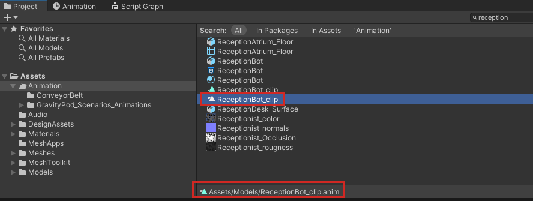

1. Select the **ReceptionBot_clip** animation clip and then press Ctrl + D to copy it.
1. Rename the copy "ReceptionBot_clip_copy."
1. In the **Hierarchy**, search for and then select the *ReceptionBot* GameObject.
1. In the **Inspector**, navigate to the **Animation** component and note that it currently points to **ReceptionBot_clip**.
1. Drag **ReceptionBot_clip_copy** from the **Project** folder and then drop it in the **Animation** component's **Animation** property, replacing the previous animation clip.

    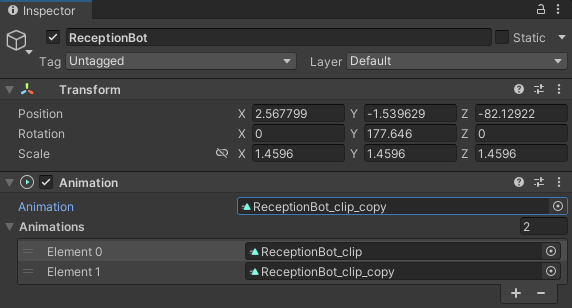

1. In the component's **Animations** section, select the **Element** that contains **ReceptionBot_clip** and click the minus ("-") button to delete it.

    

### Viewing the animation

1. If you haven't done so already, in the **Scene** window, adjust the view so that you can clearly see *ReceptionBot* from the front.
1. On the menu bar, select **Window** > **Animation** > **Animation**.
1. Dock the **Animation** window next to the **Project** window.
1. In the **Animation** window, move the playback head to frame 224 as show below. Note that in the **Scene** window, *ReceptionBot* is pointing to the first in a series of informational popups. We'll insert our AnimationEvent at this frame.

    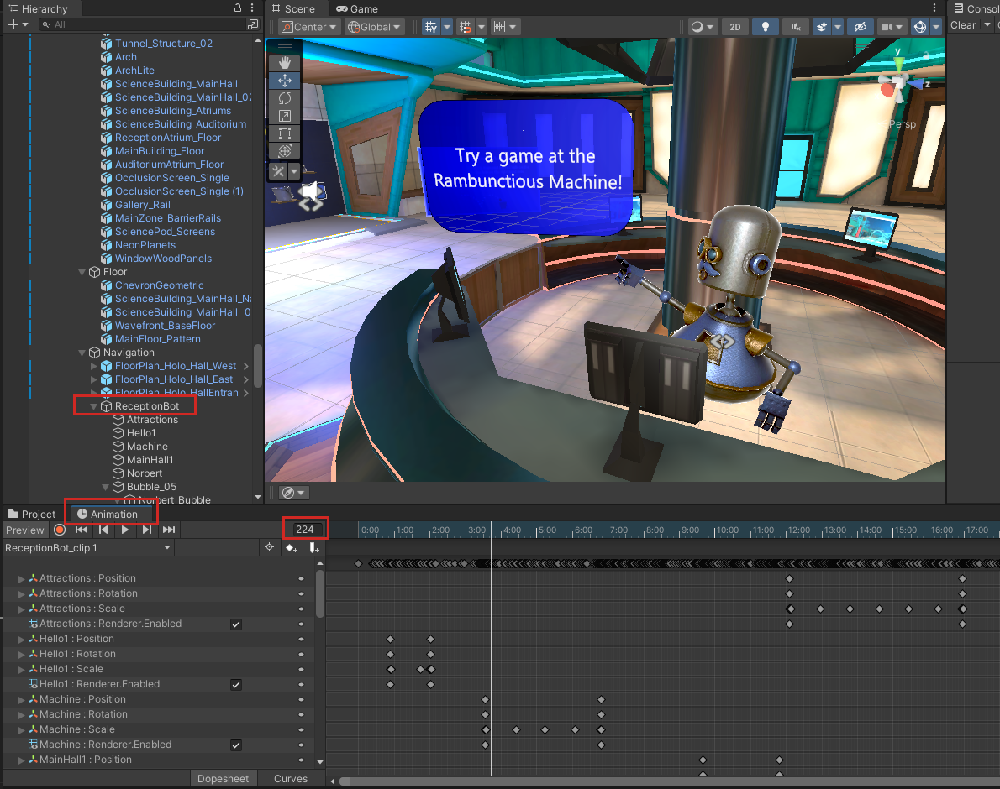

    First, though, we'll create the visual script that we'll be calling from the animation.

**TIP**: You can scrub the Animation timeline to zero in on the precise frame that you want to add an AnimationEvent to.

### Create the Visual Script

1. With **ReceptionBot** selected in the **Hierarchy**, select the **Add Component** button in the **Inspector** and then add the **Script Machine** component.
1. Click the **Source** drop-down and then select **Embed**.
1. Click the **Edit Graph** button.
1. Dock the **Script Graph** window next to the **Animation** window and then delete the two default nodes, **On Start** and **On Update**.

    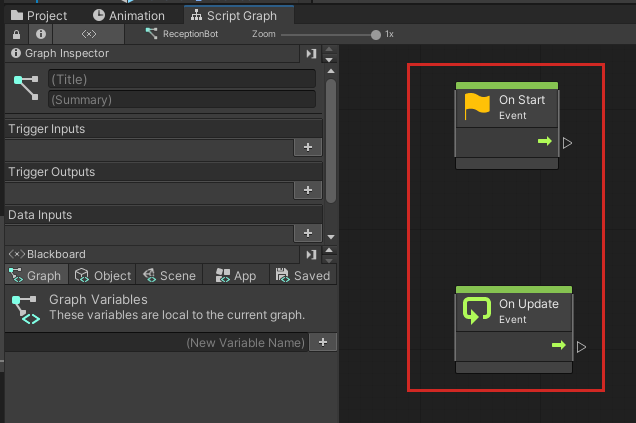

    There are two types of AnimationEvent nodes, as shown below.
    
        
    
    The function called by an AnimationEvent has the option to take one parameter; it can be a float, string, int, or object reference, or an AnimationEvent object. In the node on the right, you can add a name. This is the node we'll use here.

1. Right-click in the script graph and then, in the Fuzzy Finder, search for "named anim" and then add the *Named Animation Event* node.
1. In the node, add the name "ShowMessage."

    

1. Drag a connector from the output control port of the **AnimationEvent** node and then create a new **Debug Log** node (in the Fuzzy Finder, search for **debug log**.)
1. Drag a connector from the data input port of the **Debug Log** node and then create a new **String** (Literal) node (in the Fuzzy Finder, search for **string literal**.)
1. In the **String** node, add this text: "Bot pointed to the first popup."

    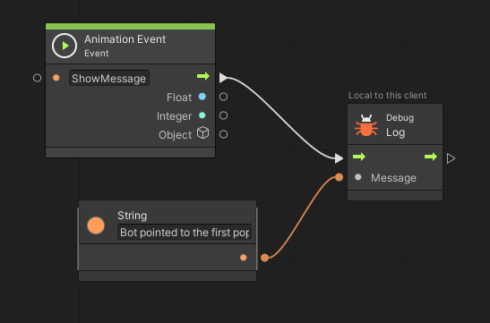

### Add the AnimationEvent in the Animation window

1. Select the **Animation** tab.
1. In the **Animation** window, ensure that the playback head is at frame 224.
1. Click the Add Event button. This will cause an AnimationEvent marker to appear at frame 224.

    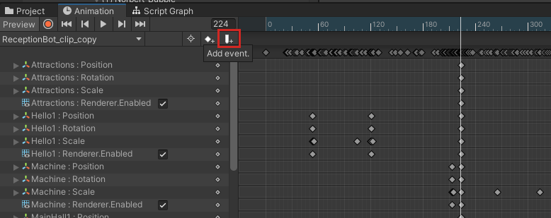

1. In the **Inspector**, select the **Function** drop-down, and then select **Script Machine** > **Methods** > **TriggerAnimationEvent (Animation Event)**.

    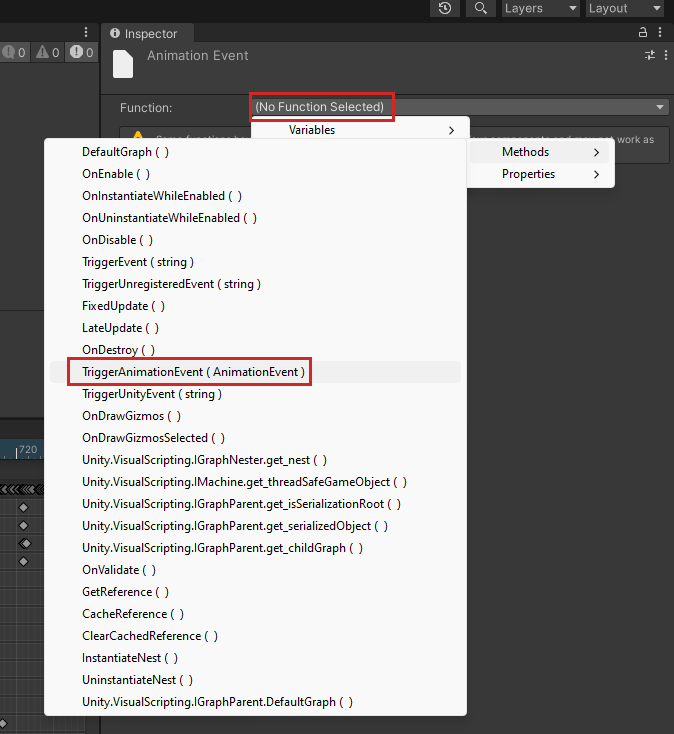

1. Recall that when you created the script machine for *ReceptionBot* you named the **AnimationEvent** node *ShowMessage*. 

    

1. In the **Inspector**, add this name to the text field for the **String** property. This ensures that when the AnimationEvent in the **Animation** window fires at frame 224, it connects to the **AnimationEvent** node in the script graph and triggers the function that displays the message in the **Console**.

    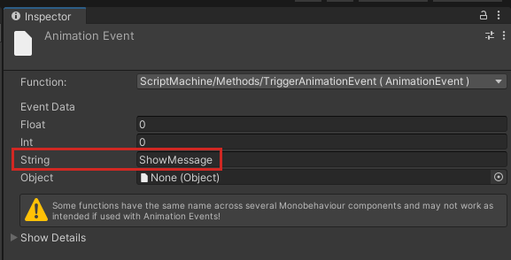

### Test your work

1. Save the project and then press the Unity Editor Play button.
2. Note that after a few seconds, the message from the **String** node in the script graph, "Bot pointed to the first popup.", displays in the **Console**.

    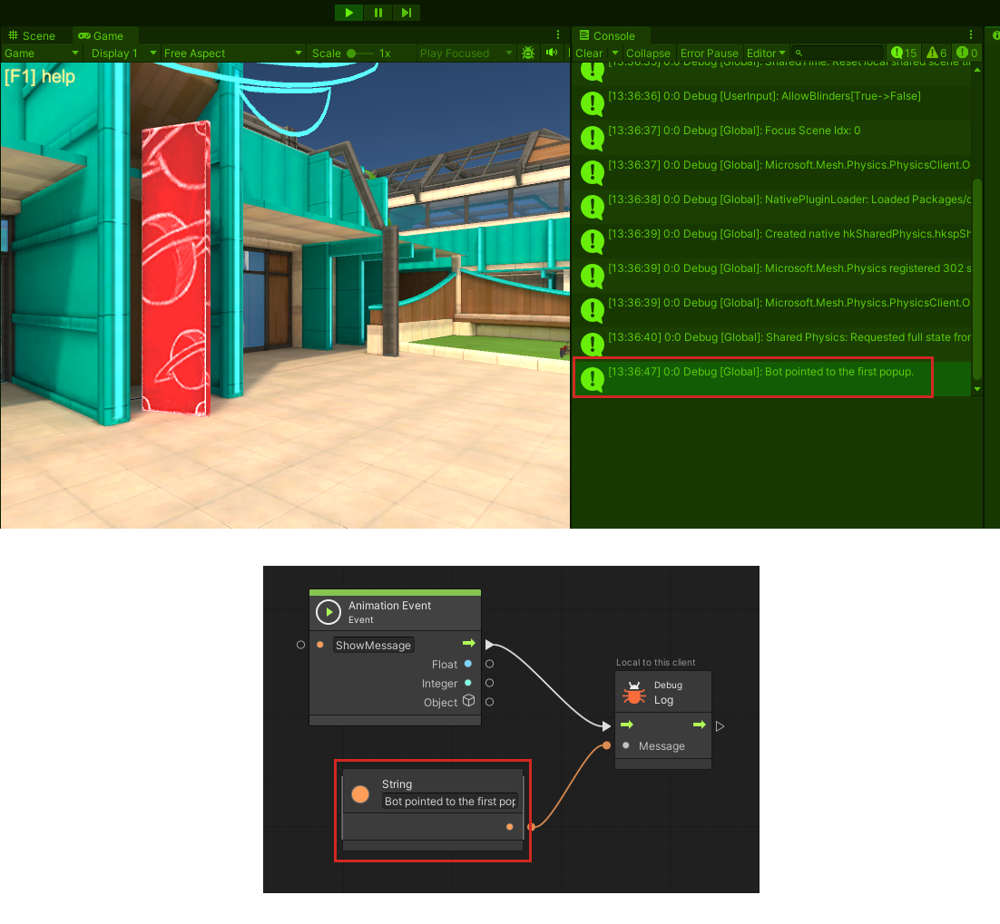

Your [Mesh Emulator](../debug-and-optimize-performance/mesh-emulator.md) avatar, with attached camera, doesn't appear in the reception area by default, so you can't initially see the synchronization between the pointing *ReceptionBot* and the display of the message in the **Console**. If you want to view this synchronization, you must navigate to the reception area and get a close-up view of *ReceptionBot*.

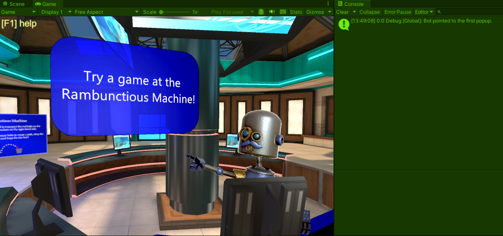    

The reception area is forward and to the left of the original vantage point of the camera. You can navigate there while in Play mode.

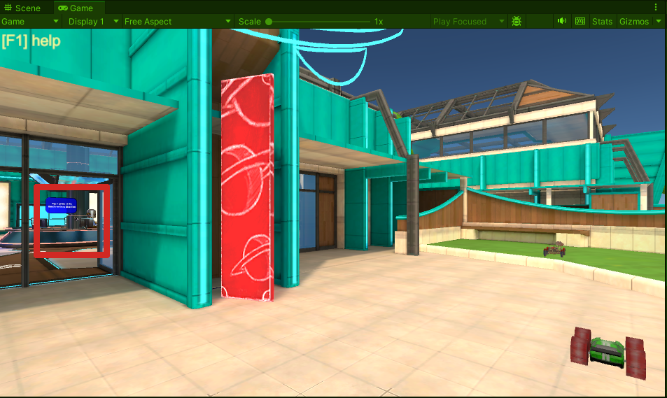

**Navigation tips**:

Move forward:   W  
Move back:      S  
Move left:      A  
Move right:     D  
Pan left:       Q  
Pan right:      E  

You can also pan up/down/left/right with your mouse's buttons.

**TIP**: In the **Console** window, it's easier to see the "Bot pointed to the first popup" message when the window is clear. Click the **Clear** button as needed to remove other system messages that appear. 

