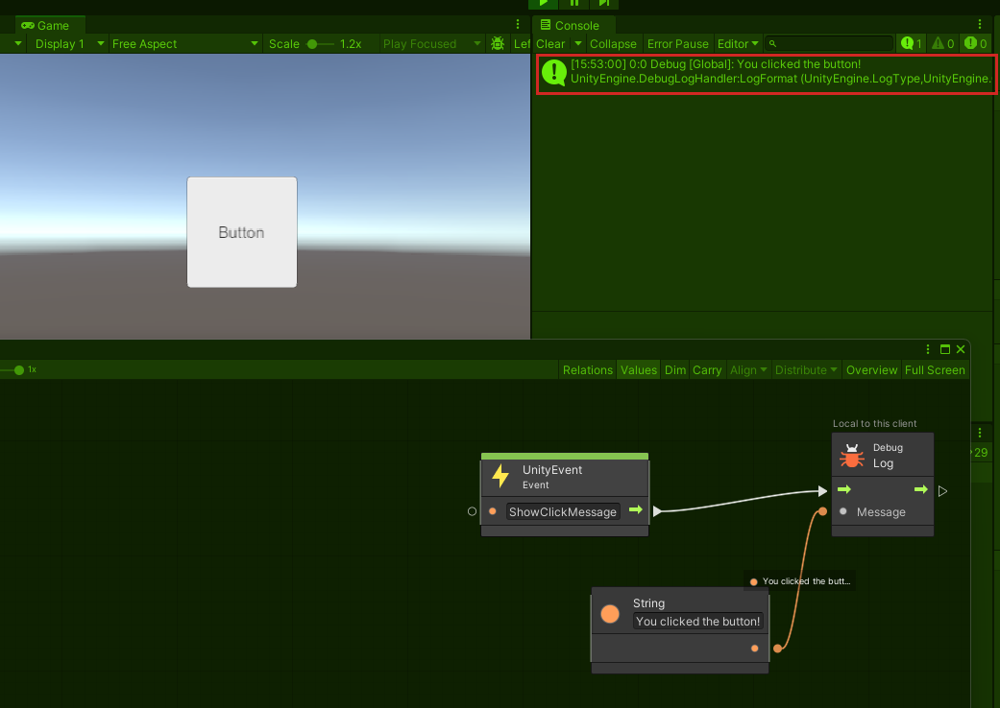

# UnityEvents and AnimationEvents

This article contains a brief tutorial on how to use UnityEvents with Visual Scripting. **IMPORTANT**: UnityEvents can *only* be used in script graphs; they're not available in cloud scripting.

1. Drag the Console window into the right side of the Scene window.
1. On the menu bar, select **GameObject** > **UI** > **Legacy** > **Button.**
1. Ensure that **Button** is selected, and then, in the **Inspector**, rest **Button** so that its **Rect Transform** component's XYZ values are all set to zero.

    

1. Scroll down to the bottom of the **Inspector** and note that **Button** has an **On Click()** UnityEvent attached. 

    Right now, there are no events to trigger--we'll add something here in a moment. First, let's create the event. We'll keep it simple and set things up so that when you click the button, a message appears in the **Console**.

1. On the menu bar, select **GameObject** > **Create Empty**.
1. Change the empty's name to *MessageHolder*.
1. In the **Inspector**, select the **Add Component** button and then search for and add **Script Machine**.
1. In the **Script Machine**, select the **Source** drop-down and then select **Embed**.
1. Select the **Edit Graph** button, and then, in the script graph, delete the two default nodes.
1. Right-click in the graph and then add the **UnityEvent Event** node.

    

1. Name the **UnityEvent Event** node: in the text field in the node, add the name *ShowClickMessage*.

    

1. Drag the control output port of the **UnityEvent Event** node and then, in the Fuzzy Finder, search for and add the **Debug Log Message** node.

    

1. Drag the data input port of the **Debug Log Message** node and then, in the Fuzzy Finder, search for and add the **String Literal** node.
1. In the **String Literal** node, add the text: "You clicked the button!"

    

    That's all we need for the script. Let's connect the UnityEvent in the button to the script.

1. In the **Hierarchy**, select **Button (Legacy)** and then navigate to its **On Click()** UnityEvent.
1. Click the plus sign ("+") in the UnityEvent.
1. Drag the **MessageHolder** GameObject from the **Hiearchy** and then drop it in the field in the **On Click()** that says **None (Object)**.

    

1. Select the **No Function** drop-down, then point to **Script Machine**, and then select **TriggerUnityEvent (string)**.

    

    The final step here is to add the *name* of the UnityEvent you want to trigger to the **On Click()** event. In a more complex script graph, you might have several to choose from; in our simple example, there's only one.

    

1. Click the Unity editor Play button.
1. In the **Game** window, click the button. This causes the "You clicked the button!" message from the String node in the script graph to appear in the **Console**.

    

