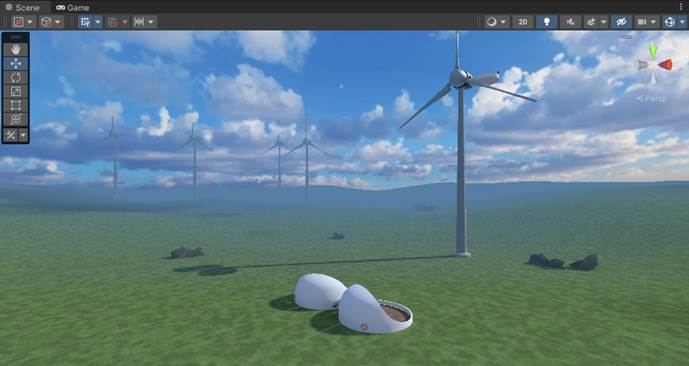
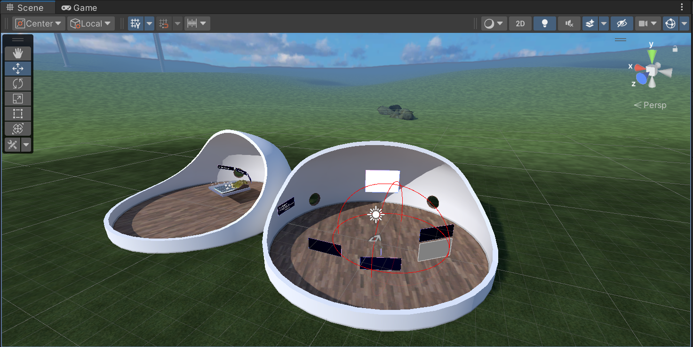
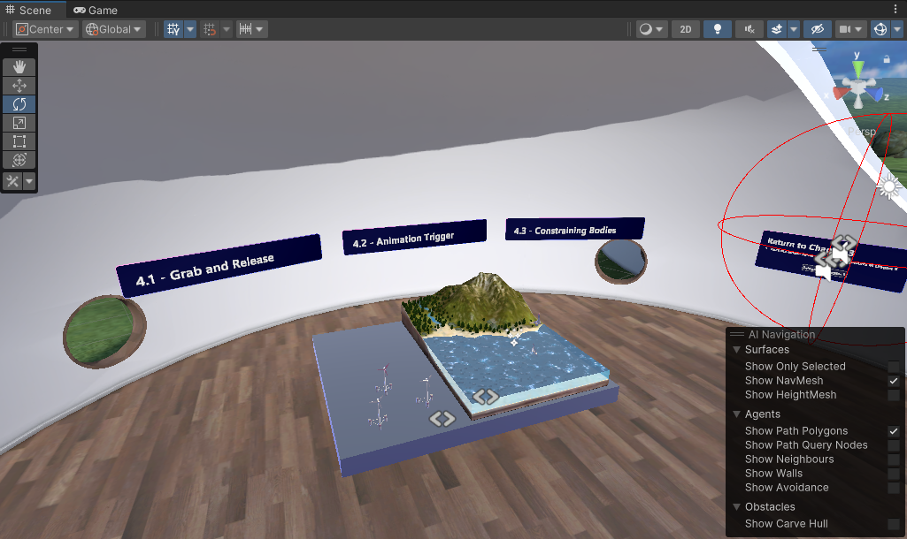
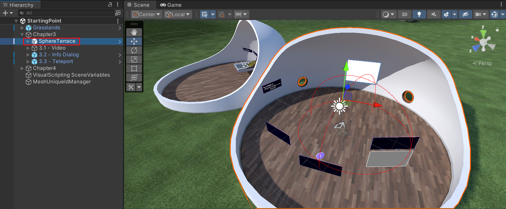

# Mesh 101 Tutorial Chapter 2: Prepare the project

### Scenes in the project

1. Open the **Mesh101** project in Unity. If you have more than
    one version of Unity installed, be sure to open the project with `Unity 2022.3.7f1` which is required for this tutorial.

2. In the **Assets** folder, there are two scenes available: **Starting Point** and **Finished Project**.

    

    Open the **StartingPoint** scene. You should see the **TMP Importer** window.

3. Select **Import TMP Essentials**, and then close the window.

    

    In the **Scene** window, the letter "T" appears over every object that's using **TextMeshPro**. You can turn these off to achieve a less cluttered
    view. To do so:

1. In the toolbar above the upper right corner of the **Scene** window,
    select the Gizmos drop-down.
2. In the **Scripts** section, scroll down to **TextMeshPro**, and then
    select its **icon** toggle button. This turns off the display of
    "T"s in the **Scene** window.

    

### About the Scenes

**StartingPoint**: This is the scene you'll do the tutorial in. It
contains a pre-built setting that includes the wind turbines and
stations you'll be visiting and adding Mesh features to.

**FinishedProject**: As the title implies, this scene contains an
accurate completed version of the tutorial. You can refer to this at any
time to confirm that you've completed tutorial steps in the
*StartingPoint* scene correctly. Always save your work in the
*StartingPoint* scene before switching scenes.

### Exploring the `StartingPoint` scene

Feel free to move around in the **Scene** window to get familiar with
the scene's contents. If we zoom out a little, we can see that there are
a number of wind turbines in our wind farm. Those two white rounded
items at the bottom of the window are called *Sphere Terraces*.

If you navigate to the front of the Sphere Terraces and take a closer
look, you can see that each Sphere Terrace contains a space inside that
you'll soon be walking around in.

You'll be visiting the Sphere Terraces starting in the next chapter---they each contain a series of stations where you'll learn how to implement Mesh features. The first Sphere Terrace (covered in Chapter 3) is where you'll learn about Mesh Visual Scripting ...

... and the other Sphere Terrace, covered in Chapter 4, is where you'll
learn about Mesh Interactables and Mesh Physics.

### Choose the NavMesh layer

For this project, we want our avatar to be able to walk around only on
the floors inside the *Sphere Terrace* objects and the floor of a
platform that's attached to one of the wind turbine generators. For
these areas to be teleportable, they must be on the *NavMesh* layer. Let's
add the *Sphere Terrace* in Chapter 3 to the NavMesh layer.

1. In the **Hierarchy**, expand the **Chapter 3** GameObject.

1. Select the **Sphere Terrace** GameObject that's a child object to
    the **Chapter3** GameObject.

    

1. In the **Inspector**, select the **Layer** drop-down and then choose
    **NavMesh**.

    

You don't have to add the other walkable GameObjects to the NavMesh
layer---we've already done it for you.

### Add the Mesh Emulator

Let's add the *Mesh Emulator* (or, simply, the "Emulator") to your project. This will give you an
approximate preview of what the content will look and feel like when it runs in the Mesh app every time you enter Play mode. A key feature of the Mesh Emulator is the ability to run multiple clients within the same process; this allows you to easily get a first impression of a multi-user scenario.

**To add the Mesh Emulator**:
1. Press the Play button. This dialog appears:

    

1. Select the first button, **Add working MeshEmulatorSetup prefab.** The **MeshEmulatorSetup [NoUpload]** prefab appears in the **Hierarchy**.

    

    This prefab provides you with a highly stylized avatar controller that has a camera attached, so now when we "play" the project we can have a look around.

    

1. Select the Unity Editor Play button.

1. In the **Game** window, note that you now have a view from the avatar's position. Use the <kbd>W</kbd><kbd>A</kbd><kbd>S</kbd><kbd>D</kbd> keys to walk around inside the Sphere Terrace. You can also use the arrow keys or drag the right mouse button to pan in any direction. When you're done experimenting, click the Unity Editor Play button again to exit Play mode.

### Check the scale of your GameObjects

The tutorial project uses default Unity scale values: 1 unit = 1 meter.
The *MeshEmulatorSetup* avatar is the same height as an average human. When
you're creating your own Environment, you can compare its size to any
custom `GameObject` you add to your project to ensure that those objects
are the size you want.

### Add the Mesh Thumbnail Camera

Adding the `Mesh Thumbnail Camera` provides a thumbnail image that will be
added to your Environment's listing in the Mesh Portal and its
selection button in the Mesh app. This comes in handy when you're
selecting Environments in either place because it gives you a visual
reminder of what the Environment looks like.

**To add the thumbnail camera to the scene and set its view:**

1. In the **Scene** window, adjust the view so that it shows what you
    want to display in the thumbnail (the Thumbnail Camera's view will
    be based on the **Scene** window).

2. Select the "+" drop-down located below the **Hierarchy** tab, and
    then select **Mesh Toolkit** > **Thumbnail Camera**.

3. To confirm that the view in the Thumbnail Camera is what you want,
    in the **Hierarchy**, select **MeshThumbnailCamera**. The Camera's
    view appears in a small window in the lower right of the **Scene**
    window.

> **Note**: If you decide you want a different view for the Thumbnail
Camera, the easiest way to achieve this is to delete the Camera, establish the Scene view that you want, and then add the Camera again. You can also adjust the Camera GameObject directly in the **Scene**
window or change its **Position** and **Rotation** values in the
**Inspector** prior to uploading your Environment to Mesh.

There are no set rules for how your thumbnail should look---it's totally
up to you. For the example below, we chose a close-up front view of a
wind turbine.

## Next steps

> [!div class="nextstepaction"]
> [Chapter 3: Add interactivity with Mesh Visual Scripting](mesh-101-03-visual-scripting.md)