# Mesh 201 Tutorial Chapter 3: Load a local shared HTML file into a WebSlate

In the previous chapter of this tutorial, you enabled a button to load a local non-shared HTML file into a WebSlate. In this chapter, we'll also set up an HTML page to load, but this time it will have the capability to be shared among all attendees in the experience.

## Navigate to the buttons

1. In the **Scene** window, change your view so that you're looking at Station 1.2, pictured below.

Just as in the previous chapter, there's already a GameObject in place with some descriptive text but this time there are two buttons: **LoadButton1** and **LoadButton2**. There's also a WebSlate already in place. We'll complete the station by updating a script graph that's attached to one of the buttons. When an attendee clicks either button, a web page will load and all the other attendees in the experience can *share* in viewing the new page. Each button at this Station loads a slightly different type of content.

1. In the **Hierarchy**, collapse the GameObject named **1.1 - LocalWebslate**.
1. Expand **1.2 - StaticContentWebslate**. The **WebSlateFramed** object that has been pre-added is located here.

    

1. Expand **ChapterLabel** and its child object **Actions**. The buttons we'll be working with, **LoadButton1** and **LoadButton2**, are located here.

    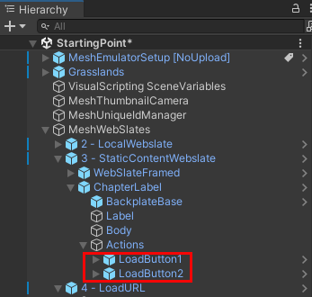

## Edit the script graph

1. In the **Hierarchy**, select **LoadButton1**.

    In the **Inspector**, you can see that that **LoadButton1** has a **Script Machine** component containing an embedded script named **Load HTML on a Shared Webslate** and a variable that we'll be using in the script.

    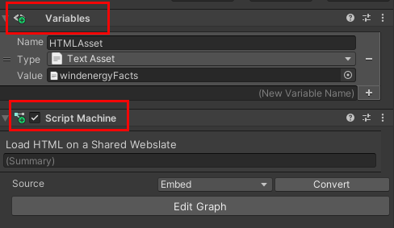

1. In the **Script Machine** component, click **Edit Graph**. 

    As in the previous chapter, the script graph has already been started for you.

    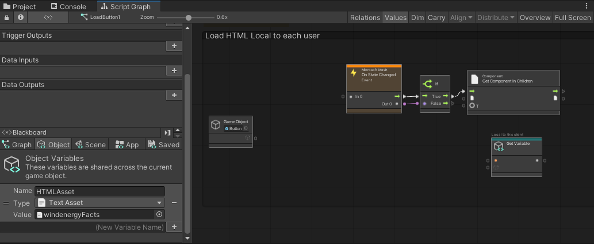

### Add the *Mesh Interactable Body: Is Selected* node

Our first task is to add a *Mesh Interactable Body: Is Selected* node. As discussed in the previous chapter, you have a choice of *two* "Mesh Interactable Body" nodes: *Is Selected Locally* or *Is Selected*. The text above each node can help you to confirm the behavior.

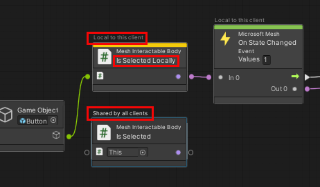

For Station 1.0, we wanted only the person triggering the event to experience it, so the script contained the node that says "Is Selected *Locally*". This time, we want *all* attendees to share the event, so we'll select the other node for this--the one that simply says "Is Selected".

1. Click and hold on the Data Output port of the **Game Object** node, and then release the mouse button. This opens the Fuzzy Finder. **WARNING**: Once you open the Fuzzy Finder, don't click anywhere outside of the Unity interface. This closes the Fuzzy Finder and causes unpredictable behavior in the Script Graph.
1. In the Fuzzy Finder, search for "Mesh Interactable Body: Is Selected" and then select it. 

    

    This adds the node to the graph.

1. Drag a connector from the Data Output port of the **Mesh Interactable Body: Is Selected** node and then connect it to the Data Input port of the **Microsoft Mesh: On State Changed** node.

    

### Add the *Web Slate: Load HTML Content (HTML Asset)* node

The **Get Component in Children** node already contains the target we want--**WebSlateFramed**--so we can move forward and add the next node.

1. Drag a connector from the Control Output port of the **Mesh Interactable Body: Is Selected** node and then create a new *Web Slate: Load HTML Content (HTML Asset)* node. As discussed in the previous chapter, keep in mind that there are two nodes with very similar names. 

    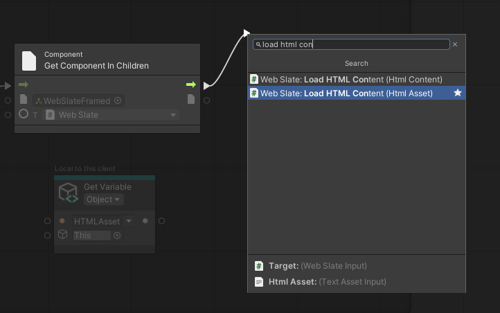

    You want the one that says "HTML **Asset**", not "HTML **Content**".

    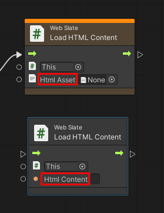

1. Drag a connector from the Data Output port of the **Get Component in Children** node and then connect it to the Data Input port of the **Web Slate: Load HTML Content** node.

1. We already have the web page we want to load in a **Get Variable** node. Drag a connector from the Data Output port of the **Get Variable** node and then connect it to the Data Input port of the **Web Slate: Load HTML Content** node.

    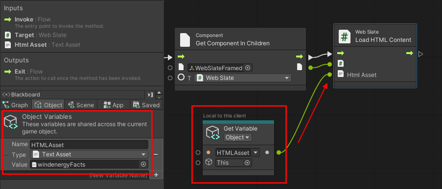

## Test your work

1. In Unity, save the project and then press the Unity Editor Play button.

1. Position yourself in front of Station 1.2. As in the previous chapter, WebSlate is displaying some information about Microsoft because the default URL in the **WebSlate** component is set to the Microsoft home page.

    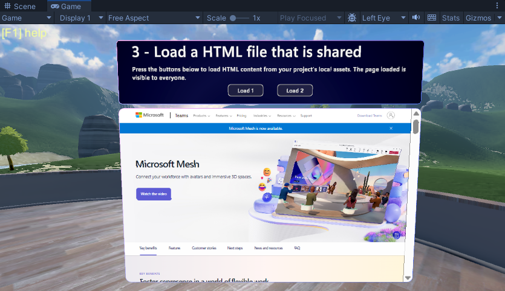

1. Click the **Load 1** button. The WebSlate loads and displays a page with the title "Wind Energy Across the World". Note that the WebSlate is interactive--you can click an empty space in the scroll bar to move the slider to that position and change the view of the page. (You can't drag the slider itself.)

    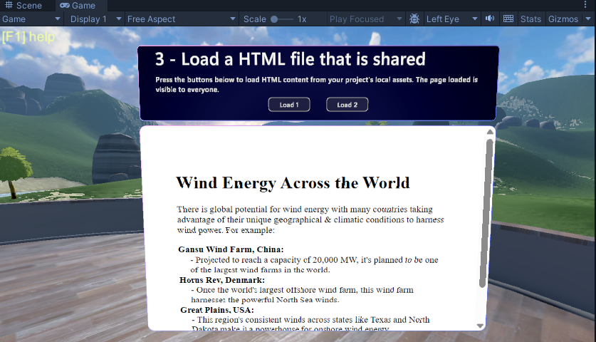

1. Click the **Load 2** button and note that an image loads into the WebSlate.

    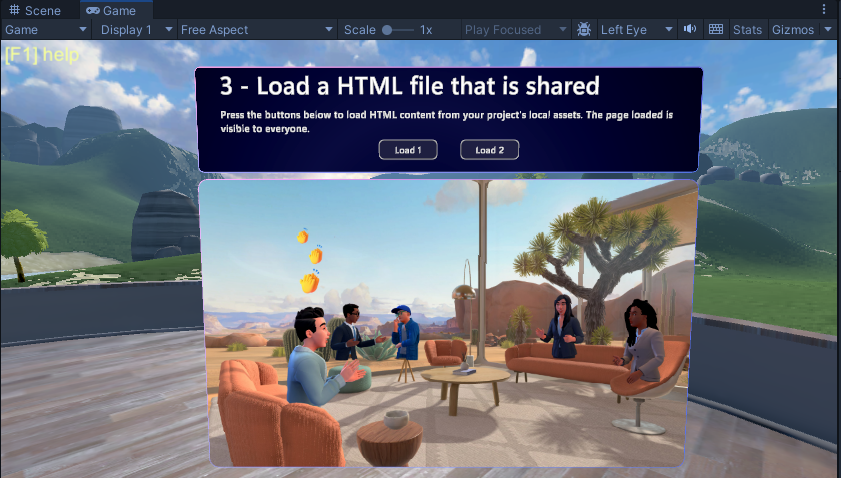

This works because we already have a complete script set up for the **Load 2** button and it has *exactly the same node structure as the script for the **Load 1** button*. The only difference is the variable for each script. For the **Load 1** button, the value for its **HTMLAsset** variable is the HTML file "windenergyfacts". 

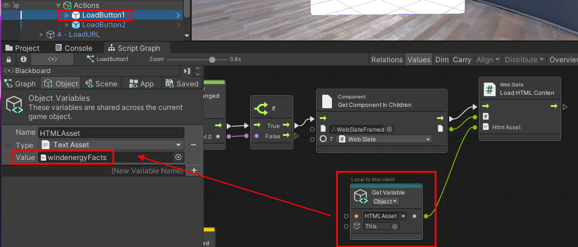

With the **Load 2** button, the value for its **HTMLAsset** variable is the HTML file "meshimage".

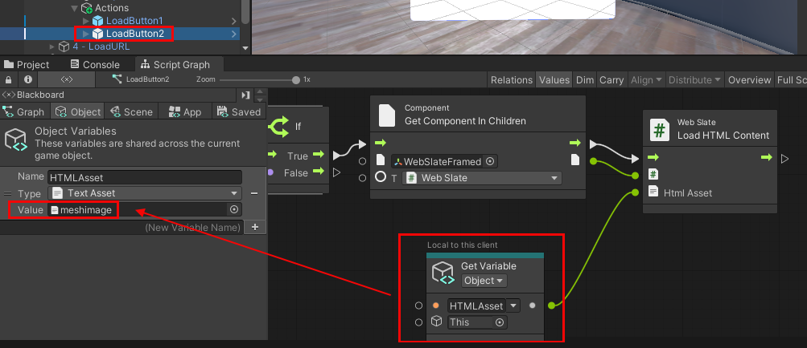

If you're curious about the meshimage.html file, open it and take a look. It's located in the project's **Assets** > **MeshWebSlates** > **HTMLFiles** folder.

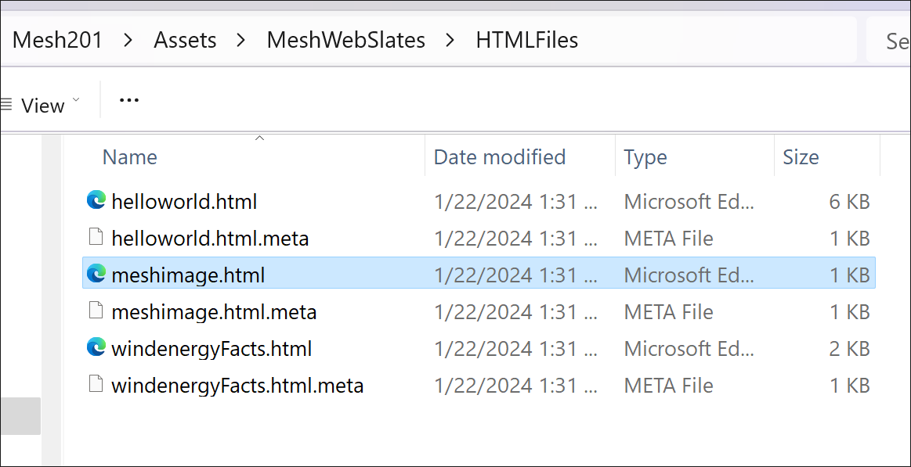

The sole content in the file is a link to the image that you saw when you clicked the **Load 2** button.

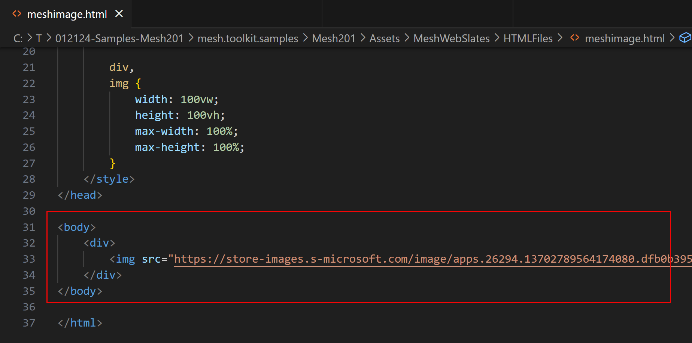

## Next steps

> [!div class="nextstepaction"]
> [Chapter 4: Load a URL from a 3D asset](./mesh-201-04-webslate-3.md)
