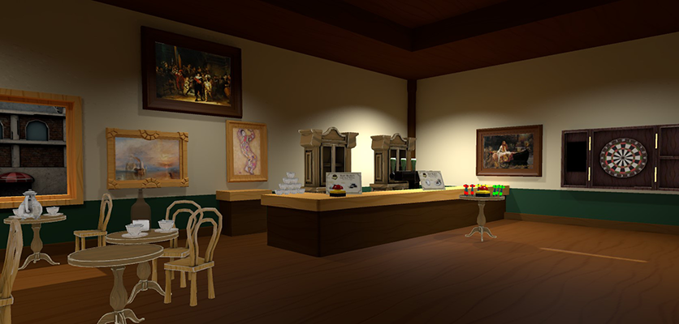
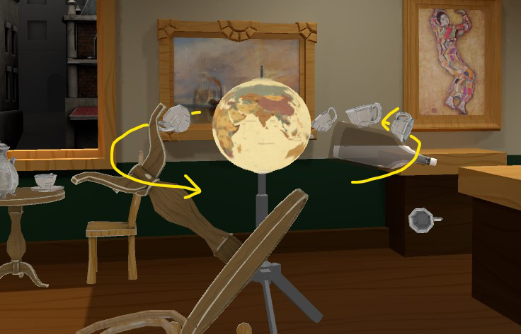

# Microsoft Mesh Toolkit Sample: Dart Room

The *Dart Room* project (scene: *DartRoom*) contains a carefully designed scene that demonstrates the power of combining appealing visuals with the creative use of Mesh Physics features found in the Mesh Toolkit. Feel free to inspect and modify the scene and play with it!.

In this project, you'll find:

* **Cups**: Simple objects to pick up.
* **Tables**: When grabbed, they try to align themselves with gravity.
* **Cupboards**: These should feel heavy. They use physics constraints.
* **Reset buttons** (red): Resets the transforms of a sub-scene.
* **Clock pendulums**: Powered by a physics hinge and velocity field.
* **Darts**: You can throw these in the camera direction. They're "sticky," so they'll stay attached to anything they hit.
* **Globe**: The globe rotates, demonstrating a motored hinge. The globe also has a gravity field which influences small objects entering a spherical trigger volume. Drag some cups close to the globe and watch them rotate around it like satellites.

## Feedback and contributions

This project welcomes contributions and suggestions.  Most contributions require you to agree to a
Contributor License Agreement (CLA) declaring that you have the right to, and actually do, grant us
the rights to use your contribution. For details, visit <https://cla.opensource.microsoft.com>.

When you submit a pull request, a CLA bot will automatically determine whether you need to provide
a CLA and decorate the PR appropriately (e.g., status check, comment). Simply follow the instructions
provided by the bot. You will only need to do this once across all repos using our CLA.

This project has adopted the [Microsoft Open Source Code of Conduct](https://opensource.microsoft.com/codeofconduct/).
For more information see the [Code of Conduct FAQ](https://opensource.microsoft.com/codeofconduct/faq/) or
contact [opencode@microsoft.com](mailto:opencode@microsoft.com) with any additional questions or comments.

## Contributions

Mesh is a new product from Microsoft, and at this time we are not accepting code contributions to our samples.  If you have any feedback or if you run into any issues with the samples or the Mesh Toolkit, do the following: in a Unity project that has the Mesh Toolkit package installed, select **Mesh Toolkit** -> **Give feedback to Microsoft** and then use the feedback link in the Mesh Toolkit to let us know.

This project has adopted the [Microsoft Open Source Code of Conduct](https://opensource.microsoft.com/codeofconduct/).
For more information see the [Code of Conduct FAQ](https://opensource.microsoft.com/codeofconduct/faq/) or
contact [opencode@microsoft.com](mailto:opencode@microsoft.com) with any additional questions or comments.

The [Samples Overview](samples-overview.md) page contains instructions on how to download the Mesh Toolkit.

## License

The Mesh sample in this project is governed by the MIT license as shown in the [LICENSE.MD](https://github.com/microsoft/Mesh-Toolkit-Unity/blob/main/LICENSE) file in the *Mesh-Toolkit-Unity* repository. However, the samples functionality is dependent on the Mesh Toolkit, which is governed by a separate license, and contains 3rd party software. 
