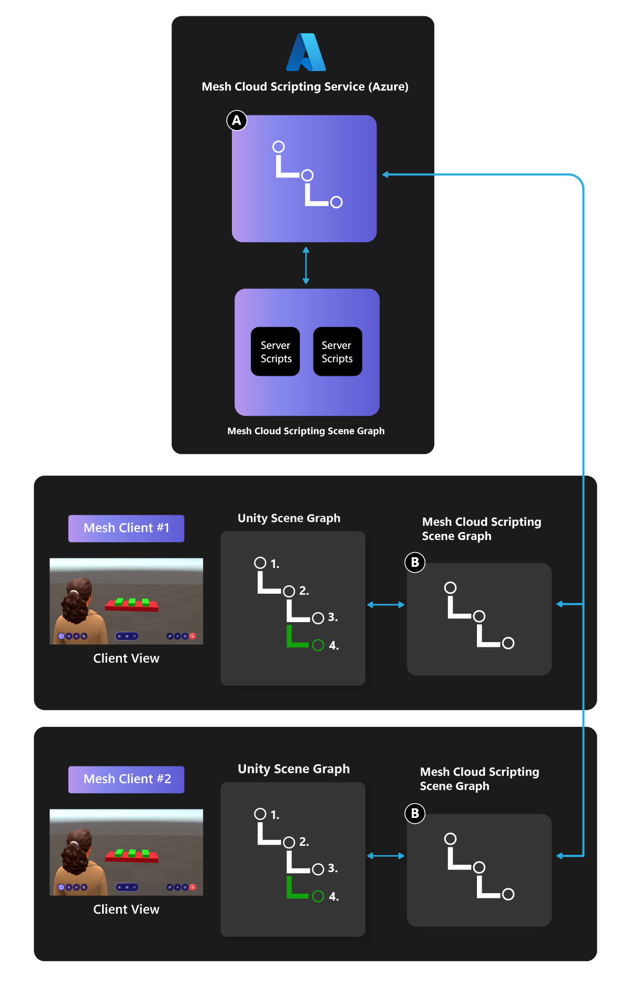
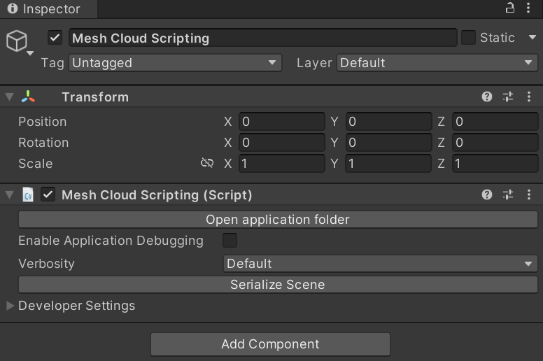
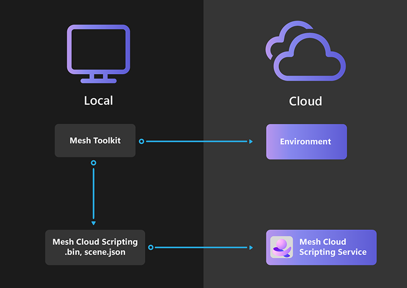
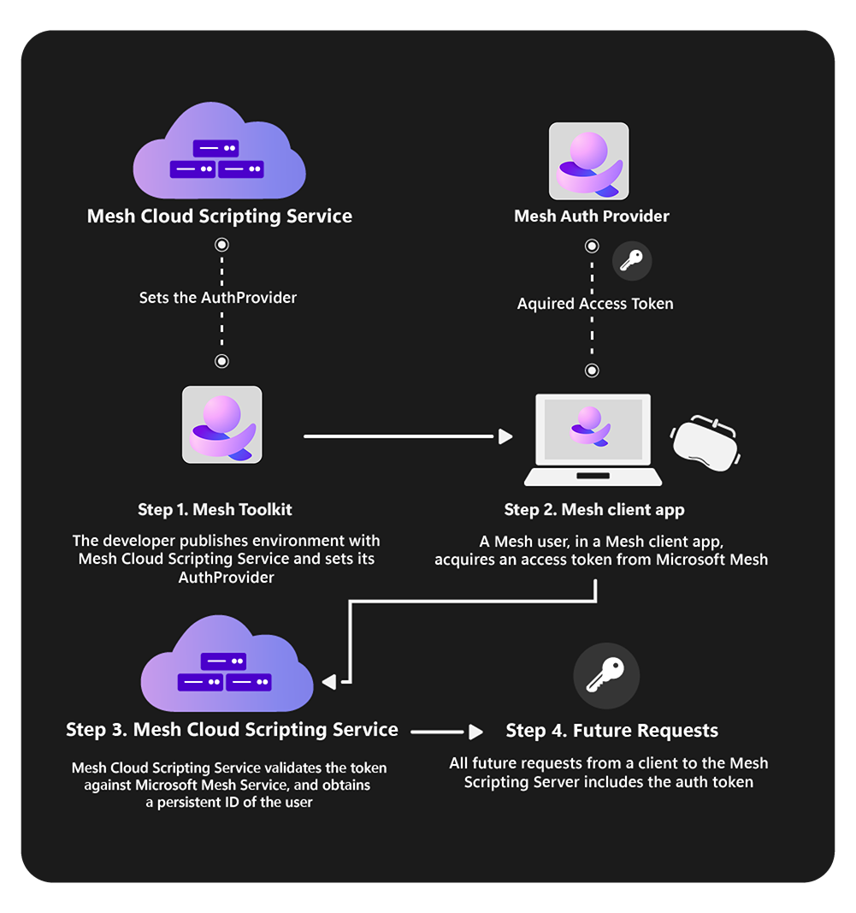

# Cloud scripting basic concepts

Read an [overview of Mesh Cloud Scripting and Mesh Visual Scripting](../mesh-scripting-overview.md)

## Differences between Mesh Cloud Scripts and MonoBehaviours

There are several major differences between Mesh Cloud Scripting and MonoBehaviours:

- Cloud Scripting Services are written against the Mesh Cloud Scripting API (as opposed to the Unity API).
- Cloud Scripting Services run in the cloud in a separate process (as opposed to on the client), and their effects are automatically synchronized to all connected clients.

## Architecture Overview

To enable Mesh Cloud Scripting, an application service called *Mesh Cloud Scripting Service* is deployed to a particular Azure resource group that you provide. Cloud Scripting runs on the Azure back end and consists of a set of server C# scripts running in a container with an endpoint that the clients connect to. In the diagram below, you can see that there are two clients that connect to Cloud Scripting Service. Cloud Scripting Service has its own authoritative scene graph (marked "A" in the diagram). Cloud Scripting Service interacts with this scene graph through the Mesh Cloud Scripting scene graph API.

The Mesh Cloud Scripting scene graph is automatically synchronized from the cloud to all connected clients. Each client has an identical copy of the Mesh Cloud Scripting scene graph (marked "B" on the diagram), which is kept in sync with the authoritative cloud version. When the Mesh Cloud Scripting Service makes changes to the scene graph in the cloud, these changes are propagated to the copies on all the clients.

On each client, the Unity Mesh runtime reacts to changes in the client's instance of the Mesh Cloud Scripting scene graph and updates the Unity scene to reflect its state. Although the Mesh Cloud Scripting scene graph API and the Unity scene graph API are different, they map closely to each other and have the same or similar structure.

### Mesh Cloud Scripting, Game Objects, and the Mesh Cloud Scripting Scene Graph

Objects that eventually appear in an Event in the Mesh app can be divided into two categories:

1. Objects that you add to your Environment in Unity.

1. Objects you [customize your Event](../../../events-guide/customize-event.md) with. Since these weren't part of the Environment, Mesh Cloud Scripting is unaware of them.

## Building a scene

In order to enable Mesh Cloud Scripting, your scene must have a *Mesh Cloud Scripting* component.

The component is responsible for managing the scripts you create and binding them to the Unity scene both at edit time and runtime in the Mesh app. Mesh Cloud Scripting is a standalone technology but it has a tight integration with Unity. You can find instructions for adding the Mesh Cloud Scripting GameObject in the [Getting Started Guide](cloud-scripting-getting-started.md) and more detailed information about scripting in the [Programmer's Guide](cloud-scripting-programmers-guide.md) section.

The Mesh Cloud Scripting scene graph is limited to GameObjects that you add to the scene under the GameObject that contains the Mesh Cloud Scripting component. Although Mesh Cloud Scripting can't directly see the scene hierarchy of the rest of the scene, it can access APIs that the Mesh app provides&ndash;for example, it can get a list of Users in the scene or react to an object being selected.

### Components and the Mesh Cloud Scripting Scene Graph

In the diagram below, note that the hierarchies for the Unity Scene and the Mesh Cloud Scripting Scene are identical. The blue nodes in the Unity Scene section represent GameObjects; every GameObject has a corresponding TransformNode in the Mesh Cloud Scripting Scene Graph. When a TransformNode is updated, it causes the transform of the game object it corresponds to in the Unity Scene to update to the same value.

The Mesh Cloud Scripting API has types that map to only a *subset* of the full set of Unity Components. It's still valid to create a Unity Scene with components the Mesh Cloud Scripting API can't map to; they'll simply be invisible to Mesh Cloud Scripting. In the diagram, a white-colored component has a corresponding node in the Mesh Cloud Scripting scene graph; a green-colored component doesn't. The Mesh Cloud Scripting scene graph doesn't have a particle system node, so in our example, the particle system component in the Unity scene won't show up in the corresponding Mesh Cloud Scripting scene. However, its surrounding components and owning game object *are* in the Mesh Cloud Scripting scene graph. This means that Mesh Cloud Scripting will be able to move the particle system around the scene by moving its owning game objects even though the particle system itself is invisible to Cloud Scripting.

The Mesh Cloud Scripting API allows cloning of nodes. If the app makes a clone of "A" (which corresponds to the "A" node, **GameObjectParent**, in the Unity scene), this will clone the entire sub tree of **GameParentObject** *including* the particle system Mesh Cloud Scripting can't see.

## Authoring Mesh Cloud Scripting

Detailed instructions on Mesh Cloud Scripting can be found in the [Getting Started](cloud-scripting-getting-started.md) and [Programmer's Guide](cloud-scripting-programmers-guide.md) articles. Here, we give a brief overview.

A typical Unity project containing a scene with Mesh Cloud Scripting would look as follows on the disk (the folders are shown as bold):

- **Unity project**
	- **Assets**
		- **Scenes**
			- *MyScene.unity*
		- **.MeshCloudScripting**
			- **MyScene**
				- *MyScene.csproj*
				- *Program.cs*
				- *scene.map*
				- *App.cs*
  
Each scene in your Unity project that contains the MeshCloudScripting component has a corresponding folder of the same name contained in a ".MeshCloudScripting" folder in your Assets directory. The Mesh Cloud Scripting component creates this folder and its initial set of files which will compile to a fully working, though empty, Cloud Scripting Service. Some of the initial files are shown above. `Program.cs` contains boilerplate code that takes care of:

- configuring an [IHostBuilder](/dotnet/api/microsoft.extensions.hosting.ihostbuilder) to launch the `App` [service](/dotnet/api/microsoft.extensions.hosting.ihostedservice).

- building an [IHost](/dotnet/api/microsoft.extensions.hosting.ihost) instance.

- running the `IHost` instance to completion.

`App.cs` is the class that hosts your application logic. It implements the [IHostedService](/dotnet/api/microsoft.extensions.hosting.ihostedservice) interface, so it has two entrypoints: `StartAsync` and `StopAsync`. `StartAsync` is triggered once, when the `IHost` is ready to start the `App` service. As well, `StopAsync` is triggered when the `IHost` is performing a graceful shutdown.

### Scene representation

Note the *scene.map* file in the above list. This is an internal detail but it's useful to understand. When manually triggered in the UI, or when the Unity scene plays in the Editor, the Mesh Cloud Scripting component writes a *scene.map* file into the corresponding Mesh Cloud Scripting folder.  This is a representation of the scene as a Mesh Cloud Scripting Scene hierarchy; the Unity types are converted into Mesh Cloud Scripting types. When the Mesh Cloud Scripting Service is deployed to the cloud, it doesn't need the original Unity scene to run. Instead, it loads the *scene.map* file which defines the initial scene hierarchy. When a Mesh client connects to Mesh Cloud Scripting Service, it receives the Mesh Cloud Scripting hierarchy and updates its Unity scene to match. To allow this, we additionally store IDs in Mesh Cloud Scripting bindings that are used to map to the corresponding Unity objects in the Scene.

**Note**: In order for the above to work, the *scene.map* file and the Unity scene must match. If for some reason they don't--for example, as the result of an export error--this will be detected and the Mesh Cloud Scripting Service and Mesh client won't connect.

## Publishing Environments with Mesh Cloud Scripting

When you publish an Environment with Mesh Cloud Scripting, it will publish the Environment and the Mesh Cloud Scripting Service to Azure. This is shown in the diagram below:

When you make a change to your scene you should press **Play** in Unity to preview the scene with the newly built and locally running Mesh Cloud Scripting Service. Then publish the modified environment using the Mesh Uploader. Publishing is described in more detail in the [Getting Started](cloud-scripting-getting-started.md) section.

## Auth in Mesh Cloud Scripting Service

A Cloud Scripting Service can keep a list of who its users are. Once a user is authenticated, the Cloud Scripting Service has a persistent identifier for the user across multiple sessions.

That said, **the Auth flow in Cloud Scripting Service doesn't require any extra effort from your end**. It's entirely implicit and the parties involved work to get the token and validate it automatically.

Here are the parties involved in the Auth flow:

**Mesh toolkit**: As the tool through which Cloud Scripting Services are deployed to the cloud, you could choose the `Service Mode` your Cloud Scripting Service uses in validating the auth token. This can be done in the Environment Configuration setting in the Mesh Uploader UI.

**Microsoft Mesh Service**: Responsible for issuing a token. Without a token, users can't interact with a Cloud Scripting.

**Microsoft Mesh**: The entry point for how users interact with Mesh Cloud Scripting. The Microsoft Mesh client is responsible for requesting an access token from Microsoft Mesh Service on behalf of the user.

**Mesh Cloud Scripting Service**: Validates the token it receives from connect requests against Microsoft Mesh Service and then picks out a persistent user identifier from the token.

The parties work together as illustrated below:

## Next steps

> [!div class="nextstepaction"]
> [Cloud scripting getting started](cloud-scripting-getting-started.md)
