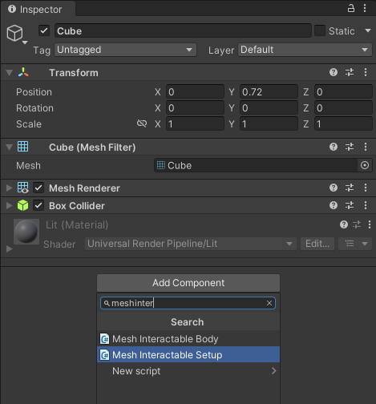
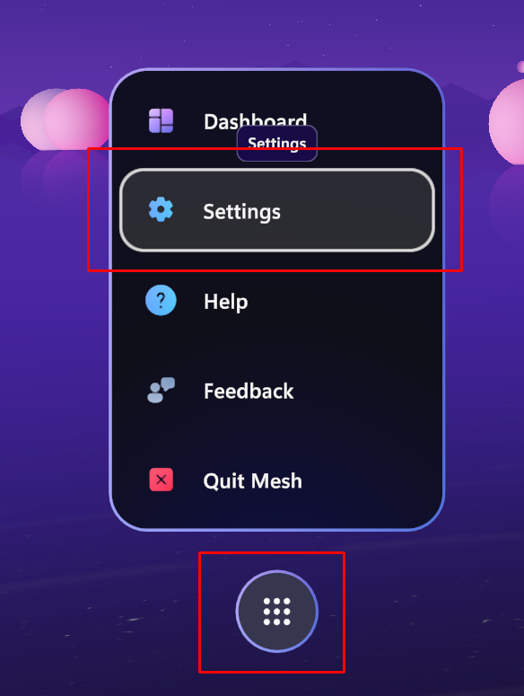

# Mesh Cloud Scripting tutorial

In this article, you'll create and publish a simple project using Mesh Cloud Scripting. The article assumes that you've already [set up Cloud Scripting on your system](./cloud-scripting-setup-on-your-system.md). We recommend that you familiarize yourself with the current list of [Mesh toolkit known issues](../../../Resources/mesh-toolkit-known-issues.md) before starting development with Mesh Cloud Scripting.

[Learn more about Mesh Cloud Scripting Infrastructure and management](cloud-scripting-setup-infrastructure.md).

## Create a Scene with Mesh Cloud Scripting

The following instructions show how to create a simple environment with a cube that rotates when a user clicks on it.

1. Go to the article named *Create new or update an existing project*. If you're creating a new project, make sure you follow all the steps in the section named [**Create a new project**](../../build-your-basic-environment/create-a-new-project-or-update.md#create-a-new-project). If you're updating an existing project, do the same for the section named [**Update an existing project**](../../build-your-basic-environment/create-a-new-project-or-update.md#update-an-existing-project).

1. Create a new scene.
1. [Add a travel point to the scene](../../enhance-your-environment/avatar-and-object-interactions/create-avatar-spawn-and-travel-points.md).
1. Save the scene and name it. For this example, we'll use the name **MyFirstCloudScripting**.
1. On the menu bar, select **GameObject** > **Mesh Toolkit** > **Set-up Cloud Scripting**.

   

   Note that a game object named **Mesh Cloud Scripting** appears in the **Hierarchy** and is selected. If you click the **Open application folder** button in the **Inspector** ... 

   
   
   ... you'll see in the Windows File Explorer that this also creates a new [ASP.NET Core](/aspnet/core/razor-pages/web-sdk?view=aspnetcore-6.0) project named **MyFirstCloudScripting.csproj** in the **Assets > .MeshCloudScripting > MyFirstCloudScripting** folder.

   

### Modify the scene

1. [Set up Mesh Emulation Mode](../../debug-and-optimize-performance/mesh-emulator.md). Make sure you add a GameObject to the scene that can act as a floor and set it to the *GroundCollision* layer.
1. When you set up Mesh Emulation Mode, it adds the prefab *MeshEmulatorSetup[NoUpoload]* to the scene which contains the camera that you'll be using from this point on. You no longer need the default *Main camera* GameObject; delete it.
1. On the menu bar, select **GameObject** > **3D object** > **Cube**.
1. In the **Hierarchy**, drag the cube to the **Mesh Cloud Scripting** object to make the cube a child of that object.

   

1. In the **Inspector**, navigate to the **Transform** component and then change the Cube's **Position** and **Rotation** values to the following:

**Position: X = 0.1, Y = 1.5, Z = 3.3.  

**Rotation**: X = -15, Y = 0.8, Z = 0.1

**Tip**: The **Camera** in the **MeshEmulatorSetup[NoUpload]** prefab is a child object of **AvatarHead**.

   

1. In the **Inspector**, click **Add Component** and then select [**MeshInteractableSetup**](../../enhance-your-environment/avatar-and-object-interactions/interactables.md).

   

1. Save the scene.

### Modify the C# project

1. In the **Hierarchy**, select the **Mesh Cloud Scripting** object.
1. In the **Inspector**, navigate to the **Mesh Cloud Scripting** component and then click the **Open application folder** button. This opens File Explorer and shows you a view of your project contents.

   

1. Open the `App.cs` script in your code editor.
1. Note that in the App class, there are two variables:

   ```c#
   private readonly ILogger<App> _logger;
   private readonly ICloudApplication _app;
   ```

   Add the following as a third variable:

   ```c#
   private float _angle = 0;
   ```

1. The **StartAsync** method contains a single comment: "Add your app startup code here." Replace that with the code below so that the **StartAsync** method looks like the following:

   ```c#
   public Task StartAsync(CancellationToken token)
   {
       // First we find the TransformNode that corresponds to our Cube gameobject
       var transform = _app.Scene.FindFirstChild<TransformNode>();

       // Then we find the InteractableNode child of that TransformNode
       var sensor = transform.FindFirstChild<InteractableNode>();

       // Handle a button click
       sensor.Selected += (_, _) =>
       {
           // Update the angle on each click
           _angle += MathF.PI / 8;
           transform.Rotation = new Rotation { X = 1, Y = 0, Z = 0, Angle = _angle };
       };

       return Task.CompletedTask;
   }
   ```
1. Save your work.

### Run your application locally

1. In Unity, click Unity Editor Play button.
1. In the **Game** window, click on the cube. Each time you click, the cube rotates on its "X" axis.
1. When you're finished, exit Play Mode.

### Debug your application with Visual Studio (optional)

1. In the **Hierarchy**, ensure that you have the **Mesh Cloud Scripting** object selected.

1. In the **Inspector**, navigate to the **Mesh Cloud Scripting** component and then select **Enable Application Debugging**.

   

1. Enter Play mode and select debugger.

   

1. Open the **App.cs** file, then add a break point, and then continue execution.

   

1. In Unity, click the cube.

   

> [!NOTE]
> By default, the application will time out after two minutes of inactivity. To increase this window, set a `"debugTimeoutSecs"` value in your manifest file (example: `"debugTimeoutSecs": "240"`).

## Build and publish the environment

To build and publish the environment, follow the instructions in the [Build and publish your environment](../../make-your-environment-available/build-and-publish-your-environment.md) article.

### Connect to the Cloud Scripting Service from Unity

> [!NOTE]
> This is only available when **ServiceMode** is set to **Dev**.

1. In the **Hierarchy**, ensure that the **Mesh Cloud Scripting** object is selected.
1. In the **Inspector**, navigate to the **Mesh Cloud Scripting** component, and then open the **Developer Settings** drop-down.
1. Unselect **Run Local Cloud Scripting Server**.
1. Click the Unity Editor Play button.

### Create an event and join it from the Mesh app

1. Create an event using the Environment you just built and published. If you need guidance, see how to [create an event in the Mesh portal](../../../events-guide/create-event-mesh-portal.md).
1. Join the event in the Mesh app.

### Show Mesh Cloud Scripting Service errors in the Microsoft Mesh application (optional)

1. The error messages from Cloud Scripting Service are by default not shown in the Mesh app in order to minimize user disruption. If you need to show these messages for debug purposes, use the following steps:

1. Open the Mesh app.
1. Click the **Menu** button and then select **Settings**.

   

1. In the left-side menu bar, select **For developers**.

   

1. Toggle the **Show Mesh scripting error** button to "on".

   

## Next steps

> [!div class="nextstepaction"]
> [Cloud scripting programmer's guide](cloud-scripting-programmers-guide.md)
