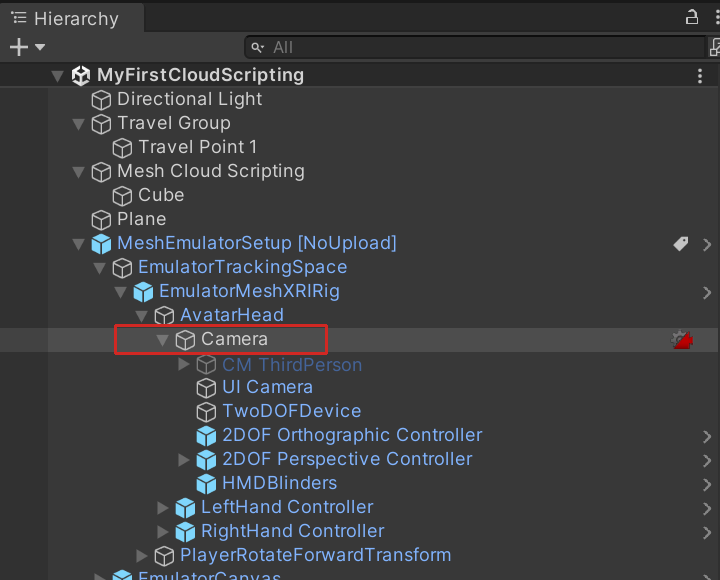
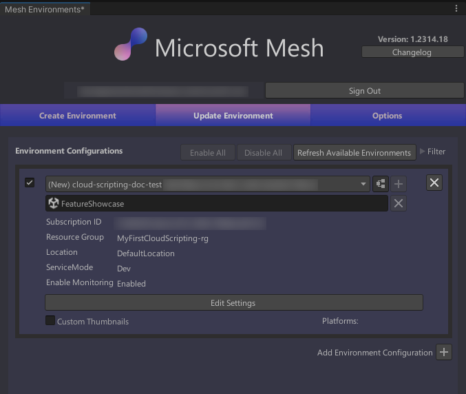
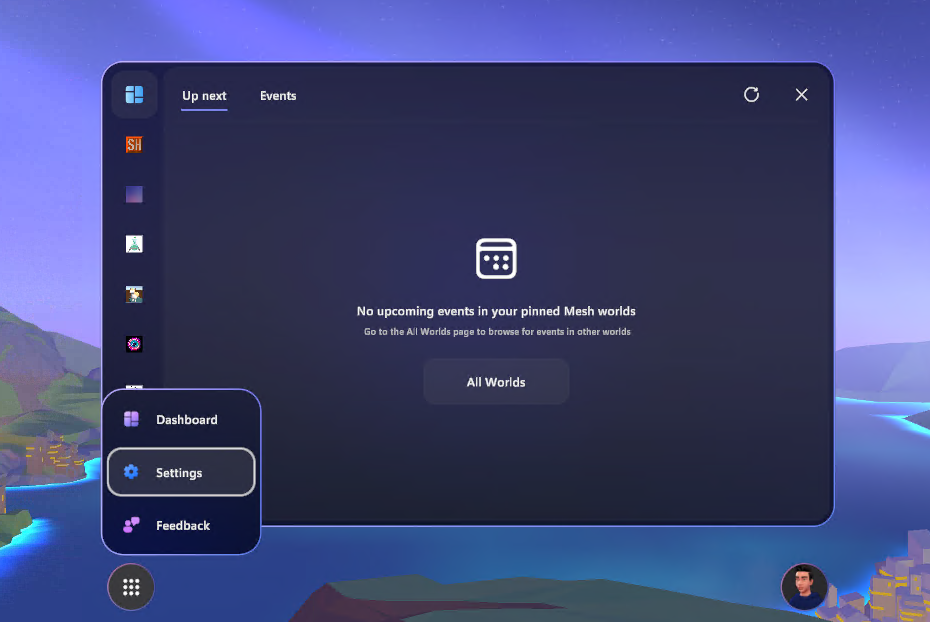

# Mesh Cloud Scripting Getting Started

This article will help you configure your development environment and start iterating on your project. We’ll also cover how to upload your environment with Mesh Cloud Scripting Service to Azure, and prepare for testing. Finally, we’ll go over testing and troubleshooting. We recommend that you familiarize yourself with the current list of [known issues](../../../Resources/mesh-toolkit-known-issues.md#cloud-scripting) before starting development with Mesh Cloud Scripting.

## Software dependencies

1. [.NET 6.0 SDK Windows](https://dotnet.microsoft.com/download)
1. [Azure CLI 2.40.0](https://learn.microsoft.com/cli/azure/install-azure-cli)

## Create a Scene with Mesh Cloud Scripting

The following instructions show how to create a simple environment with a cube that rotates when a user clicks on it. We'll demonstrate local development workflow, publishing and testing.

1. [Create new or update an existing project](../../build-your-basic-environment/create-a-new-project-or-update.md).
1. Create a new scene.
1. Save the scene and name it. For this example, we'll use the name **MyFirstCloudScripting**.

    > [!NOTE]
    > Renaming of Unity scenes isn't supported, and space characters aren't allowed in project and folder names.

1. On the menu bar, select **GameObject** > **Mesh Toolkit** > **Set-up Cloud Scripting**.

   

   Note that a game object named **Mesh Cloud Scripting** appears in the **Hierarchy** and is selected. This also creates a new [ASP.NET Core](https://learn.microsoft.com/aspnet/core/razor-pages/web-sdk?view=aspnetcore-6.0) project under `Assets/.MeshCloudScripting/MyFirstCloudScripting`.

   

1. You can use the **Open application folder** button to navigate to the project folder.

   

### Modify the scene

1. On the menu bar, select **GameObject** > **Mesh Toolkit** > **PlaymodeSetup** to add simulation support.
1. On the menu bar, select **GameObject** > **3D Object** > **Plane** to create a floor.
1. In the **Hierarchy**, select the **Plane** object and, in the **Inspector**, change the **Layer** to **NavMesh**.
1. On the menu bar, select **GameObject** > **3D object** > **Cube**.
1. In the **Hierarchy**, drag the cube to the **Mesh Cloud Scripting** object to make the cube a child of that object.

   

1. With the cube selected, in the **Inspector**, click **Add Component** and then select **MeshInteractableSetup**.

   

1. In the **Transform** component, set the Cube's **Position** values to 0, 1, 3.
1. Save the scene.

### Modify the C# project

1. In the **Hierarchy**, select the **Mesh Cloud Scripting** object.
1. In the **Inspector**, navigate to the **Mesh Cloud Scripting** component and then click the **Open application folder** button. This opens File Explorer and shows you a view of your project contents.

   

1. Open the `App.cs` script in your code editor.
1. Note that in the App class, there are two variables:

   ```c#
   private readonly ILogger<App> _logger;
   private readonly ICloudApplication _app;
   ```

   Add the following as a third variable:

   ```c#
   private float _angle = 0;
   ```

1. The **StartAsync** method contains a single comment: "Add your app startup code here." Replace that with the code below so that the **StartAsync** method looks like the following:

   ```c#
   public Task StartAsync(CancellationToken token)
   {
       // First we find the TransformNode that corresponds to our Cube gameobject
       var transform = _app.Scene.FindFirstChild<TransformNode>();

       // Then we find the InteractableNode child of that TransformNode
       var sensor = transform.FindFirstChild<InteractableNode>();

       // Handle a button click
       sensor.Selected += (_, _) =>
       {
           // Update the angle on each click
           _angle += MathF.PI / 8;
           transform.Rotation = new Rotation { X = 1, Y = 0, Z = 0, Angle = _angle };
       };

       return Task.CompletedTask;
   }
   ```

### Run your application locally

1. Click the Play button.
1. Navigate around the scene and click on the cube.
1. Exit play mode.

### Debug your application with Visual Studio (optional)

1. In the **Hierarchy**, ensure that you have the **Mesh Cloud Scripting** object selected.

1. In the **Inspector**, navigate to the **Mesh Cloud Scripting** component and then select **Enable Application Debugging**.

   

1. Enter Play mode and select debugger.

   

1. Open the **App.cs** file, then add a break point, and then continue execution.

   

1. In Unity, click the cube.

   

## Upload the Environment

The Mesh Cloud Scripting Service  infrastructure deployment and publishing is integrated as part of the Mesh Toolkit Uploader.
You can use the specific settings UI in MeshUploader to define your Azure subscription ID that the Mesh Cloud Scripting Service will be deployed to.

1. Add your deployment configurations such as Azure subscription ID to the environment from the MeshUploader UI. You could do this when you create an environment: setup the configs in the **Mesh Environments** window, **Create Environment** tab, **Setup Mesh Script Configuration** block shown in the following images. Alternatively, you could set up and update the setting for an existing environment in the **Update Environment** steps.

   

1. In the **Mesh Environments** window, **Update Environment** tab, select your environment and scene to upload. If the scene has a Mesh Cloud Scripting component, the deployment configurations will be shown along with the selected scene. Select the **Modify Deployment Configs** tickbox to add or change the configs associated with the current environment and scene. Unselect the tickbox to save and update the settings and you should see the updated configs, as illustrated below.

   

1. In the **Mesh Environments** window, on the **Update Environment** tab, select **Build & Publish**. To learn more about the Mesh Environments window, see how to [build and publish your environment](../../make-your-environment-available/build-and-publish-your-environment.md)

   

1. As the Uploader builds and publishes your Environment, the Mesh Cloud Scripting infrastructure will be provisioned in Azure and published.

   

1. When the Uploader has finished, you should see the Mesh Cloud Scripting Service provisioning and publishing operation results in the results window

> [!NOTE]
> It's expected that there will be multiple entries for *Cloud Scripting Metadata* in the results window.

   

### Connect to the Cloud Scripting Service from Unity

1. In the **Hierarchy**, ensure that the **Mesh Cloud Scripting** object is selected.
1. In the **Inspector**, navigate to the **Mesh Cloud Scripting** component, and then open the **Developer Settings** drop-down.
1. Unselect **Run Local Cloud Scripting Server**.
1. Click the Play button.

> [!NOTE]
> This is only available when ServiceMode is set to **Dev**.

### Create an event and join it from the Microsoft Mesh application

1. Create an event using the Environment **MyFirstCloudScripting**. If you need guidance, see how to [create an event in the Mesh portal](../../../events-guide/create-event-mesh-portal.md).
1. Join the event in the Microsoft Mesh app.

### Show Mesh Cloud Scripting Service errors in the Microsoft Mesh application (optional)

1. The error messages from Cloud Scripting Service are by default not shown in the Microsoft Mesh application in order to minimize user disruption. If you need to show these messages for debug purposes, use the following steps:

1. Go to **Menu** in the Microsoft Mesh application.

   

1. Select **Settings** in the main menu.

   

1. Go to the **Troubleshooting** tab in **Settings** and toggle the **Show Mesh scripting error** button.

   

## Next steps

> [!div class="nextstepaction"]
> [Cloud scripting basic concepts](cloud-scripting-basic-concepts.md)

> [!div class="nextstepaction"]
> [Cloud Scripting Troubleshooting](cloud-scripting-troubleshooting.md)

> [!div class="nextstepaction"]
> [Cloud scripting programmer's guide](cloud-scripting-programmers-guide.md)
