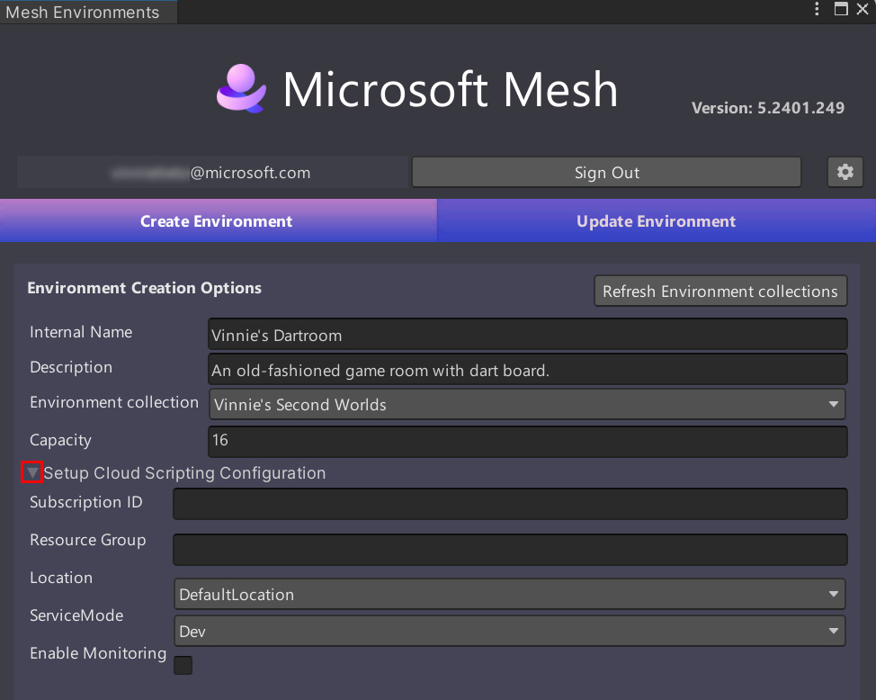

# Provide Cloud Scripting details for build and publish

## Overview

In this article, you'll learn about providing Mesh Cloud Scripting details when you build and publish your Mesh project. The article assumes that you've taken the necessary steps to [prepare to create a project that uses Cloud Scripting](./cloud-scripting-prepare-for-your-project.md) and, as explained in that article, have chosen a Resource Group and Subscription ID which you'll need when you build and publish.

[Learn more about Mesh Cloud Scripting Infrastructure and management](cloud-scripting-setup-infrastructure.md).

As explained in the [Cloud Scripting basic concepts](./cloud-scripting-basic-concepts.md) article, an application service called *Mesh Cloud Scripting Service* is deployed to an Azure resource group that you provide. This service contains the C# code that supports multiplayer interactivity and is built and deployed automatically when you build and publish.

## Cloud Scripting options in the Mesh Uploader

The rest of this article focuses solely on the information you need to provide for Mesh Cloud Scripting when building and publishing your project. To learn about the full build and publish process, see [Build and publish your environment](../../make-your-environment-available/build-and-publish-your-environment.md).

### Settings in the Create Environment tab

At this point you should have a resource group and Subscription ID handy.

1. In the Mesh Uploader, in the **Create Environment** tab, expand the **Setup Cloud Scripting Configuration** drop-down.

1. Copy the subscription ID that you recorded earlier for *Mesh Cloud Scripting Service* and then paste it into the Subscription ID field.  
1. Enter a [Resource Group](./cloud-scripting-prepare-for-your-project.md#resource-group) or let the project choose one for you.  
1. You can accept the default **Location** or choose a different one.

1. For **ServiceMode**, you have two options:

    **Dev**: Allows unauthenticated connections. This is useful for debugging when connected to an environment from Unity.

    **Prod**: This is more secure--it requires that clients be authenticated and joined to the Mesh session. This mode should be preferred for any production deployment.

1. If you want to use [Azure Monitor](./cloud-scripting-troubleshooting.md#b-azure-monitor), select **Enable Monitoring**.

### Settings in the Update Environment tab

After you click the **Create Environment** button in the **Create Environment** tab, you're taken to the **Update Environment** tab, where you select an environment and Scene to build and publish. If the Scene has a Mesh Cloud Scripting component, the deployment configurations are also shown here.

If you navigated to this article from the *Build and publish your environment* article, you can now [return to that article](../../make-your-environment-available/build-and-publish-your-environment.md#create-your-environment). **Note**: When you build and publish, the Mesh Cloud Scripting cloud infrastructure is deployed to your Azure Subscription. To learn more about the specific apps that are deployed, see [Resources deployed](./cloud-scripting-setup-infrastructure.md#resources-deployed).

## Next steps

   > [!div class="nextstepaction"]
   > [Cloud scripting programmer's guide](./cloud-scripting-programmers-guide.md)
