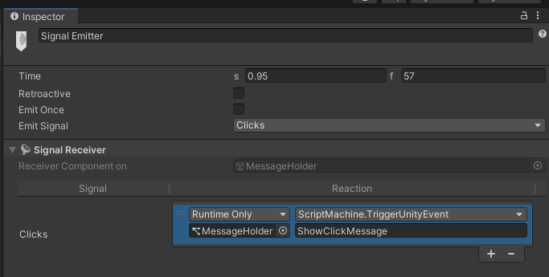

# UnityEvents

Mesh environments can also wire logic to UnityEvents to handle user-driven callbacks with a visual script flow. This article walks you through a brief tutorial for setting up and using UnityEvents for this kind of interop.

**IMPORTANT**: UnityEvents are only allowed to initiate [visual script](visual-scripting/visual-scripting-overview.md) flows, which can then set properties and invoke methods. A UnityEvent points to *ScriptMachine.TriggerUnityEvent*. From there, corresponding visual script flows can be triggered through "Unity Event" event nodes.

> [!TIP]
> You can also create [AnimationEvents](./animationevents.md) to call a function from an animation clip at a specific point in time, or a specific frame, that you specify.

## UnityEvent in a basic script

To demonstrate how a UnityEvent in a visual script works, we'll create a button that, when clicked, causes a message to appear in the **Console** window.

### Create the button

1. In your project, drag the **Console** window into the right side of the **Scene** window so you can view them side-by-side.
1. On the menu bar, select **GameObject** > **UI** > **Legacy** > **Button.**
1. Ensure that **Button** is selected, and then, in the **Inspector**, reset **Button** so that its **Rect Transform** component's XYZ values are all set to zero.
1. In the **Scene** window, adjust the view so that you can clearly see the button.

    

1. In the **Inspector**, navigate to the **Button** component and note that it contains an **On Click()** UnityEvent. 

## Create a Script Machine

Right now, there are no events to trigger--we'll add something here in a moment. First, let's create the event. We'll keep it simple and set things up so that when you click the button, a message appears in the **Console**.

1. On the menu bar, select **GameObject** > **Create Empty**.
1. Change the empty object's name to *MessageHolder*.
1. In the **Inspector**, select the **Add Component** button and then search for and add **Script Machine**.
1. In the **Script Machine** component, select the **Source** drop-down and then select **Embed**.
1. Select the **Edit Graph** button, and then dock the **Script Graph** window next to the **Project** window.
1. In the script graph, delete the two default nodes.
1. Right-click in the graph and then add the **UnityEvent Event** node.

    

1. Name the **UnityEvent Event** node: in the text field in the node, add the name *ShowClickMessage*.

    

1. Drag the control output port of the **UnityEvent Event** node and then, in the Fuzzy Finder, search for and add the **Debug Log Message** node.

    

1. Drag the data input port of the **Debug Log Message** node and then, in the Fuzzy Finder, search for and add the **String Literal** node.
1. In the **String Literal** node, add the text: "You clicked the button!"

    

### Connect the button to the script

1. In the **Hierarchy**, select **Button (Legacy)** and then, in the **Inspector**, navigate to its **On Click()** UnityEvent.
1. Click the plus sign ("+") in the UnityEvent.
1. Drag the **MessageHolder** GameObject from the **Hierarchy** and then drop it in the field in the **On Click()** UnityEvent property that says **None (Object)**.

    

1. Select the **No Function** drop-down, then point to **Script Machine**, and then select **TriggerUnityEvent (string)**.

    

    The final step here is to add the UnityEvent node you want to trigger to the **On Click()** event. In a more complex script graph, you might have several to choose from, each with a different name; in our simple example, there's only one: *ShowClickMessage*.

    

1. In the remaining blank field in the **On Click()** event, type "ShowClickMessage."

### Test your work

1. Save the project, and then click the Unity editor Play button.
1. In the **Game** window, click the button. This causes the "You clicked the button!" message contained in the **String** node in the script graph to appear in the **Console**.

    

    Each time you click the button, the message appears.

**Note**: With the *ScriptMachine.TriggerUnityEvent* function, you can't pass any parameters into the script flow.

## UnityEvents and Timeline Signals

You can trigger a UnityEvent from a [Timeline](../enhance-your-environment/multi-room-sync.md) by adding a Signal Emitter, then creating a Signal Asset and connecting it to the Signal emitter, and then creating a Signal Receiver component. Inside the Signal Receiver, you select a Signal Asset and then choose the function you wish you call (in other words, the UnityEvent). This is similar to how the UnityEvents work in the Button example explained above--the same event callback, *ScriptMachine.TriggerUnityEvent*, is used.

In this example, we created a Signal Asset named *Clicks*.

To learn more about using Signals in the Timeline, [see this Unity Blog](https://blog.unity.com/engine-platform/how-to-use-timeline-signals).
