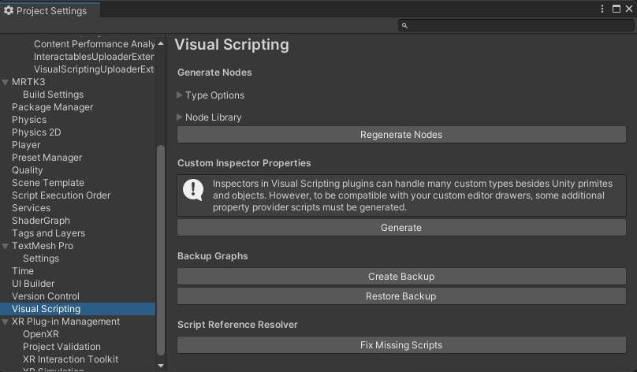

# Handling syncing issues in Visual Scripting

If you find that something is wrong with what type or node options you're seeing in Visual Scripting, it could mean that the unit database is out of sync. If the *UnitOptions.db* file is absent from your project, Visual Scripting will regenerate it, but it doesn't ensure that Mesh's assemblies and types are included or that any nodes that aren't on Mesh's allowlist are filtered out.

**To resolve a syncing issue**:
1. On the menu bar, select **Mesh Toolkit** > **Configure** > **Apply Project Settings**.
1. In the **Project Settings for Mesh** dialog, select **Configure Settings**.

    .

It's also a good idea to run **Configure Settings** before you start working on visual scripts.

## Preventive measures

Here are some other things you can do to avoid syncing issues:

- Preserve the following files by keeping them in version control:
    
    `Assets\Unity.VisualScripting.Generated\VisualScripting.Flow\UnitOptions.db`
    `ProjectSettings\VisualScriptingSettings.asset`

- On the **Edit** > **Project Settings** > **Visual Scripting** page, don't change anything in the **Type Options** or **Node Library** sections and don't click the **Regenerate Nodes** button.

    .