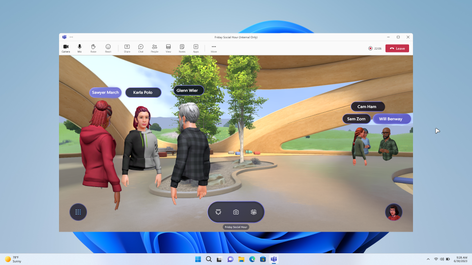
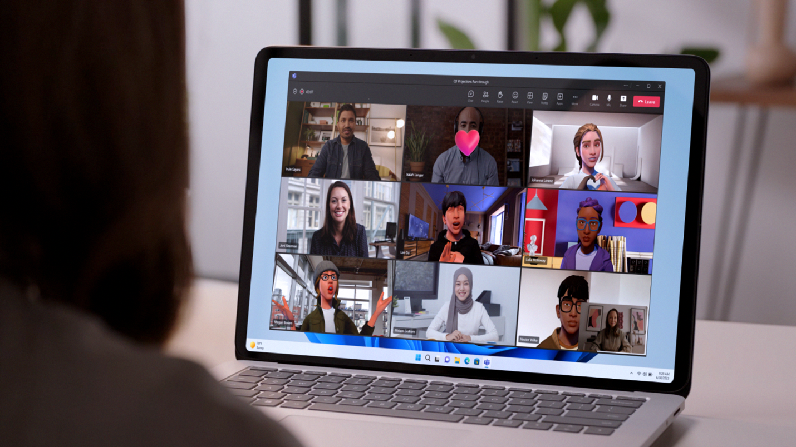

# Microsoft Mesh overview

Microsoft Mesh is a platform that powers shared immersive experiences. It offers remote and hybrid workers a more natural way to connect with a sense of co-presence. Mesh enables creators to build custom employee experiences that bring people together for new hire onboarding, training, team building, and more. At Microsoft, we are bringing Mesh capabilities into Microsoft Teams with avatars  and immersive experiences so employees can easily connect where work happens.

## Experience Microsoft Teams like never before

Mesh-powered immersive experiences are now integrated with Microsoft Teams, helping employees form more experiential connections where work happens.

Avatars for Microsoft Teams enables you to build connections in meetings without turning your video on. Include more people in the conversation — whether they need a break due to video fatigue or just feel more comfortable with their video off. Avatars add a new layer of choice to your meetings, enhancing your team meetings for more engagement and fun.

[Learn more about avatars for Teams](https://support.microsoft.com/en-us/office/join-a-meeting-as-an-avatar-in-microsoft-teams-5384e7b7-30c7-4bcb-8065-0c9e830cc8ad)

[Learn more about setting up avatars for Teams](https://learn.microsoft.com/microsoftteams/meeting-avatars)

Take your digital presence a step further with immersive spaces for Teams. Add immersive spaces to a Teams meeting to create social gatherings that provide participants a sense of natural co-presence and togetherness. Connecting with others in immersive spaces mimics many elements of an in-person gathering – like the ability to have a side chat with someone you want to catch up with, or to have multiple conversations in the same space without talking over each other. Immersive spaces for Teams can be accessed through PCs or Quest 2 headsets.

[Learn more about immersive spaces in Teams](https://support.microsoft.com/en-us/office/join-a-meeting-as-an-avatar-in-microsoft-teams-5384e7b7-30c7-4bcb-8065-0c9e830cc8ad)

## Build custom experiences tailored to your organization’s needs

In addition to Mesh-powered experiences being integrated into Teams, the Mesh platform enables you to build custom experiences for your organization that are accessible through the standalone Mesh application.

Mesh provides a rich set of out-of-box functionalities like synchronizing the experience for users across devices, on PCs and Quest 2 headsets. Core capabilities include avatars to represent participants, spatial audio to enable participants to experience sound as they would in an in-person setting, and the ability to interact with objects and the environment. With event management capabilities, you can orchestrate real-time experiences by facilitating presentations, teleporting users within the environment, and triggering content and animations all in a predetermined time sequence. With these capabilities, you can create employee training, team onboarding, guided tours and more. And, because Mesh is built on Microsoft 365, identity management and enterprise-grade privacy and security are built-in.

With Mesh, there are plenty of ways to add value, content, interactivity, and magic to custom experiences.

* Use Unity to create new 3D environments or port existing ones into your space.
* Use cloud scripting to add interactivity by inserting logic, integrating with live backend business data, connecting triggers to actions, infusing AI, and more – all with the full power of C# and .NET Core.
* Enrich the user experience by adding interactive web content such as videos and webapps to your environment.
* Use physics tools in Mesh to assign properties to objects in your space using gravity or buoyancy. Create a realistic experience or enable more fantastical interactions for games, challenges, and help participants unleash their endless creativity.
* Diagnose potential issues and bring more polish to the experience with performance tools in Mesh.

At this time, you’ll need to be a part of the Microsoft Mesh Technical Adoption Program (Mesh TAP) to build custom experiences with Mesh private preview.

## Next steps

   > [!div class="nextstepaction"]
   > [Use Mesh](Use/usage-overview.md)

   > [!div class="nextstepaction"]
   > [Create for Mesh](Create/development-overview.md)

   > [!div class="nextstepaction"]
   > [Setup Mesh](Setup/Content/setup-azure-mesh-guide.md)
