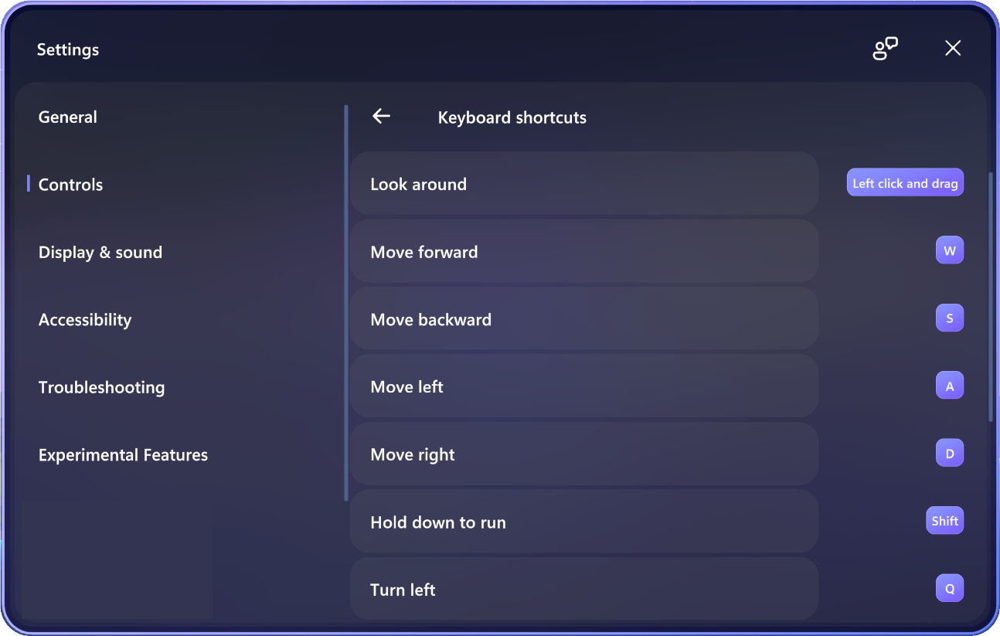
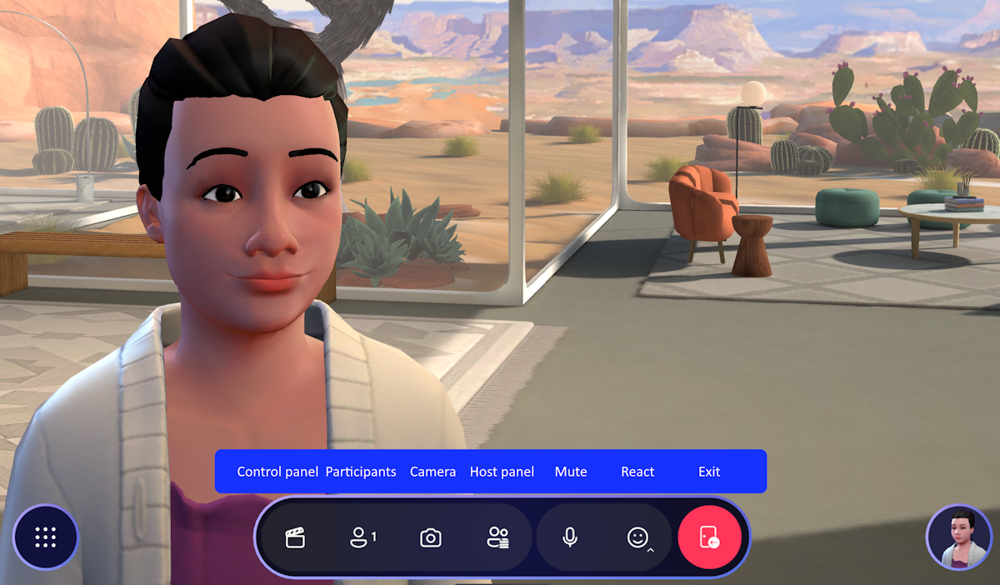
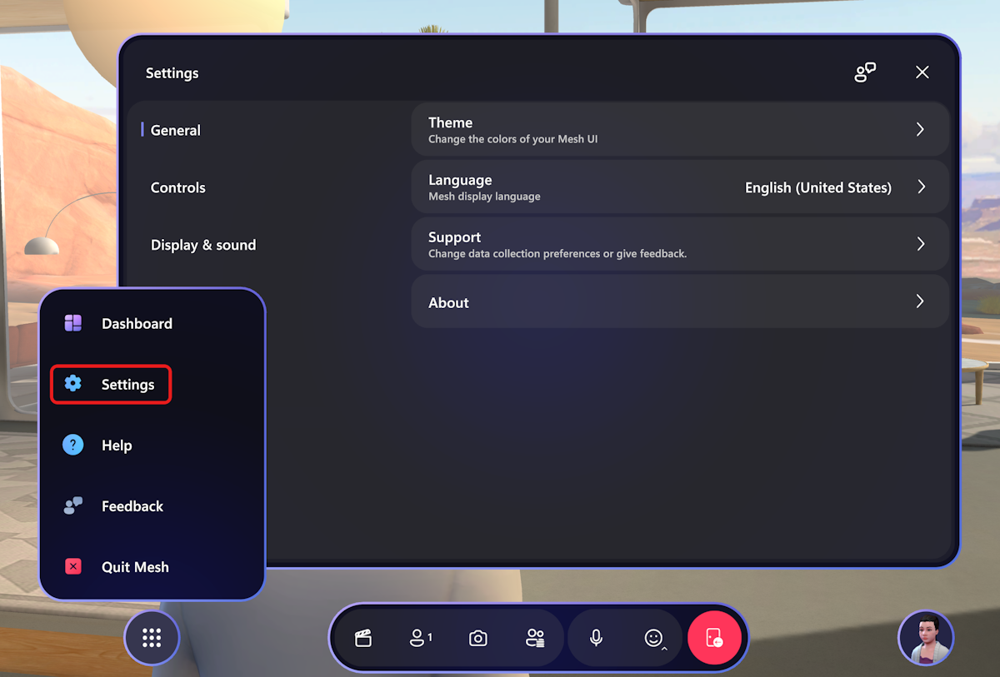
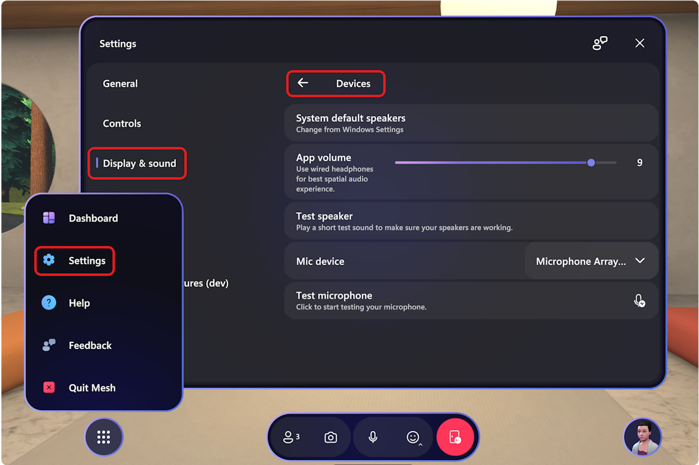
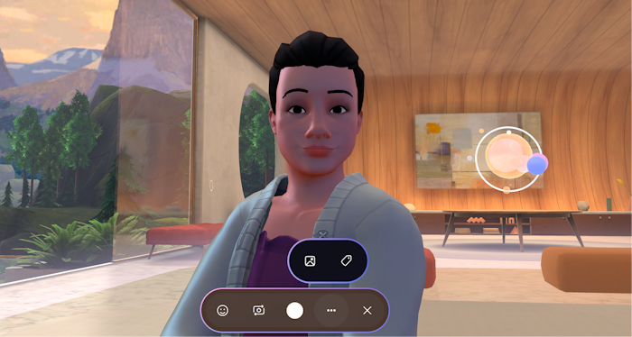
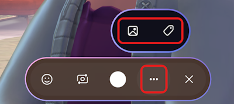
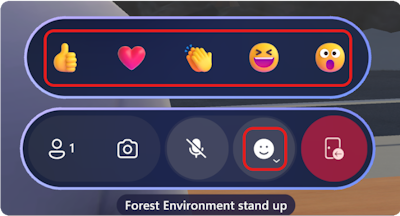
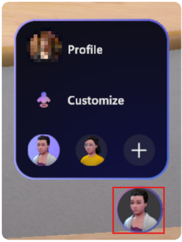

# Mesh user controls

## Mesh Dashboard

The Mesh Dashboard displays all Mesh events available to you. The Mesh Dashboard is the main interface you can use to explore what Mesh has to offer.

The Dashboard is viewable using the Mesh App on PC or Quest.

>[!Note] 
>On the Dashboard, the changes from upcoming to live events are updated automatically.

## Move around in your event

### On PC

You can look around, walk, run, teleport around, or just sit at the
table with other avatars. To move around, press the **WASD** keys.

**Other keyboard controls:**

- **Q** to rotate left
- **E** to rotate right
- Press and hold on **W, S, A,** or **D** to leave your chair when
    sitting
- **V** to toggle between direct view and avatar view (1st and 3rd
    person views)

Here are some keyboard shortcuts for moving around in your event:

## Mesh controls overview

Now that you're in an event, explore the interface to see what controls are available. To the left, we have the **System Menu** with **Dashboard**, **Settings**, **Feedback**, and **Quit Mesh**. The app bar in the middle holds the **Participants**, **Selfie**, and **Reactions** buttons. The **Profile** button in the lower right corner
holds the **Customize** button for customizing your avatars.

### Adjust settings

The **Settings** menu helps you to set up the app according to your preferences. There are many options available here. It can be accessed directly from the bottom left menu button of the Mesh menu bar.

You can also select and setup your audio devices in the **Settings** dialog, **Display & sound -> Devices**.

Learn more about frequently asked questions related to audio in Mesh [here](../Resources/mesh-troubleshooting.md#audio-setup-in-mesh).

### Participants

The **Participants** button will show the number of participants in an event.

### Take a photo or selfie

Use the **Camera** button on the app bar to take a selfie of yourself with friends or snap a picture from the view of your avatar!

>[!Note]
>Avatars nametags are turned off by default when taking a photo or selfie. You can still turn on the nametag by clicking on **...** in the App bar.

Selecting on the photo icon in the menu will take you to the SharePoint folder where your photos are stored.

### React with emotes

In the app bar, you can trigger **Reactions**, that cause your avatar to
react with body gestures as well as emotes.

### Profile

The **Profile** button in the lower right corner gives you access to your personal details and avatar customization options.

Select **Customize** to fine tune your Avatar's appearance while in an event!

### Nametag and contact card

To find out about another participant in your event, click the nametag above an avatar, and then select the **Contact card** icon.

## Next steps

  > [!div class="nextstepaction"]
   > [Personalize your avatars](avatars.md)

   > [!div class="nextstepaction"]
   > [Join an event](join-an-event.md)

   > [!div class="nextstepaction"]
   > [Create an event](events-guide/create-event.md)